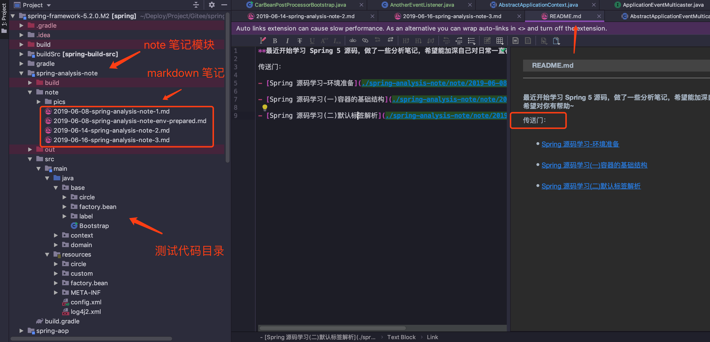

<h1 align="center">Welcome to Spring-Analysis-Note 👋</h1>
<p>
  
  <a href="https://juejin.im/user/58782b471b69e6005823ab38">
    
  </a>
</p>

> Spring 5 源码学习笔记

**最近开始学习 Spring 5 源码，做了一些分析笔记，希望能加深自己对日常一直在用的 Spring 容器的理解，也希望对你有帮助**

**同时由于个人技术有限，出现理解错误或者有疑问的地方，可在掘金文章下留言，期待朋友们的反馈~**


### 🏠 [工程地址](https://github.com/Vip-Augus/spring-analysis-note)

## 下载源码

```sh
git clone https://github.com/Vip-Augus/spring-analysis-note
```

## 如何阅读



## 跟踪代码 Debug


## 传送门：

- [Spring 源码学习-环境准备](./spring-analysis-note/note/2019-06-08-spring-analysis-note-env-prepared.md)

- [Spring 源码学习(一)容器的基础结构](./spring-analysis-note/note/2019-06-08-spring-analysis-note-1.md)

- [Spring 源码学习(二)默认标签解析](./spring-analysis-note/note/2019-06-14-spring-analysis-note-2.md)

- [Spring 源码学习(三)自定义标签](./spring-analysis-note/note/2019-06-16-spring-analysis-note-3.md)

- [Spring 源码学习(四) bean 的加载](./spring-analysis-note/note/2019-06-19-spring-analysis-note-4.md)

- [Spring 源码学习(五)循环依赖](./spring-analysis-note/note/2019-06-21-spring-analysis-note-5.md)

- [Spring 源码学习(六)扩展功能 上篇-BeanFactoryPostProcessor](./spring-analysis-note/note/2019-06-25-spring-analysis-note-6.md)


## 关于我

👤 **JingQ**

* Github: [@Vip-Augus](https://github.com/Vip-Augus)
* JueJin: [@Vip-Augus](https://juejin.im/user/58782b471b69e6005823ab38)
* Github page : [JingQ](http://vip-augus.github.io)

## 点个小星星✨

**如果觉得这个项目不错，请点个小星星，蟹蟹你的鼓励~**

***
_This README was generated with ❤️ by [readme-md-generator](https://github.com/kefranabg/readme-md-generator)_
