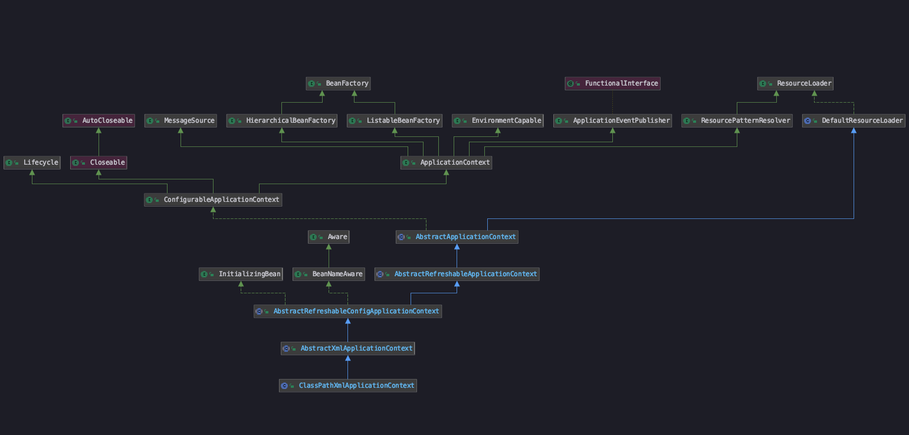
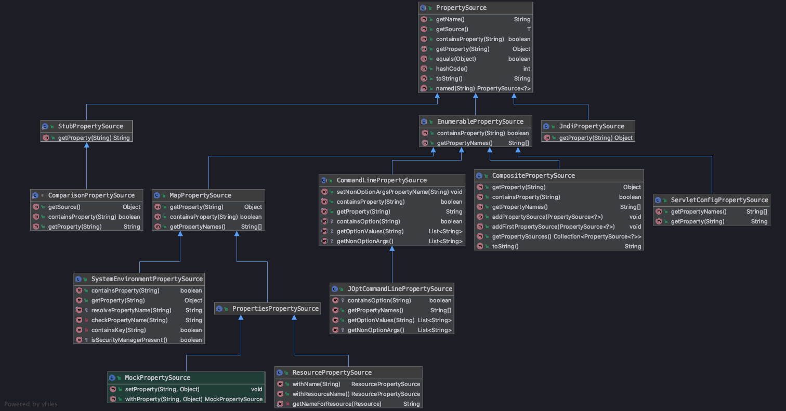
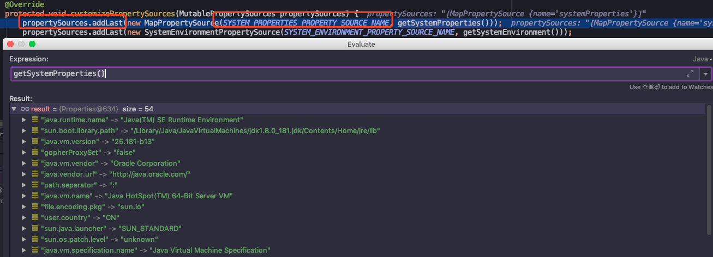
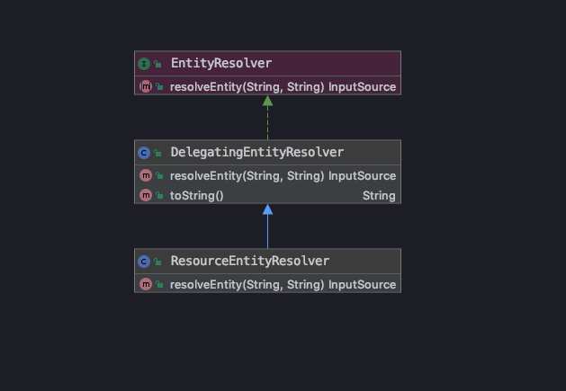

<!-- START doctoc generated TOC please keep comment here to allow auto update -->
<!-- DON'T EDIT THIS SECTION, INSTEAD RE-RUN doctoc TO UPDATE -->
-   [ClassPathXmlApplicationContext](#classpathxmlapplicationcontext)
    -   [设置配置文件路径](#设置配置文件路径)
        -   [Profile](#profile)
        -   [PropertySource 接口](#propertysource-接口)
-   [Bean 的解析和注册](#bean-的解析和注册)
    -   [具体校验的方法](#具体校验的方法)
    -   [获取 bean 容器](#获取-bean-容器)
        -   [BanFactory 自定义](#banfactory-自定义)
            -   [EntityResolver](#entityresolver)
        -   [配置文件加载](#配置文件加载)
        -   [默认标签解析](#默认标签解析)
            -   [获取 id 和 name](#获取-id-和-name)
            -   [对标签中其它属性的解析](#对标签中其它属性的解析)
            -   [BeanDefinitionHolder 修饰](#beandefinitionholder-修饰)
    -   [prepareBeanFactory](#preparebeanfactory)
        -   [invokeBeanFactoryPostProcessors](#invokebeanfactorypostprocessors)
        -   [initMessageSource](#initmessagesource)
        -   [onRefresh](#onrefresh)
        -   [finishBeanFactoryInitialization](#finishbeanfactoryinitialization)
        -   [resetCommonCaches](#resetcommoncaches)
-   [踩坑记录](#踩坑记录)
    -   [Javadoc 编译错误](#javadoc-编译错误)
-   [参考资料](#参考资料)

本篇笔记主要记录了以下内容：

使用 `ClassPathXmlApplicationContext`，通过在 `xml` 注册一个
`bean`，跟踪代码，了解它从配置文件的 `<bean>` 标签，加载到 `BeanFactory`
注册表 `beanDefinitionMap` 的详细过程。

**展示的代码摘取了一些核心方法，去掉一些默认设置和日志输出，还有大多数错误异常也去掉了，小伙伴想看详细代码，注释和
demo，可以下载我上传的笔记项目📒**

[spring-analysis-note 码云 Gitee 地址](https://gitee.com/vip-augus/spring-analysis-note.git)

[spring-analysis-note Github 地址](https://github.com/Vip-Augus/spring-analysis-note)

通过阅读源码的过程，了解设计者的设计思路和从中学习，对 `spring`
有个基础的了解。

ClassPathXmlApplicationContext
------------------------------

`ClassPathXmlApplicationContext` 的继承体系结构图：



这种结构图是通过 `IDEA` 编辑器的 `Diagrams`
功能展示的，对当前类右键选择，可以看到继承体系，继承了哪些类和引用了哪些接口，方便我们去了解\~

`ClassPathXmlApplicationContext` 继承自 `AbstractApplicationContext`，而
`AbstractRefreshableApplicationContext` 是 `AbstractApplicationContext`
的抽象子类，使用的类注册工厂是
`DefaultListableBeanFactory`，这个注册工厂也很重要，后面会有它的介绍。

**简单来说，`DefaultListableBeanFactory` 是 `Spring` 注册及加载 `bean`
的默认实现，它会将注册的 `bean`放入 `beanDefinitionMap` 进行 `key-value`
形式存储。**

在图片的右上角能看到，`ResourceLoader`
是它的顶层接口，表示这个类实现了资源加载功能。

构造器的代码：

``` java
public ClassPathXmlApplicationContext(
        String[] configLocations, boolean refresh, @Nullable ApplicationContext parent)
        throws BeansException {
    super(parent);
    // 注释 1.1 获取资源文件
    setConfigLocations(configLocations);
    if (refresh) {
        refresh();
    }
}
```

------------------------------------------------------------------------


### 设置配置文件路径

> org.springframework.context.support.AbstractRefreshableConfigApplicationContext

``` java
public void setConfigLocations(@Nullable String... locations) {
    if (locations != null) {
        Assert.noNullElements(locations, "Config locations must not be null");
        // 注释 1.2 将配置资源路径放入 configLocations 数组中
        this.configLocations = new String[locations.length];
        for (int i = 0; i < locations.length; i++) {
            this.configLocations[i] = resolvePath(locations[i]).trim();
        }
    }
    else {
        this.configLocations = null;
    }
}
```

`resolvePath`，用途是：**解析给定的路径，用对应的占位符(placeholder)替换占位符**

例如
`new ClassPathXmlApplicationContext("classpath:config.xml");`，就需要解析
`classpath`，变成正确路径。

``` java
protected String resolvePath(String path) {
    return getEnvironment().resolveRequiredPlaceholders(path);
}
```

我们有不同的运行环境，`dev`，`test` 或者
`prod`，这个时候加载的配置文件和属性应该有所不同，这个时候就需要使用到
`Environment` 来进行区分。

`Spring` 环境和属性是由四个部分组成：

-   `Environment` ： 环境，由 `Profile` 和 `PropertyResolver` 组合。
-   `Profile` : 配置文件，可以理解为，容器里多个配置组别的属性和
    `bean`，只有激活的 `profile`，它对应的组别属性和 `bean` 才会被加载
-   `PropertySource` ： 属性源， 使用 `CopyOnWriteArrayList`
    数组进行属性对 `key-value` 形式存储
-   `PropertyResolver` ：属性解析器，这个用途就是解析属性

------------------------------------------------------------------------

#### Profile

通过这个属性，可以同时在配置文件中部署两套配置，用来适用于生产环境和开发环境，这样可以方便的进行切换开发、部署环境，常用来更换不同的数据库或者配置文件。

`demo`:（引用自参考资料第四条）

``` xml
<!-- 测试环境配置文件 -->
<beans profile="test">
    <context:property-placeholder location="classpath:test/*.properties, classpath:common/*.properties" />
</beans>

<!-- 生产环境配置文件 -->
<beans profile="production">
    <context:property-placeholder location="classpath:production/*.properties, classpath:common/*.properties" />
</beans>

<!-- 开发环境配置文件 -->
<beans profile="development">
    <context:property-placeholder location="classpath:dev/*.properties, classpath:common/*.properties" />
</beans>
```

**有两种方式可以设置选择使用哪套配置：**

① 在 `web.xml` 中设置

``` xml
<context-param>
    <param-name>spring.profiles.active</param-name>
    <param-value>test</param-value>
</context-param>
```

② 在代码启动时设置

``` java
context.getEnvironment().setActiveProfiles("test");
```

------------------------------------------------------------------------


#### PropertySource 接口

继承体系如图：



从 `PropertySource` 继承体系来看，`customizePropertySources`
方法的调用链路是从子类一直往上调用 ：

`AbstractEnvironment` -\> `StandardServletEnvironment` -\>
`StandardEnvironment`

最终在 `StandardEnvironment` 使用 `CopyOnWriteArrayList`
数组进行属性存储

``` java
protected void customizePropertySources(MutablePropertySources propertySources) {
    propertySources.addLast(new MapPropertySource(SYSTEM_PROPERTIES_PROPERTY_SOURCE_NAME, getSystemProperties()));
    propertySources.addLast(new SystemEnvironmentPropertySource(SYSTEM_ENVIRONMENT_PROPERTY_SOURCE_NAME, getSystemEnvironment()));
}
```

例如从上面可以看出，`propertySourceList` 将会存储系统的参数：



到时这些参数就能在启动的应用中，通过上下文 `context` 进行获取

``` java
((MutablePropertySources)((StandardEnvironment)context.environment).propertySources).propertySourceList
```

------------------------------------------------------------------------


Bean 的解析和注册
-----------------

`Spring bean` 的解析和注册有一个重要的方法 `refresh()`

> AbstractApplicationContext.refresh()

``` java
public void refresh() throws BeansException, IllegalStateException {
    synchronized (this.startupShutdownMonitor) {
        // Prepare this context for refreshing. （为更新准备上下文，设定一些标志）
        prepareRefresh();
        // Tell the subclass to refresh the internal bean factory. （告诉子类去更新它们的 bean factory）
        // 类的注册到 bean factory 也是在这一步
        ConfigurableListableBeanFactory beanFactory = obtainFreshBeanFactory();
        // Prepare the bean factory for use in this context.
        prepareBeanFactory(beanFactory);
        try {
            // Allows post-processing of the bean factory in context subclasses.
            postProcessBeanFactory(beanFactory);
            // Invoke factory processors registered as beans in the context.
            invokeBeanFactoryPostProcessors(beanFactory);
            // Register bean processors that intercept bean creation.
            registerBeanPostProcessors(beanFactory);
            // Initialize message source for this context.
            initMessageSource();
            // Initialize event multicaster for this context.
            initApplicationEventMulticaster();
            // Initialize other special beans in specific context subclasses.
            onRefresh();
            // Check for listener beans and register them.
            registerListeners();
            // Instantiate all remaining (non-lazy-init) singletons.
            finishBeanFactoryInitialization(beanFactory);
            // Last step: publish corresponding event.
            finishRefresh();
        }
        catch (BeansException ex) {
            if (logger.isWarnEnabled()) {
                logger.warn("Exception encountered during context initialization - " +
                        "cancelling refresh attempt: " + ex);
            }
            // Destroy already created singletons to avoid dangling resources.
            destroyBeans();
            // Reset 'active' flag.
            cancelRefresh(ex);
            // Propagate exception to caller.
            throw ex;
        }
        finally {
            // Reset common introspection caches in Spring's core, since we
            // might not ever need metadata for singleton beans anymore...
            resetCommonCaches();
        }
    }
}
```

下面会围绕这个方法进行跟踪和分析。

------------------------------------------------------------------------


#### 具体校验的方法

> org.springframework.core.env.AbstractPropertyResolver\#validateRequiredProperties

``` java
public void validateRequiredProperties() {
    MissingRequiredPropertiesException ex = new MissingRequiredPropertiesException();
    for (String key : this.requiredProperties) {
        if (this.getProperty(key) == null) {
            ex.addMissingRequiredProperty(key);
        }
    }
    if (!ex.getMissingRequiredProperties().isEmpty()) {
        throw ex;
    }
}
```

可以看到，校验逻辑是遍历 `requiredProperties`，它是一个字符
`Set`，默认情况下是空，表示不需要校验任何元素，如果列表中有值，然后根据
`key` 获取对应的环境变量为空，将会抛出异常，导致 `Spring`
容器初始化失败。

### 获取 `bean` 容器

在这行代码中
`ConfigurableListableBeanFactory beanFactory = obtainFreshBeanFactory();`

具体调用的是 :

> org.springframework.context.support.AbstractRefreshableApplicationContext\#refreshBeanFactory

``` java
protected final void refreshBeanFactory() throws BeansException {
    // 在更新时，如果发现已经存在，将会把之前的 bean 清理掉，并且关闭老 bean 容器
    if (hasBeanFactory()) {
        destroyBeans();
        closeBeanFactory();
    }
    try {
        DefaultListableBeanFactory beanFactory = createBeanFactory();
        beanFactory.setSerializationId(getId());
        customizeBeanFactory(beanFactory);
        // 注释 1.3 开始加载 （bean 注册）
        loadBeanDefinitions(beanFactory);
        synchronized (this.beanFactoryMonitor) {
            this.beanFactory = beanFactory;
        }
    }
    catch (IOException ex) {
        throw new ApplicationContextException("I/O error parsing bean definition source for " + getDisplayName(), ex);
    }
}
```

这个入口方法很重要，在这一步新建了 `bean` 容器和解析 `bean`，并将 `bean`
注册到容器中。

------------------------------------------------------------------------

#### BanFactory 自定义

具体方法如下，通过这个方法，可以对工厂进行定制化设置，让子类进行自由配置：

> org.springframework.context.support.AbstractRefreshableApplicationContext\#customizeBeanFactory

``` java
protected void customizeBeanFactory(DefaultListableBeanFactory beanFactory) {
    if (this.allowBeanDefinitionOverriding != null) {
        // 默认是 false，不允许覆盖
        beanFactory.setAllowBeanDefinitionOverriding(this.allowBeanDefinitionOverriding);
    }
    if (this.allowCircularReferences != null) {
        // 默认是 false，不允许循环引用
        beanFactory.setAllowCircularReferences(this.allowCircularReferences);
    }
}
```

------------------------------------------------------------------------


##### EntityResolver



接口全路径是：`org.xml.sax.EntityResolver`，具体解析使用的方法是:

> org.springframework.beans.factory.xml.ResourceEntityResolver\#resolveEntity

该方法是用于解析 `schema` 和 `dtd`，具体深究的话也很复杂，但解析 `xml`
不是我想了解的点，所以先跳过\~

------------------------------------------------------------------------

#### 配置文件加载

入口方法：(由于有多个重名方法，所以复制路径时，将参数的类型也拷贝了）

> org.springframework.beans.factory.support.AbstractBeanDefinitionReader\#loadBeanDefinitions(java.lang.String,
> java.util.Set\<org.springframework.core.io.Resource\>)

**核心方法是这两行**

``` java
public int loadBeanDefinitions(String location, @Nullable Set<Resource> actualResources) throws BeanDefinitionStoreException {
    // 获取资源文件（资源加载器从路径识别资源文件）
    Resource[] resources = ((ResourcePatternResolver) resourceLoader).getResources(location)
    // 注释 1.6 根据资源文件加载 bean
    int count = loadBeanDefinitions(resources);     
    ···
}
```

获取资源文件后，开始解析资源文件（也就是一开始传参的
`config.xml`)，将它转换成 `Document`

跟踪代码可以看到，进行解析的资源文件从 `Resource` 包装成
`EncodeResouce`，为输入流添加了字符编码（默认为 `null`)，体现了设计模式
- 装饰器模式

遍历资源文件，进行转换，核心方法是以下两行：

> org.springframework.beans.factory.xml.XmlBeanDefinitionReader\#loadBeanDefinitions(org.springframework.core.io.support.EncodedResource)

``` java
public int loadBeanDefinitions(EncodedResource encodedResource) throws BeanDefinitionStoreException {
    // 注释 1.7 从资源文件中获取输入流
    InputStream inputStream = encodedResource.getResource().getInputStream();
    InputSource inputSource = new InputSource(inputStream);
    return doLoadBeanDefinitions(inputSource, encodedResource.getResource());
}
```

------------------------------------------------------------------------

#### 默认标签解析

这部分不会细说，之后再写一篇进行补充，所以简单的过下代码中，是如何解析默认标签的

-   **IMPORT**：导入标签
-   **ALIAS**：别名标签
-   **BEAN**：`bean` 标签
-   **NESTED\_BEANS**：`beans` 标签（嵌套的 `beans`)

> org.springframework.beans.factory.xml.DefaultBeanDefinitionDocumentReader\#parseDefaultElement

``` java
private void parseDefaultElement(Element ele, BeanDefinitionParserDelegate delegate) {
    if (delegate.nodeNameEquals(ele, IMPORT_ELEMENT)) {
        importBeanDefinitionResource(ele);
    }
    else if (delegate.nodeNameEquals(ele, ALIAS_ELEMENT)) {
        processAliasRegistration(ele);
    }
    else if (delegate.nodeNameEquals(ele, BEAN_ELEMENT)) {
        processBeanDefinition(ele, delegate);
    }
    else if (delegate.nodeNameEquals(ele, NESTED_BEANS_ELEMENT)) {
        // recurse
        doRegisterBeanDefinitions(ele);
    }
}
```

让我们来看下如何解析 `bean` 标签

------------------------------------------------------------------------

##### 获取 id 和 name

> org.springframework.beans.factory.xml.BeanDefinitionParserDelegate\#parseBeanDefinitionElement(org.w3c.dom.Element,
> org.springframework.beans.factory.config.BeanDefinition)

``` java
public BeanDefinitionHolder parseBeanDefinitionElement(Element ele, @Nullable BeanDefinition containingBean) {
    // 获取 ID 属性
    String id = ele.getAttribute(ID_ATTRIBUTE);
    // 获取 NAME 属性
    String nameAttr = ele.getAttribute(NAME_ATTRIBUTE);
    List<String> aliases = new ArrayList<>();
    if (StringUtils.hasLength(nameAttr)) {
        // 名称按照 , ; 进行分割
        String[] nameArr = StringUtils.tokenizeToStringArray(nameAttr, MULTI_VALUE_ATTRIBUTE_DELIMITERS);
        aliases.addAll(Arrays.asList(nameArr));
    }
    String beanName = id;
    if (!StringUtils.hasText(beanName) && !aliases.isEmpty()) {
        // 如果没有指定 id，将 name 的第一个值作为 id
        beanName = aliases.remove(0);
    }
    // 默认 null
    if (containingBean == null) {
        // 检查名字是否唯一，如果 id 重复了，将抛出错误
        // 内部 usedNames 是一个 HashSet，将会存储加载过的 name 和 aliases
        checkNameUniqueness(beanName, aliases, ele);
    }
    // 将公共属性放入 AbstractBeanDefinition，具体实现在子类 GenericBeanDefinition
    AbstractBeanDefinition beanDefinition = parseBeanDefinitionElement(ele, beanName, containingBean);
    if (beanDefinition != null) {
        if (!StringUtils.hasText(beanName)) {
            if (containingBean != null) {
                // 如果 id 和 name 都是空，那个 spring 会给它生成一个默认的名称
                beanName = BeanDefinitionReaderUtils.generateBeanName(
                        beanDefinition, this.readerContext.getRegistry(), true);
            }
            else {
                beanName = this.readerContext.generateBeanName(beanDefinition);
                String beanClassName = beanDefinition.getBeanClassName();
                if (beanClassName != null &&
                        beanName.startsWith(beanClassName) && beanName.length() > beanClassName.length() &&
                        !this.readerContext.getRegistry().isBeanNameInUse(beanClassName)) {
                    aliases.add(beanClassName);
                    }
                }
            }
        }
        String[] aliasesArray = StringUtils.toStringArray(aliases);
        return new BeanDefinitionHolder(beanDefinition, beanName, aliasesArray);
    }
    return null;
}
```

获取 `id` 和 `name` 属性的流程，按照代码注释一步一步往下走就清晰了

该方法主要工作流程如下：

-   **提取元素中的 `id` `name` 属性**
-   **进一步解析其它所有属性并统一封装到 `GenericBeanDefinition`
    类型的实例中**
-   **检测到 `bean` 没有指定 `beanName`** 使用默认规则生成 `beanName`
-   **将获取到的信息封装到 `BeanDefinitionHolder` 的实例中**

------------------------------------------------------------------------

##### 对标签中其它属性的解析

> org.springframework.beans.factory.xml.BeanDefinitionParserDelegate\#parseBeanDefinitionElement(org.w3c.dom.Element,
> java.lang.String,
> org.springframework.beans.factory.config.BeanDefinition)

``` java
public AbstractBeanDefinition parseBeanDefinitionElement(
        Element ele, String beanName, @Nullable BeanDefinition containingBean) {
    AbstractBeanDefinition bd = createBeanDefinition(className, parent);
    parseBeanDefinitionAttributes(ele, beanName, containingBean, bd);
    bd.setDescription(DomUtils.getChildElementValueByTagName(ele, DESCRIPTION_ELEMENT));
    parseMetaElements(ele, bd);
    parseLookupOverrideSubElements(ele, bd.getMethodOverrides());
    parseReplacedMethodSubElements(ele, bd.getMethodOverrides());
    parseConstructorArgElements(ele, bd);
    parsePropertyElements(ele, bd);
    parseQualifierElements(ele, bd);
    bd.setResource(this.readerContext.getResource());
    bd.setSource(extractSource(ele));
    return bd;
}
```

初始化 `BeanDefiniton` 在这个方法中：(具体实现是它的子类
`GenericBeanDefinition` 噢\~）

> BeanDefinitionReaderUtils.createBeanDefinition(parentName, className,
> this.readerContext.getBeanClassLoader())

``` java
public static AbstractBeanDefinition createBeanDefinition(
            @Nullable String parentName, @Nullable String className, @Nullable ClassLoader classLoader) throws ClassNotFoundException {
    GenericBeanDefinition bd = new GenericBeanDefinition();
    bd.setParentName(parentName);
    if (className != null) {
        if (classLoader != null) {
            bd.setBeanClass(ClassUtils.forName(className, classLoader));
        }
        else {
            bd.setBeanClassName(className);
        }
    }
    return bd;
}
```

后面就是解析其它标签的内容，之后会补坑\~

------------------------------------------------------------------------

##### BeanDefinitionHolder 修饰

> org.springframework.beans.factory.xml.BeanDefinitionParserDelegate\#decorateBeanDefinitionIfRequired(org.w3c.dom.Element,
> org.springframework.beans.factory.config.BeanDefinitionHolder,
> org.springframework.beans.factory.config.BeanDefinition)

``` java
public BeanDefinitionHolder decorateBeanDefinitionIfRequired(
            Element ele, BeanDefinitionHolder definitionHolder, @Nullable BeanDefinition containingBd) {
    // 方法中的第三个参数是父类 bean
    // 当对某个嵌套配置进行分析时，这里需要传递，是为了使用父类的 scope 属性，以备子类没设定 scope，可以使用父类的 scope 属性
    BeanDefinitionHolder finalDefinition = definitionHolder;

    // Decorate based on custom attributes first.
    NamedNodeMap attributes = ele.getAttributes();
    // 遍历所有的属性，进行属性的修饰
    for (int i = 0; i < attributes.getLength(); i++) {
        Node node = attributes.item(i);
        finalDefinition = decorateIfRequired(node, finalDefinition, containingBd);
    }

    // Decorate based on custom nested elements.
    NodeList children = ele.getChildNodes();
    // 遍历所有的子节点，修饰子元素
    for (int i = 0; i < children.getLength(); i++) {
        Node node = children.item(i);
        if (node.getNodeType() == Node.ELEMENT_NODE) {
            finalDefinition = decorateIfRequired(node, finalDefinition, containingBd);
        }
    }
    return finalDefinition;
}
```

在之前的常规属性解析后，在这一步操作中，主要用来完成自定义标签元素的解析，这里继续留个坑\~

------------------------------------------------------------------------

### prepareBeanFactory

准备类加载器的环境，对前面获取到的
`beanFactory(ConfigurationListableBeanFactory)` 进行相关的设置，包括
`ClassLoader`, `post-processors`等

------------------------------------------------------------------------

#### invokeBeanFactoryPostProcessors

实例化并调用所有注册的
`BeanFactoryPostProcessorBean`，这些是后处理器，处理类型是
`BeanFactory`, `Spring` 容器允许在实例化 `bean` 前，读取 `bean`
信息和修改它的属性。

相当于在实例化前，给用户最后一次机会去修改 `bean` 信息。

还有一点，执行也可以有先后顺序，依据这些处理器是否实现 `PriorityOrdered`
、`Order` 接口，根据 `order` 值进行排序。

------------------------------------------------------------------------

#### initMessageSource

初始化此上下文的消息源

------------------------------------------------------------------------

#### onRefresh

模板方法，可被重写以添加特定于上下文的刷新工作。

在实例化单例之前调用特殊 `bean` 的初始化。(雾，不知道是啥特殊 `bean`
，留个坑=-=）

此实现为空。

------------------------------------------------------------------------

#### finishBeanFactoryInitialization

完成 `bean` 容器的初始化，实例化所有剩余的(非惰性初始化)单例

------------------------------------------------------------------------

#### resetCommonCaches

真真注册的最后一步，用来清除缓存

> 重置 `Spring` 核心中的公共内省缓存，因为我们可能再也不需要单例 `bean`
> 的元数据了

------------------------------------------------------------------------

踩坑记录
========

### Javadoc 编译错误

> Javadoc generation failed. Generated Javadoc options file (useful for
> troubleshooting)

在编译时，发现无法成功，提示 `Javadoc` 的错误，解决方法是在 `gradle`
文件中添加以下配置：

    tasks.withType(Javadoc) {
        options.addStringOption('Xdoclint:none', '-quiet')
        options.addStringOption('encoding', 'UTF-8')
    }

------------------------------------------------------------------------

参考资料
========

1、[spring-analysis/note/Spring.md](https://github.com/seaswalker/spring-analysis/blob/master/note/Spring.md)

2、[Spring Framework
5.0.0.M3中文文档](https://legacy.gitbook.com/book/muyinchen/spring-framework-5-0-0-m3/details)

3、Spring 源码深度解析 / 郝佳编著. -- 北京 : 人民邮电出版社

4、[使用Spring3.1后的的Profile配置使不同环境加载不同配置文件](https://blog.csdn.net/peaceforeveryone/article/details/78125175)

5、[spring4.1.8扩展实战之一：自定义环境变量验证](https://blog.csdn.net/boling_cavalry/article/details/81474340)
