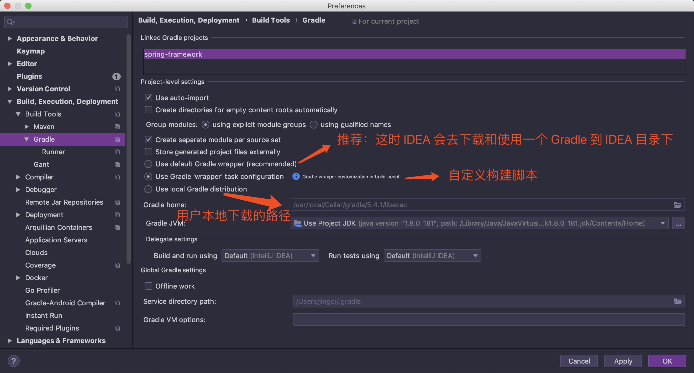
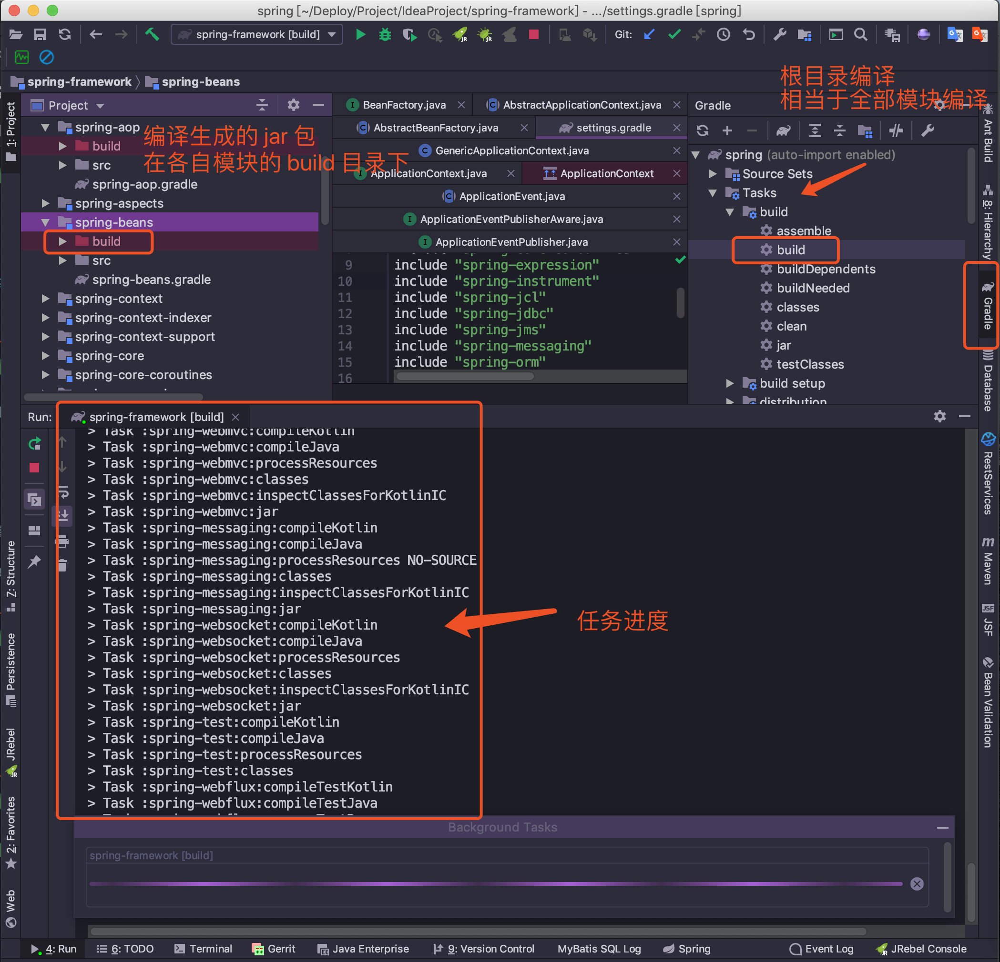

-   [代码环境准备](#代码环境准备)
-   [设置 Gradle 路径](#设置-gradle-路径)
-   [下载依赖和编译](#下载依赖和编译)
-   [Spring 源码分析大致流程](#spring-源码分析大致流程)
-   [遇到的坑](#遇到的坑)
    -   [无法识别 Gradle 项目](#无法识别-gradle-项目)
    -   [gradle 版本和 Idea 版本不匹配](#gradle-版本和-idea-版本不匹配)
-   [参考资料](#参考资料)

一起来准备阅读 `Spring` 源码

<!--more-->

------------------------------------------------------------------------

代码环境准备
------------

-   JDK 8

-   Gradle

-   编译工具（常用 IDEA）

-   [源码地址](https://github.com/spring-projects/spring-framework/tree/v5.2.0.M2)

下载源码到本地


    $ git clone git@github.com:spring-projects/spring-framework.git 

不建议下载 `master` 分支的代码，因为有些小问题一直在修复，所以我下载的是
`v2.3.0.M2` 版本的 `releases` 代码。

因为我也是一边看书，一边做笔记，下载了源码，写的 `demo`
代码和注释都在里面，小伙伴们可以下载我上传的代码，亲测可运行\~

[码云 Gitee 地址](https://gitee.com/vip-augus/spring-analysis-note.git)

[Github 地址](https://github.com/Vip-Augus/spring-analysis-note)

------------------------------------------------------------------------

设置 Gradle 路径
----------------

有两种选择：

-   选择 IDEA 工具中默认（Recommend）

-   选择用户自己下载的 Gradle （我本地通过 brew 下载）

最后设定：



------------------------------------------------------------------------

下载依赖和编译
--------------

导入项目后，识别到 `Gradle` 依赖后，首先会从中央库下载相关的依赖。

下载完依赖后，进行代码编译，通过图形界面，选择根路径下的 `build` 任务。



最后编译生成 `class` 等文件路径，在各自模块的 `build` 目录。

------------------------------------------------------------------------

Spring 源码分析大致流程
-----------------------

-   介绍概念

-   查看类的集成体系

-   简单 demo

-   查看源码

-   分析流程

------------------------------------------------------------------------

遇到的坑
--------

### 无法识别 Gradle 项目

这个问题是通过 `version controll` 克隆代码后，打开新项目时一直提示


    Could not resolve symbol "XXX" 

    # 还有右上角弹出的 

    Try resolve again 

一开始不知道是哪个导入流程错误，通过查询资料，发现将代码 `clone`
到本地后，通过下面步骤操作，项目就能正常识别和下载依赖了：

-   点击 `IDEA` 的 `File -> Open`，选择项目的 `build.gradle`

-   按照提示设定 `Gradle`

-   下载依赖和编译

------------------------------------------------------------------------

### gradle 版本和 Idea 版本不匹配

本地的 `gradle` 版本号是 5.4.1

``` {.linux}

$ gradle -v 

Welcome to Gradle 5.4.1! 
```

`IDEA` 工具的版本是 2018.2，查了资料，有可能是高版本 `gradle` 需要新版本
`IDEA`，于是我就去下载新版工具。

(顺便安利一下[新版本的主题 Dark Purple
Theme](https://plugins.jetbrains.com/plugin/12100-dark-purple-theme))


更新 `IDEA` 后，在构建项目时，在最后一步卡住了，提示：


    java.lang.AbstractMethodError: org.jetbrains.plugins.gradle.tooling.util.ModuleComponentIdentifierImpl.getModuleIdentifier()Lorg/gradle/api/artifacts/ModuleIdentifier; 

查看资料，大概是 `gradle` 升级后，出现了 `jar`
版本兼容的问题，于是按照提示，修改了编译方式（**看上面 gradle
选择方式图片**），修改完成后，能够正常构建项目。

------------------------------------------------------------------------

参考资料
--------

1、 [解决IDEA在导入Gradle项目之后报Could not resolve symbol
"XXX"错误](https://www.jianshu.com/p/f1fb53a494ab)

2、[gradle版本引起编译报错问题：Cause:
org.jetbrains.plugins.gradle.tooling.util.ModuleComponentIdentifierImpl.getM](https://blog.csdn.net/leftfist/article/details/88617463)

3、[Gradle 5 IntelJ
java.lang.AbstractMethodError](https://www.jianshu.com/p/f9951d5506fc)
