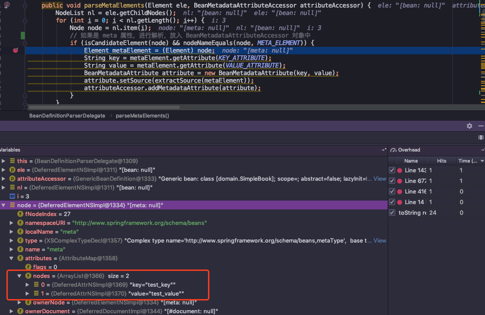
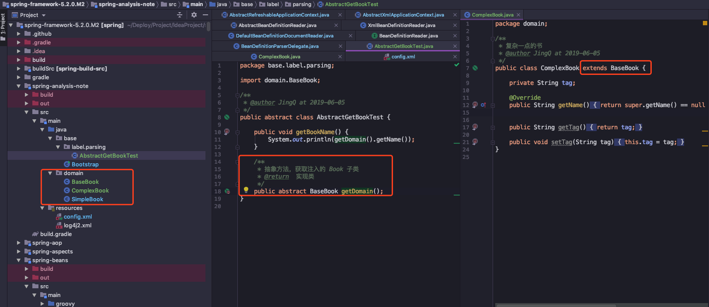

-   [Bean 标签解析入口](#bean-标签解析入口)
    -   [创建 GenericBeanDefinition](#创建-genericbeandefinition)
    -   [解析 meta 属性](#解析-meta-属性)
    -   [解析 lookup-method 属性](#解析-lookup-method-属性)
    -   [解析 constructor-arg 属性](#解析-constructor-arg-属性)
    -   [解析 qualifer 属性](#解析-qualifer-属性)
-   [参考资料](#参考资料)

从上一篇笔记可以看出，在容器注册 `bean` 信息的时候，做了很多解析操作，而
`xml` 文件中包含了很多标签、属性，例如 `bean` 、 `import` 标签， `meta`
、`look-up` 和 `replace`等子元素属性。

上一篇主要介绍 `Spring` 容器的基础结构，没有细说这些标签是如何解析的。

所以本篇是来进行补坑的，介绍这些标签在代码中是如何识别和解析的\~

本篇笔记的结构大致如下：

-   介绍概念
-   展示 `demo` 代码，如何使用
-   结合源码分析
-   聊聊天和思考

再次说下，下载项目看完整注释，跟着源码一起分析\~

[spring-analysis-note 码云 Gitee 地址](https://gitee.com/vip-augus/spring-analysis-note.git)

[spring-analysis-note Github 地址](https://github.com/Vip-Augus/spring-analysis-note)

------------------------------------------------------------------------

在 `Spring` 中，标签有两种，**默认和自定义**：

-   **默认标签** 这是我们最常使用到的标签类型了，像我们一开始写的
    `<bean id="book" class="domain.SimpleBook"/>`，它属于默认标签，除了这个标签外，还有其它四种标签（`import`、
    `alias`、 `bean`、 `beans`）

-   **自定义标签**
    自定义标签的用途，是为了给系统提供可配置化支持，例如事务标签
    `<tx:annotation-driven />`，它是 `Spring` 的自定义标签，通过继承
    `NamespaceHandler` 来完成自定义命名空间的解析。

先看源码是如何区分这两者：

``` java
protected void parseBeanDefinitions(Element root, BeanDefinitionParserDelegate delegate) {
    if (delegate.isDefaultNamespace(root)) {
        // 注释 1.12 遍历 doc 中的节点列表
        NodeList nl = root.getChildNodes();
        for (int i = 0; i < nl.getLength(); i++) {
            Node node = nl.item(i);
            if (node instanceof Element) {
                Element ele = (Element) node;
                if (delegate.isDefaultNamespace(ele)) {
                    // 注释 1.13 识别出默认标签的 bean 注册
                    // 根据元素名称，调用不同的加载方法，注册 bean
                    parseDefaultElement(ele, delegate);
                }
                else {
                    delegate.parseCustomElement(ele);
                }
            }
        }
    }
    else {
        delegate.parseCustomElement(root);
    }
}
```

可以看到，在代码中，关键方法是 `delegate.isDefaultNamespace(ele)`
进行判断，识别扫描到的元素属于哪种标签。

找到命名空间 `NamespaceURI` 变量，如果是
`http://www.springframework.org/schema/beans`，表示它是默认标签，然后进行默认标签的元素解析，否者使用自定义标签解析。

**本篇笔记主要记录的是默认标签的解析，下来开始正式介绍\~**

Bean 标签解析入口
-----------------

定位到上面第三个方法 `processBeanDefinition(ele, delegate)`：

``` java
protected void processBeanDefinition(Element ele, BeanDefinitionParserDelegate delegate) {
        // 注释 1.15 解析 bean 名称的元素
        BeanDefinitionHolder bdHolder = delegate.parseBeanDefinitionElement(ele);
        if (bdHolder != null) {
            bdHolder = delegate.decorateBeanDefinitionIfRequired(ele, bdHolder);
            try {
                // Register the final decorated instance. （注释 1.16 注册最后修饰后的实例）
                BeanDefinitionReaderUtils.registerBeanDefinition(bdHolder, getReaderContext().getRegistry());
            }
            catch (BeanDefinitionStoreException ex) {
                getReaderContext().error("Failed to register bean definition with name '" +
                        bdHolder.getBeanName() + "'", ele, ex);
            }
            // Send registration event. 通知相关的监听器，表示这个 bean 已经加载完成
            getReaderContext().fireComponentRegistered(new BeanComponentDefinition(bdHolder));
        }
    }
```

上一篇笔记只是简单描述这个方法的功能：将 `xml` 中配置的属性对应到
`document` 对象中，然后进行注册，下面来完整描述这个方法的处理流程：

-   **创建实例 `bdHolder`**：首先委托 `BeanDefinitionParserDelegate`
    类的 `parseBeanDefinitionElement`
    方法进行元素解析，经过解析后，`bdHolder`
    实例已经包含刚才我们在配置文件中设定的各种属性，例如 `class`、
    `id`、 `name`、 `alias`等属性。
-   **对实例 `bdHolder`
    进行装饰**：在这个步骤中，其实是扫描默认标签下的自定义标签，对这些自定义标签进行元素解析，设定自定义属性。
-   **注册 `bdHolder` 信息**：解析完成了，需要往容器的
    `beanDefinitionMap` 注册表注册 `bean` 信息，注册操作委托给了
    `BeanDefinitionReaderUtils.registerBeanDefinition`，通过工具类完成信息注册。
-   **发送通知事件**：通知相关监听器，表示这个 `bean` 已经加载完成

看到这里，同学们应该能看出，`Spring`
源码的接口和方法设计都很简洁，上层接口描述了该方法要做的事情，然后分解成多个小方法，在小方法中进行逻辑处理，方法可以被复用。

所以看源码除了能了解到框架的实现逻辑，更好的去使用和定位问题，还能够学习到大佬们写代码时的设计模式，融入自己的工作或者学习中\~

------------------------------------------------------------------------

### 创建 GenericBeanDefinition

关于 `GenericBeanDefinition`
的继承体系上一篇已经讲过了，所以这里再简单解释一下这个方法的用途：

> createBeanDefinition(className, parent);

从方法名字就能看出，它的用途是创建一个 `beanDefinition`
，用于承载属性的实例。

在最后一步实例化 `GenericBeanDefinition`
时，还会判断类加载器是非存在。如果存在的话，使用类加载器所在的 `jvm`
来加载类对象，否则只是简单记录一下 `className`。

### 解析 meta 属性

先讲下 `meta` 属性的使用（汗，在没了解前，基本没使用该属性=-=）

``` xml
<bean id="book" class="domain.SimpleBook">
    <!--    元标签 -->
    <meta key="test_key" value="test_value"/>
</bean>
```

这个元属性不会体现在对象的属性中，而是一个额外的声明，在
`parseMetaElements(ele, bd);` 方法中进行获取，具体实现是 `element`
对象的 `getAttribute(key)`，将设定的元属性放入
`BeanMetadataAttributeAccessor` 对象中



因为代码比较简单，所以通过图片进行说明：

最终属性值是以 `key-value` 形式保存在链表中
`Map<String, Object> attributes`，之后使用只需要根据 `key` 值就能获取到
`value` 。想到之后在代码设计上，为了扩展性，也可以进行 `key-value`
形式存储和使用。

------------------------------------------------------------------------

### 解析 lookup-method 属性

这个属性也是不常用，引用书中的描述

> 通常将它成为获取器注入。获取器注入是一个特殊的方法注入，它是把一个方法声明为返回某种类型的
> `bean`，但实际要返回的 `bean`
> 是在配置文件里面配置的，次方法可用在设计有些可插拔的功能上，解除程序依赖。

代码写的有点多，我贴张图片，介绍一下关键信息:



首先我定义了一个基础对象 `BaseBook` 和两个继承对象 `SimpleBook`、
`ComplexBook`，还新建一个抽象类，并且设定了一个方法
`getDomain`，返回类型是基础对象。

我觉得是因为抽象类无法被实例化，必须要有具体实现类，所以在这个时候，`Spring`
容器要加载 `AbstractGetBookTest` 对象，可以用到 `<lookup method>`
属性，通过注入特定实现类，来完成类的加载。

> config.xml

``` xml
<?xml version="1.0" encoding="UTF-8"?>
<beans xmlns="http://www.springframework.org/schema/beans"
       xmlns:xsi="http://www.w3.org/2001/XMLSchema-instance"
       xsi:schemaLocation="http://www.springframework.org/schema/beans http://www.springframework.org/schema/beans/spring-beans.xsd">


    <bean id="getBookTest" class="base.label.parsing.AbstractGetBookTest">
        <!-- 注释 2.6 loop-up 属性🌰 -->
        <!-- 获取器注入 name 表示方法，bean 表示要注入的类-->
        <lookup-method name="getDomain" bean="complexBook"/>
    </bean>

    <bean id="book" class="domain.SimpleBook">
        <!-- 元标签    -->
        <meta key="test_key" value="test_value"/>
    </bean>

    <bean id="complexBook" class="domain.ComplexBook"/>

</beans>
```

`Spring` 会对 `bean` 指定的 `class`做动态代理，识别中 `name`
属性所指定的方法，返回 `bean` 属性指定的 `bean` 实例对象。

既然叫做获取器注入，我们可以将 `bean="complexBook"` 替换一下，换成
`bean="simpleBook"`，这样注入的类就变成了 `SimpleBook`
对象了，这样只需要修改配置文件就能更换类的注入\~

然后代码对 `<lookup-method>`
解析跟元属性的解析很相近，所以阅读起来也很容易噢

------------------------------------------------------------------------

### 解析 constructor-arg 属性

解析构造函数这个属性是很常用的，但同时它的解析也很复杂，下面贴一个实例配置：

``` xml
<bean id="testConstructorArg" class="base.label.parsing.TestConstructorArg">
    <!-- 这里展示一个构造函数的情况下，如果有两个以上，解析会更复杂 -->
    <constructor-arg index="0" value="JingQ"/>
    <constructor-arg index="1" value="23"/>
</bean>
```

这个配置所实现的功能很简单，为 `TestConstructorArg`
自动寻找对应的构造函数，然后根据下标 `index` 为对应的属性注入
`value`，实现构造函数。

具体解析在这个方法中：

``` java
/**
 * 注释 2.8 解析 构造函数 子元素
 * Parse constructor-arg sub-elements of the given bean element.
 */
public void parseConstructorArgElements(Element beanEle, BeanDefinition bd) {
    NodeList nl = beanEle.getChildNodes();
    for (int i = 0; i < nl.getLength(); i++) {
        Node node = nl.item(i);
        if (isCandidateElement(node) && nodeNameEquals(node, CONSTRUCTOR_ARG_ELEMENT)) {
            // 循环解析 constructor-arg 属性
            parseConstructorArgElement((Element) node, bd);
        }
    }
}
```

代码太多也不贴出来啦，感兴趣的同学定位到我写注释的地方详细看下吧\~

下面来梳理下解析构造函数代码的流程：

① 配置中指定了 `index` 属性

-   解析 `constructor-arg` 的子元素
-   使用 `ConstructorArgumentValues.ValueHolder(value)`
    类型来封装解析出来的元素（包含`type` `name` `index` 属性）
-   `addIndexedArgumentValue` 方法，将解析后的 `value` 添加到当前
    `BeanDefinition` 的 `ConstructorArgumentValues` 的
    `indexedArgumentValues` 属性中

① 配置中没有指定了 `index` 属性

-   解析 `constructor-arg` 的子元素
-   使用 `ConstructorArgumentValues.ValueHolder(value)`
    类型来封装解析出来的元素（包含`type` `name` `index` 属性）
-   `addGenericArgumentValue` 方法，将解析后的 `value` 添加到当前
    `BeanDefinition` 的 `ConstructorArgumentValues` 的
    `genericArgumentValues` 属性中

这两个流程区别点在于，最后解析到的属性信息保存的位置不同，指定下标情况下，保存到
`indexedArgumentValues` 属性，没有指定下标情况下，将会保存到
`genericArgumentValues`。

可以看到，这两段代码处理上，第一步和第二部其实是一样的逻辑，存在重复代码的情况，我刚学习和工作时，为了求快，也有很多这种重复类型的代码。

在慢慢学习更多知识和设计模式后，回头看之前写的代码，都有种删掉重写的冲动，所以如果如果在一开始写的时候，就**抽出相同处理代码的逻辑，然后进行代码复用，减少代码重复率，让代码更好看一些，这样就以后就不用被别人和自己吐槽了Σ(oﾟдﾟoﾉ)**

`ref` `value`
属性的处理比较简单，所以大家看代码就能了解它是如何解析的，比较难的是子元素处理，例如下面的例子：

``` xml
<constructor-arg>
    <map>
        <entry key="key" value="value" />
    </map>
</constructor-arg>
```

具体解析子元素的方法是：`org.springframework.beans.factory.xml.BeanDefinitionParserDelegate#parsePropertySubElement(org.w3c.dom.Element, org.springframework.beans.factory.config.BeanDefinition, java.lang.String)`

这个方法主要对各种子元素进行解析，包括 `idref` `value` `array` `set`
`map` 等等子元素的机械，这里不细说，同学们感兴趣继续去跟踪吧\~

------------------------------------------------------------------------

### 解析 qualifer 属性

大家更熟悉的应该是 `@qualifer` 标签吧，它跟 `qualifer` 属性的用途一样。

在使用 `Spring` 框架进行类注入的时候，匹配的候选 `bean`
数目必须有且只有一个，如果找不到一个匹配的 `bean` 时，容器就会抛出
`BeanCreationException` 异常。

例如我们定义了一个抽象类 `AbstractBook`，有两个具体实现类 `Book1` 和
`Book2`，如果使用代码：

``` java
@Autowired
private AbstractBook book;
```

这样运行时就会抛出刚才说的错误异常，我们有两种方式来消除歧义：

① 在配置文件中设定 `quailfer`

通过 `qualifier` 指定注入 `bean` 的名称

``` xml
<bean id="testBean" class="base.TestBean">
    <qualifer type="org.Springframeword.beans.factory.annotation.Quailfier" value="book1"/>
</bean>
```

② 使用 `@Qualifier("beanNeame")`

``` java
@Qualifier("book1")
private AbstractBook book;
```

同样的，代码的解析过程跟前面的套路相近，留给同学们自己去分析吧\~

参考资料
--------

1.  Spring 源码深度解析 / 郝佳编著. -- 北京 : 人民邮电出版社
