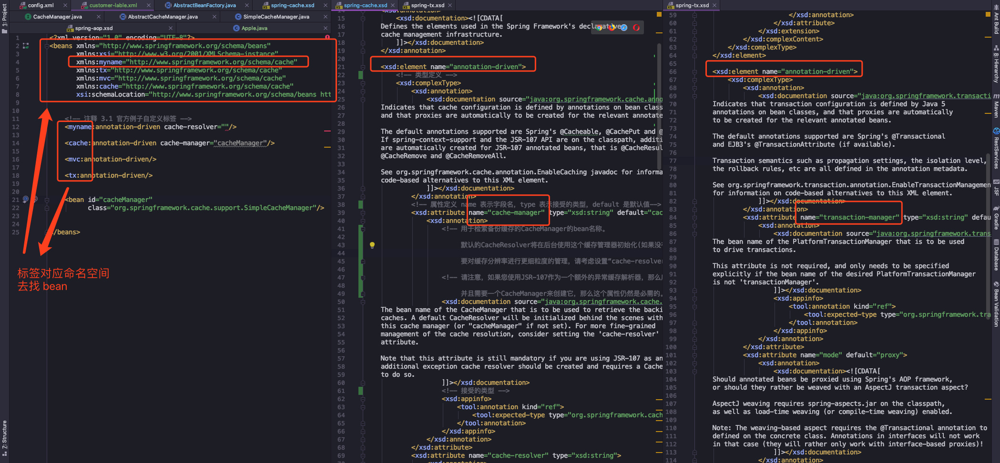

<!-- START doctoc generated TOC please keep comment here to allow auto update -->
<!-- DON'T EDIT THIS SECTION, INSTEAD RE-RUN doctoc TO UPDATE -->
**Table of Contents**  *generated with [DocToc](https://github.com/thlorenz/doctoc)*

- [官方例子](#%E5%AE%98%E6%96%B9%E4%BE%8B%E5%AD%90)
- [自定义标签使用](#%E8%87%AA%E5%AE%9A%E4%B9%89%E6%A0%87%E7%AD%BE%E4%BD%BF%E7%94%A8)
  - [定义普通的 POJO 组件](#%E5%AE%9A%E4%B9%89%E6%99%AE%E9%80%9A%E7%9A%84-pojo-%E7%BB%84%E4%BB%B6)
  - [定义 `XSD` 描述文件](#%E5%AE%9A%E4%B9%89-xsd-%E6%8F%8F%E8%BF%B0%E6%96%87%E4%BB%B6)
  - [定义组件解析器](#%E5%AE%9A%E4%B9%89%E7%BB%84%E4%BB%B6%E8%A7%A3%E6%9E%90%E5%99%A8)
  - [创建处理类的注册器](#%E5%88%9B%E5%BB%BA%E5%A4%84%E7%90%86%E7%B1%BB%E7%9A%84%E6%B3%A8%E5%86%8C%E5%99%A8)
  - [编写 `spring.hanlders` 和 `spring.schemas` 文件](#%E7%BC%96%E5%86%99-springhanlders-%E5%92%8C-springschemas-%E6%96%87%E4%BB%B6)
  - [使用 Demo](#%E4%BD%BF%E7%94%A8-demo)
    - [配置文件](#%E9%85%8D%E7%BD%AE%E6%96%87%E4%BB%B6)
    - [测试代码](#%E6%B5%8B%E8%AF%95%E4%BB%A3%E7%A0%81)
  - [小结](#%E5%B0%8F%E7%BB%93)
- [自定义标签解析](#%E8%87%AA%E5%AE%9A%E4%B9%89%E6%A0%87%E7%AD%BE%E8%A7%A3%E6%9E%90)
  - [① 获取标签的命名空间](#%E2%91%A0-%E8%8E%B7%E5%8F%96%E6%A0%87%E7%AD%BE%E7%9A%84%E5%91%BD%E5%90%8D%E7%A9%BA%E9%97%B4)
  - [② 根据命名空间找到对应的 NamespaceHandler](#%E2%91%A1-%E6%A0%B9%E6%8D%AE%E5%91%BD%E5%90%8D%E7%A9%BA%E9%97%B4%E6%89%BE%E5%88%B0%E5%AF%B9%E5%BA%94%E7%9A%84-namespacehandler)
  - [③ 调用自定义的 NamespaceHandler 进行解析](#%E2%91%A2-%E8%B0%83%E7%94%A8%E8%87%AA%E5%AE%9A%E4%B9%89%E7%9A%84-namespacehandler-%E8%BF%9B%E8%A1%8C%E8%A7%A3%E6%9E%90)
- [总结](#%E6%80%BB%E7%BB%93)
- [参考资料](#%E5%8F%82%E8%80%83%E8%B5%84%E6%96%99)

<!-- END doctoc generated TOC please keep comment here to allow auto update -->


---

又来填坑啦，上一篇讲完默认标签的解析，这篇笔记记录一下自定义标签的解析吧。

我们知道，`Spring` 源码的核心模块是 `Spring-core` 和 `Spring-beans`，在此基础上衍生出其他模块，例如 `context`、 `cache`、 `tx` 等模块，都是根据这两个基础模块进行扩展的。

聪明如你，应该想到我们代码中常用的缓存注解 `@Cacheable`、事务注解 `@Transaction`，还有阿里巴巴的 `RPC` 中间件 `Dubbo`，在配置文件中通过 `<dubbo:service/>` 或者 `<dubbo:reference/>` 进行服务注册和订阅，这些都都属于 `Spring` 的自定义标签的实现，通过自定义标签可以实现更加强大的功能！

作为一个有追求的程序员，当然不能满足于框架自带默认的标签，为了扩展性和配置化要求，这时候就需要学习自定义标签和使用自定义标签~

---
## 官方例子

先来看一张源码图片（红框框圈着是重点哟）



刚才说了缓存和事务，那就拿这两个举例，还有一个标签 `<myname:>`（这个我也不太清楚，网上查的资料也不多，所以按照我的理解大家跟说下）

首先我们看到，`<tx>` `<cache>` `<mvc>` 和 `<myname>` 都是自定义标签，左一是配置文件，进行 `bean` 的定义，顶部的 `xmlns` 是命名空间，表示标签所属的定义文件，像事务、缓存、`MVC` 的命名空间都是固定的。

**而 `myname` 相当于万金油，既可以定义为事务，又可以定义为缓存，只要我们在命名空间中进行相应的定义就能正确的识别。这个就是我们待会要使用到的自定义标签，通过命名空间定位到我们想要的处理逻辑。**

中间的是缓存定义的 `xsd` 文件，通过 `<xsd:element name="annotation-driven">` 定义元素，`<xsd:complexType>` 区间内定义属性列表，`<xsd:attribute>` 定义单个属性，详细分析可以看下注释~

右边的是事务定义的 `xsd` 文件，大体内容的跟中间一样，虽然元素名称 `<annotation-driven>` 有相同的，但是下面的属性定义是有所区别的。

所以我们对自定义注解有个大概的了解，`xsd` 描述文件是个其中一个关键，在配置文件顶部的命名空间是标签进行解析时，进行定位的配置，当然还有处理器，下面使用时进行介绍。

**不知道理解的对不对，如果有误的话请大佬们指出，我会进行修改的！**

---

## 自定义标签使用

`Spring` 提供了可扩展的 `Schema` 的支持，扩展 `Spring` 自定义标签配置需要以下几个步骤：

- 创建一个需要扩展的组件
- 定义一个 `XSD` 描述文件
- 创建一个文件，实现 `BeanDefinitionParse` 接口，用来解析 `XSD` 文件中的定义和组件定义。
- 创建一个 `Handler` 文件，扩展自 `NamespaceHandlerSupport`，将组件注册到 `Spring` 容器
- 编写 `Spring.handlers` 和 `Spring.schemas` 文件

刚开始看到这些流程时，我还是有点慌的，毕竟从一个使用默认标签的萌新小白，突然要我自己定义，感觉到很新鲜，所以请各位跟着下面的流程一起来看吧~

---
### 定义普通的 POJO 组件

这个没啥好说的，就是一个普通的类：

```java
public class Product {

	private Integer productId;

	private String unit;

	private String name;
}
```

---
### 定义 `XSD` 描述文件

> custom-product.xsd

```xml
<xsd:schema targetNamespace="http://vip-augus.github.io/schema/product"
			xmlns:xsd="http://www.w3.org/2001/XMLSchema"
			elementFormDefault="qualified">
	<!-- 注释 3.4 自定义元素  -->
	<xsd:element name="product">
		<xsd:complexType>
            <!-- 这个是类注册时的名字，组件中请不要占用该字段~ -->
			<xsd:attribute name="id" type="xsd:string"/>
			<!-- 属性定义列表，名字和类型 -->
			<xsd:attribute name="productId" type="xsd:integer"/>
			<xsd:attribute name="unit" type="xsd:string"/>
			<xsd:attribute name="name" type="xsd:string"/>
		</xsd:complexType>
	</xsd:element>
</xsd:schema>
```

我在上面的描述文件中，定义了一个新的 `targetNamespace`，同时定义了一个 叫 `product` 的新元素，并且将组件中的属性都列在 `<xsd:attribute>` 中。`XSD` 文件是 `XML` `DTD` 的替代者，具体就不多深入，感兴趣的同学可以继续深入了解。

---
### 定义组件解析器

> base.label.custom.ProductBeanDefinitionParser

```java
public class ProductBeanDefinitionParser extends AbstractSingleBeanDefinitionParser {

	@Override
	protected Class getBeanClass(Element element) {
		// 返回对应的类型
		return Product.class;
	}

	// 从 element 中解析并提取对应的元素
	@Override
	protected void doParse(Element element, BeanDefinitionBuilder builder) {

		String productId = element.getAttribute("productId");
		String productName = element.getAttribute("name");
		String productUnit = element.getAttribute("unit");
		// 将提取到的数据放入 BeanDefinitionBuilder 中，等到完成所有 bean 的解析之后统一注册到 beanFactory 中
		if (productId != null) {
			// element.getAttribute("") 方法取出来的都是 string 类型，使用时记得手动转换
			builder.addPropertyValue("productId", Integer.valueOf(productId));
		}
		if (StringUtils.hasText(productName)) {
			builder.addPropertyValue("name", productName);
		}
		if (StringUtils.hasText(productUnit)) {
			builder.addPropertyValue("unit", productUnit);
		}
	}
}
```

关键点在于，我们的解析器是继承于 `AbstractSingleBeanDefinitionParser`，重载了两个方法，详细用途请看注释~

---
### 创建处理类的注册器

> base.label.custom.ProductBeanHandler

```java
public class ProductBeanHandler extends NamespaceHandlerSupport {

	@Override
	public void init() {
		// 将组件解析器进行注册到 `Spring` 容器
		registerBeanDefinitionParser("product", new ProductBeanDefinitionParser());
	}
}
```

这个类也比较简单，关键是继承了 `NamespaceHandlerSupport`，对他进行了扩展，在该类初始化时将组件解析器进行注册到 `Spring` 容器中。

---
### 编写 `spring.hanlders` 和 `spring.schemas` 文件

我将文件位置放在 `resources` -> `META-INF` 目录下：

> spring.handlers
```
http\://vip-augus.github.io/schema/product=base.label.custom.ProductBeanHandler
```

> spring.schemas
```
http\://vip-augus.github.io/schema/product.xsd=custom/custom-product.xsd
```

到了这一步，自定义的配置就结束了。下面是如何使用

---
### 使用 Demo

#### 配置文件

```xml
<?xml version="1.0" encoding="UTF-8"?>
<!-- 注意 schema 位置，最后两行是我新增的自定义配置  -->
<beans xmlns="http://www.springframework.org/schema/beans"
	   xmlns:xsi="http://www.w3.org/2001/XMLSchema-instance"
	   xmlns:myname="http://vip-augus.github.io/schema/product"
	   xsi:schemaLocation="http://www.springframework.org/schema/beans
	   http://vip-augus.github.io/schema/product
	   http://vip-augus.github.io/schema/product.xsd">

	<!-- 自定义标签使用 -->
	<myname:product id="product" productId="1" name="Apple" unit="台"/>
</beans>
```

#### 测试代码

```java
public class ProductBootstrap {
	public static void main(String[] args) {
		ApplicationContext context = new ClassPathXmlApplicationContext("custom/custom-label.xml");
		Product product = (Product) context.getBean("product");
		// 输出 Product{, productId ='1', unit='台', name='Apple'}
		System.out.println(product.toString());
	}
}
```

---
### 小结

现在来回顾一下，`Spring` 遇到自定义标签是，加载自定义的大致流程：

- **定位 `spring.hanlders` 和 `spring.schemas`**：在两个文件中找到对应的 `handler` 和 `XSD`，默认位置在 `resources` -> `META-INF`。
- **`Handler` 注册 `Parser`**：扩展了 `NamespaceHandlerSupport` 的类，在初始化注册解析器
- **运行解析器  `Parser`**：扩展了 `AbstractSingleBeanDefinitionParser`，通过重载方法进行属性解析，完成解析。

上面已经将自定义注解的使用讲了，接下来讲的是源码中如何对自定义标签进行解析。

---
## 自定义标签解析

在上一篇笔记中，讲了如何解析默认标签，`Spring` 判断一个标签不是默认标签的话，就会将这个标签解析交给自定义标签的解析方法

直接定位到解析自定义标签的方法吧：

> org.springframework.beans.factory.xml.BeanDefinitionParserDelegate#parseCustomElement(org.w3c.dom.Element, org.springframework.beans.factory.config.BeanDefinition)

```java
public BeanDefinition parseCustomElement(Element ele, @Nullable BeanDefinition containingBd) {
		// 注释 3.8 ① 找到命名空间
		String namespaceUri = getNamespaceURI(ele);
		// ② 根据命名空间找到对应的 NamespaceHandler
		NamespaceHandler handler = this.readerContext.getNamespaceHandlerResolver().resolve(namespaceUri);
		// ③ 调用自定义的 NamespaceHandler 进行解析
		return handler.parse(ele, new ParserContext(this.readerContext, this, containingBd));
	}
```

看着流程是不是觉得很熟悉，我们刚才在自定义标签使用时，定义的文件顺序是一样的，下面来讲下这三个方法，具体代码不会贴太多，主要记录一些关键方法和流程，详细代码和流程请下载我上传的工程~

---
### ① 获取标签的命名空间

```java
public String getNamespaceURI(Node node) {
		return node.getNamespaceURI();
	}
```

这个方法具体做的事情很简单，而且传参的类型 `org.w3c.dom.Node`，已经提供了现成的方法，所以我们只需要调用即可。

---
### ② 根据命名空间找到对应的 NamespaceHandler

具体解析方法这这个类中：

> org.springframework.beans.factory.xml.DefaultNamespaceHandlerResolver#resolve

```java
public NamespaceHandler resolve(String namespaceUri) {
	// 注释 3.9 获取所有已经配置的 handler 映射
	Map<String, Object> handlerMappings = getHandlerMappings();
	// 从 map 中取出命名空间对应的 NamespaceHandler 的 className
	// 这个映射 map 值，没有的话，会进行实例化类，然后放入 map，等下次同样命名空间进来就能直接使用了
	Object handlerOrClassName = handlerMappings.get(namespaceUri);
	if (handlerOrClassName == null) {
		return null;
	}
	else if (handlerOrClassName instanceof NamespaceHandler) {
		return (NamespaceHandler) handlerOrClassName;
	}
	else {
		String className = (String) handlerOrClassName;
		
		Class<?> handlerClass = ClassUtils.forName(className, this.classLoader);
		if (!NamespaceHandler.class.isAssignableFrom(handlerClass)) {
			throw new FatalBeanException("Class [" + className + "] for namespace [" + namespaceUri +
					"] does not implement the [" + NamespaceHandler.class.getName() + "] interface");
		}
		// 实例化类
		NamespaceHandler namespaceHandler = (NamespaceHandler) BeanUtils.instantiateClass(handlerClass);
		// 调用 handler 的 init() 方法
		namespaceHandler.init();
		// 放入 handler 映射中
		handlerMappings.put(namespaceUri, namespaceHandler);
		return namespaceHandler;
	}
}
```

找对应的 `NamespaceHandler`，关键方法在于 `getHandlerMappings()`：

```java
private Map<String, Object> getHandlerMappings() {
	Map<String, Object> handlerMappings = this.handlerMappings;
	// 如果没有缓存，进行缓存加载，公共变量，加锁进行操作，细节好评👍
	if (handlerMappings == null) {
		synchronized (this) {
			handlerMappings = this.handlerMappings;
			if (handlerMappings == null) {
				Properties mappings =
						PropertiesLoaderUtils.loadAllProperties(this.handlerMappingsLocation, this.classLoader);
				handlerMappings = new ConcurrentHashMap<>(mappings.size());
				CollectionUtils.mergePropertiesIntoMap(mappings, handlerMappings);
				this.handlerMappings = handlerMappings;
			}
		}
	}
	return handlerMappings;
}
```

所以我们能看到，找 `Handler` 时，使用的策略是延迟加载，在 `map` 缓存中找到了直接返回，没找到对应的 `Handler`，将处理器实例化，执行 `init()` 方法，接着将 `Handler` 放入 `map` 缓存中，等待下一个使用。

---
### ③ 调用自定义的 NamespaceHandler 进行解析

回忆一下，我们在自定义标签解析的时候，是没有重载 `parse()` 方法，所以定位进去，看到实际调用方法是这两行：

> org.springframework.beans.factory.xml.NamespaceHandlerSupport#parse

```java
public BeanDefinition parse(Element element, ParserContext parserContext) {
		// 寻找解析器并进行解析操作
		BeanDefinitionParser parser = findParserForElement(element, parserContext);
		// 真正解析调用调用的方法
		return (parser != null ? parser.parse(element, parserContext) : null);
	}
```

第一步获取解析器，就是我们之前在 `init()` 方法中，注册到 `Spring` 容器的解析器。

第二步才是解析器进行解析的方法，我们的解析器扩展的是 `AbstractSingleBeanDefinitionParser`，**所以实际是调用了我们解析器父类的父类** `AbstractBeanDefinitionParser` 的 `parse` 方法：

> org.springframework.beans.factory.xml.AbstractBeanDefinitionParser#parse

```java
public final BeanDefinition parse(Element element, ParserContext parserContext) {
		// 注释 3.10 实际自定义标签解析器调用的方法，在 parseInternal 方法中，调用了我们重载的方法
		AbstractBeanDefinition definition = parseInternal(element, parserContext);
    ...
    return definition;
}
```

解析关键方法

> org.springframework.beans.factory.xml.AbstractSingleBeanDefinitionParser#parseInternal

```java
protected final AbstractBeanDefinition parseInternal(Element element, ParserContext parserContext) {
	BeanDefinitionBuilder builder = BeanDefinitionBuilder.genericBeanDefinition();
	String parentName = getParentName(element);
	if (parentName != null) {
		builder.getRawBeanDefinition().setParentName(parentName);
	}
	Class<?> beanClass = getBeanClass(element);
	if (beanClass != null) {
		builder.getRawBeanDefinition().setBeanClass(beanClass);
	}
	else {
		String beanClassName = getBeanClassName(element);
		if (beanClassName != null) {
			builder.getRawBeanDefinition().setBeanClassName(beanClassName);
		}
	}
	builder.getRawBeanDefinition().setSource(parserContext.extractSource(element));
	BeanDefinition containingBd = parserContext.getContainingBeanDefinition();
	if (containingBd != null) {
		// Inner bean definition must receive same scope as containing bean.
		builder.setScope(containingBd.getScope());
	}
	if (parserContext.isDefaultLazyInit()) {
		// Default-lazy-init applies to custom bean definitions as well.
		builder.setLazyInit(true);
	}
	// 注释 3.11 在这里调用了我们写的解析方法
	doParse(element, parserContext, builder);
	return builder.getBeanDefinition();
}
```

**这里我要倒着讲，在第二步解析时，不是直接调用了自定义的 `doParse` 方法，而是进行了一系列的数据准备，包括了 `beanClass`、 `class`、 `lazyInit` 等属性的准备。**

**第一步解析，在我省略的代码中，是将第二步解析后的结果进行包装，从 `AbstractBeanDefinition` 转换成 `BeanDefinitionHolder` ，然后进行注册。转换和注册流程在第一篇笔记已经介绍过了，不再赘述。**

到这里为止，我们自定义标签的解析就完成了~

---
## 总结

在我们自定义标签时，是不是感觉使用起来很简单，只需定义几个文件，然后在自定义解析器中写上业务处理逻辑，然后就能使用。

**在我们分析完整个解析流程，就能看到，`Spring` 在背后默默帮我们完成了很多事情，类似默认标签解析过程，根据命名空间找到对应的处理器，然后再找到解析器，在解析器里面调用我们个性化的处理逻辑。**

这两篇文章填了默认标签和自定义标签解析的坑，也完整的介绍了 `Spring` 将 `bean` 从配置中加载到内存中的全过程，下一篇开始**分析解析类的加载**~

**由于个人技术有限，如果有理解不到位或者错误的地方，请留下评论，我会根据朋友们的建议进行修正**

[spring-analysis-note 码云 Gitee 地址](https://gitee.com/vip-augus/spring-analysis-note.git)

[spring-analysis-note Github 地址](https://github.com/Vip-Augus/spring-analysis-note)

---
## 参考资料

1. [Spring自定义标签使用及原理](https://blog.csdn.net/zzg1229059735/article/details/82669955)

2. Spring 源码深度解析 / 郝佳编著. -- 北京 : 人民邮电出版社


