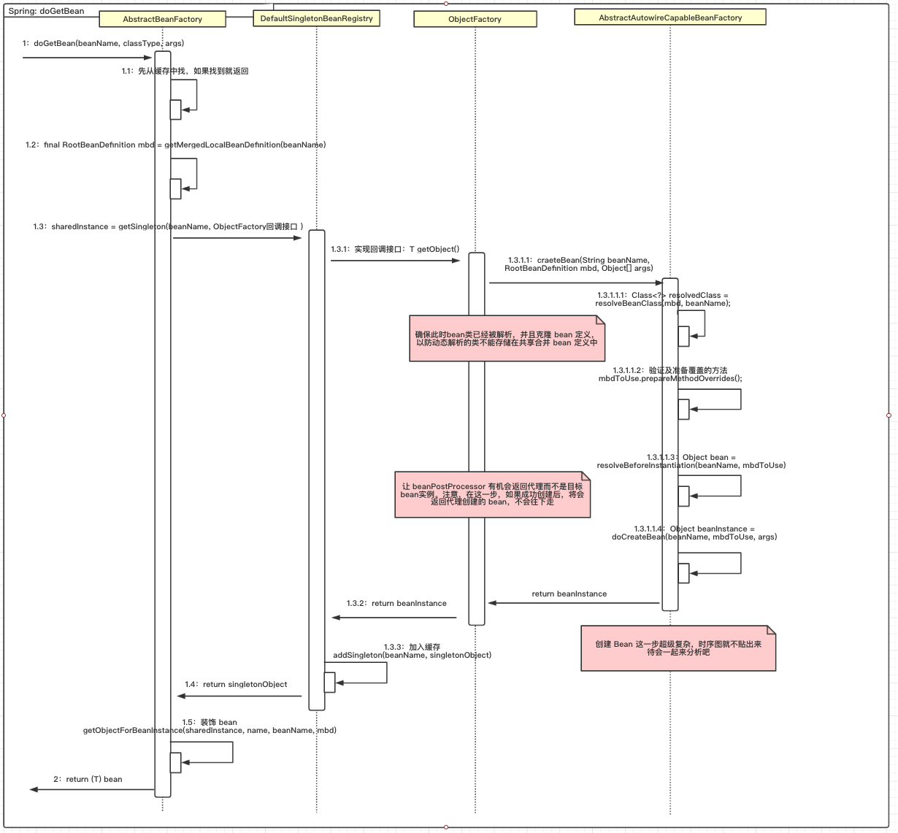
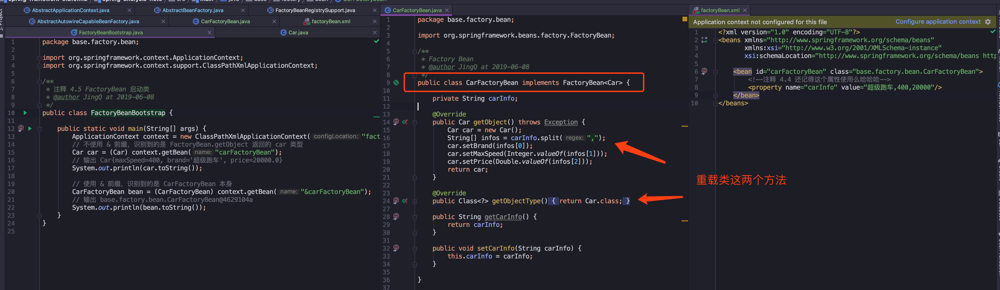
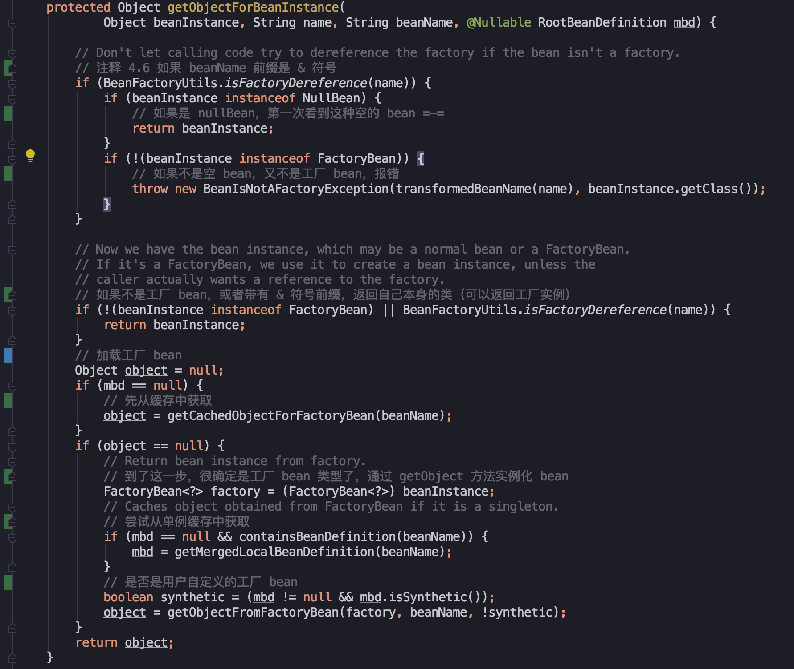

<!-- START doctoc generated TOC please keep comment here to allow auto update -->
<!-- DON'T EDIT THIS SECTION, INSTEAD RE-RUN doctoc TO UPDATE -->
**Table of Contents**  *generated with [DocToc](https://github.com/thlorenz/doctoc)*

- [前言](#%E5%89%8D%E8%A8%80)
- [时序图](#%E6%97%B6%E5%BA%8F%E5%9B%BE)
- [代码分析](#%E4%BB%A3%E7%A0%81%E5%88%86%E6%9E%90)
  - [FactoryBean 的使用](#factorybean-%E7%9A%84%E4%BD%BF%E7%94%A8)
  - [从缓存中获取单例 bean](#%E4%BB%8E%E7%BC%93%E5%AD%98%E4%B8%AD%E8%8E%B7%E5%8F%96%E5%8D%95%E4%BE%8B-bean)
  - [从 bean 的实例中获取对象](#%E4%BB%8E-bean-%E7%9A%84%E5%AE%9E%E4%BE%8B%E4%B8%AD%E8%8E%B7%E5%8F%96%E5%AF%B9%E8%B1%A1)
  - [获取单例](#%E8%8E%B7%E5%8F%96%E5%8D%95%E4%BE%8B)
  - [准备创建 `bean`](#%E5%87%86%E5%A4%87%E5%88%9B%E5%BB%BA-bean)
    - [处理 Override 属性](#%E5%A4%84%E7%90%86-override-%E5%B1%9E%E6%80%A7)
    - [实例化前的前置处理](#%E5%AE%9E%E4%BE%8B%E5%8C%96%E5%89%8D%E7%9A%84%E5%89%8D%E7%BD%AE%E5%A4%84%E7%90%86)
  - [创建 bean](#%E5%88%9B%E5%BB%BA-bean)
    - [创建 bean 的实例](#%E5%88%9B%E5%BB%BA-bean-%E7%9A%84%E5%AE%9E%E4%BE%8B)
    - [处理循环依赖](#%E5%A4%84%E7%90%86%E5%BE%AA%E7%8E%AF%E4%BE%9D%E8%B5%96)
    - [属性注入](#%E5%B1%9E%E6%80%A7%E6%B3%A8%E5%85%A5)
    - [初始化 bean](#%E5%88%9D%E5%A7%8B%E5%8C%96-bean)
    - [注册 disposableBean](#%E6%B3%A8%E5%86%8C-disposablebean)
- [总结](#%E6%80%BB%E7%BB%93)
- [参考资料](#%E5%8F%82%E8%80%83%E8%B5%84%E6%96%99)

<!-- END doctoc generated TOC please keep comment here to allow auto update -->

## 前言

既然我们 `Spring` 辛辛苦苦将 `bean` 进行了注册，当然需要拿出来进行使用，在使用之前还需要经过一个步骤，就是 `bean` 的加载。

**在第一篇笔记提到了，完成 `bean` 注册到 `beanDefinitionMap` 注册表后，还调用了很多后处理器的方法，其中有一个方法 `finishBeanFactoryInitialization()`，注释上面写着 `Instantiate all remaining (non-lazy-init) singletons`，意味着非延迟加载的类，将在这一步实例化，完成类的加载。**

**而我们使用到 `context.getBean("beanName")`方法，如果对应的 `bean` 是非延迟加载的，那么直接就能拿出来进行使用，而延迟加载的 `bean` 就需要上面的步骤进行类的加载，加载完之后才能进行使用~**

下面一起来看下这两个步骤中， `bean` 是如何进行加载的。

---
## 时序图

我们的代码分析都是围绕着这个方法，请同学们提前定位好位置：

> org.springframework.beans.factory.support.AbstractBeanFactory#doGetBean

这个 `bean` 加载的代码量是有点多的，已经超过 100 行，所以整理了时序图，希望能对加载流程有个清晰的概览：



这个时序图介绍了 `bean` 加载的大体流程，还有很多细节没在图中进行展示。我们先对整体流程有个了解，然后跟着代码一起深入分析吧。

---
## 代码分析

**再提示一下：由于代码量很多，每次贴大段代码看起来会比较吃力，所以展示的是我认为的关键代码，下载项目看完整注释，跟着源码一起分析~**

[码云 Gitee 地址](https://gitee.com/vip-augus/spring-analysis-note.git)

[Github 地址](https://github.com/Vip-Augus/spring-analysis-note)

---
### FactoryBean 的使用

在分析加载流程之前，有个前置概念要了解下，在一般情况下，`Spring` 是通过反射机制利用 `bean` 的 `class` 属性指定实现类来实例化 `bean`。

引用书本：
> 在某些情况下，实例化 `bean` 比较复杂，例如有多个参数的情况下，传统方式需要在配置文件中，写很多配置信息，显得不太灵活。在这种情况下，可以使用 `Spring` 提供的 `FactoryBean` 接口，用户可以通过实现该接口定制实例化 `bean` 的逻辑。

`FactoryBean` 接口定义了三个方法：

```
public interface FactoryBean<T> {
	T getObject() throws Exception;
	Class<?> getObjectType();
	default boolean isSingleton() {
		return true;
	}
}
```

主要讲下用法吧：

> 当配置文件中的 `<bean>` 的 `class` 属性实现类是 `FactoryBean` 时，通过 `getBean()` 方法返回的不是 `FactoryBean` 本身，而是 `FactoryBean#getObject()` 方法返回的对象。

使用 `demo` 代码请看下图：



扩展 `FactoryBean` 之后，需要重载图中的两个方法，通过泛型约定返回的类型。在重载的方法中，进行自己个性化的处理。

在启动类 `Demo`，通过上下文获取类的方法 `context.getBean("beanName")`，使用区别是 `beanName` 是否使用 & 前缀，如果有没有 & 前缀，识别到的是 FactoryBean.getObject 返回的 `car` 类型，如果带上 & 前缀，那么将会返回 `FactoryBean` 类型的类。

**验证和学习书中的概念，最快的方式是运行一遍示例代码，看输出结果是否符合预期，所以参考书中的例子，自己手打代码，看最后的输出结果，发现与书中说的一致，同时也加深了对 `FactoryBean` 的了解。**

---

**为什么要先讲 `BeanFactory` 这个概念呢？**

从时序图看，在 1.5 那个步骤，调用了方法：

> org.springframework.beans.factory.support.AbstractBeanFactory#getObjectForBeanInstance

**在这一步中，会判断 `sharedInstance` 类型，如果属于 `FactoryBean`，将会调用用户自定义 `FactoryBean` 的 `getObject()` 方法进行 `bean` 初始化。**

**实例化的真正类型是 `getObjectType()` 方法定义的类型，不是 `FactoryBean` 原来本身的类型。最终在容器中注册的是 `getObject()` 返回的 `bean`。**

提前讲了这个概念，希望大家在最后一步时不会对这个有所迷惑。

---
### 从缓存中获取单例 bean

```java
// Eagerly check singleton cache for manually registered singletons.
// 检查缓存中或者实例工厂是否有对应的实例或者从 singletonFactories 中的 ObjectFactory 中获取
Object sharedInstance = getSingleton(beanName);

protected Object getSingleton(String beanName, boolean allowEarlyReference) {
	Object singletonObject = this.singletonObjects.get(beanName);
	// 检查缓存中是否存在实例
	if (singletonObject == null && isSingletonCurrentlyInCreation(beanName)) {
		// 记住，公共变量都需要加锁操作，避免多线程并发修改
		synchronized (this.singletonObjects) {
			// 如果此 bean 正在加载则不处理
			singletonObject = this.earlySingletonObjects.get(beanName);
			if (singletonObject == null && allowEarlyReference) {
				// 当某些方法需要提前初始化，调用 addSingletonFactory 方法将对应的
				// objectFactory 初始化策略存储在 singletonFactories
				ObjectFactory<?> singletonFactory = this.singletonFactories.get(beanName);
				if (singletonFactory != null) {
					singletonObject = singletonFactory.getObject();
					this.earlySingletonObjects.put(beanName, singletonObject);
					this.singletonFactories.remove(beanName);
				}
			}
		}
	}
	return singletonObject;
}
```

单例模式在代码设计中经常用到，在 `Spring` 中，同一个容器的单例只会被创建一次，后续再获取 `bean` 直接从单例缓存 `singletonObjects` 中进行获取。

**而且因为单例缓存是公共变量，所以对它进行操作的时候，都进行了加锁操作，避免了多线程并发修改或读取的覆盖操作。**

还有这里有个 `earlySingletonObjects` 变量，它也是单例缓存，也是用来保存 `beanName` 和 创建 `bean` 实例之间的关系。

**与 `singletonFactories` 不同的是，当一个单例 `bean`  被放入到这 `early` 单例缓存后，就要从 `singletonFactories` 中移除，两者是互斥的，主要用来解决循环依赖的问题。(循环依赖下一篇再详细讲吧）**

---
### 从 bean 的实例中获取对象

**在 `getBean` 方法中，`getObjectForBeanInstance` 是个高频方法，在单例缓存中获得 `bean` 还是 根据不同 `scope` 策略加载 `bean`，都有这个方法的出现，所以结合刚才说的 `BeanFactory` 概念，一起来看下这个方法做了什么。**

> org.springframework.beans.factory.support.AbstractBeanFactory#getObjectForBeanInstance

```java
// 返回对应的实例，有时候存在诸如 BeanFactory 的情况并不是直接返回实例本身
// 而是返回指定方法返回的实例
bean = getObjectForBeanInstance(sharedInstance, name, beanName, null);
```

具体方法实现，搜索 **注释 4.6** 看代码中的注释吧：




交代一下这个方法的流程：

- **验证 `bean` 类型**：判断是否是工厂 `bean`
- **对非 `FactoryBean` 不做处理**
- **对 `bean` 进行转换**
- **处理 `FactoryBean` 类型**：委托给 `getObjectFromFactoryBean` 方法进行处理。

在这个方法中，对工厂 `bean` 有特殊处理，处理方法跟上面提到的 `FactoryBean` 使用一样，最终获取的是 `FactoryBean.getObject()` 方法返回的类型。

**对于第四个步骤，委托给 `getObjectFromFactoryBean` 方法进行处理不深入分析，但里面有三个方法值得一说：**

```java
// 单例操作，前置操作
beforeSingletonCreation(beanName);
try {
	object = postProcessObjectFromFactoryBean(object, beanName);
}
catch (Throwable ex) {
	throw new BeanCreationException(beanName,
			"Post-processing of FactoryBean's singleton object failed", ex);
}
finally {
	// 单例模式，后置操作
	afterSingletonCreation(beanName);
}
```

代码中在类的加载时，有前置操作和后置操作，之前在第一篇笔记看过，很多前置和后置操作都是空方法，等用户自定义扩展用的。

**但在这里的不是空方法，在两个方法是用来保存和移除类加载的状态，是用来对循环依赖进行检测的。**

**同时，这两个方法在不同 `scope` 加载 `bean` 时也有使用到，也是个高频方法。**

```
try {
	object = postProcessObjectFromFactoryBean(object, beanName);
}
catch (Throwable ex) {
	throw new BeanCreationException(beanName, "Post-processing of FactoryBean's object failed", ex);
}
```

这是一个执行后处理的方法，我接触的不多，先记下概念：

> Spring 获取 bean 的规则中有一条：尽可能保证所有  bean 初始化后都会调用注册的 BeanPostProcessor 的 postProcessAfterInitialization 方法进行处理。在实际开发中，可以针对这个特性进行扩展。

---
### 获取单例

现在来到时序图中的 **1.3** 步骤：

```java
// Create bean instance. 创建 bean 实例
// singleton 单例模式（最常使用）
if (mbd.isSingleton()) {
    // 第二个参数的回调接口，接口是 org.springframework.beans.factory.ObjectFactory#getObject
    // 接口实现的方法是 createBean(beanName, mbd, args)
	sharedInstance = getSingleton(beanName, () -> {
		return createBean(beanName, mbd, args);
		// 省略了 try / catch
	});
	bean = getObjectForBeanInstance(sharedInstance, name, beanName, mbd);
}
```

来看 `getSingleton` 方法做了什么：

```java
public Object getSingleton(String beanName, ObjectFactory<?> singletonFactory) {
	Assert.notNull(beanName, "Bean name must not be null");
	// 注释 4.7 全局变量，加锁
	synchronized (this.singletonObjects) {
		// 检查是否已经被加载了，单例模式就是可以复用已经创建的 bean
		Object singletonObject = this.singletonObjects.get(beanName);
		if (singletonObject == null) {
			// 初始化前操作，校验是否 beanName 是否有别的线程在初始化，并加入初始化状态中
			beforeSingletonCreation(beanName);
			boolean newSingleton = false;
			boolean recordSuppressedExceptions = (this.suppressedExceptions == null);
			if (recordSuppressedExceptions) {
				this.suppressedExceptions = new LinkedHashSet<>();
			}
			// 初始化 bean，这个就是刚才的回调接口调用的方法，实际执行的是 createBean 方法
			singletonObject = singletonFactory.getObject();
			newSingleton = true;
			if (recordSuppressedExceptions) {
				this.suppressedExceptions = null;
			}
			// 初始化后的操作，移除初始化状态
			afterSingletonCreation(beanName);
			if (newSingleton) {
				// 加入缓存
				addSingleton(beanName, singletonObject);
			}
		}
		return singletonObject;
	}
}
```

来梳理一下流程：

- **检查缓存是否已经加载过**
- **没有加载，记录 `beanName` 的加载状态**
- **调用回调接口，实例化 `bean`**
- **加载单例后的处理方法调用**：这一步就是移除加载状态
- **将结果记录到缓存并删除加载 `bean` 过程中所记录到的各种辅助状态**

对于第二步和第四步，在前面已经提到，用来记录 `bean` 的加载状态，是用来对 **循环依赖** 进行检测的，这里先略过不说。

关键的方法在于第三步，调用了 `ObjectFactory` 的 `getObject()` 方法，实际回调接口实现的是 `createBean()` 方法，需要往下了解，探秘 `createBean()`。

---
### 准备创建 `bean`

对于书中，有句话说的很到位：

> **在 `Spring` 源码中，一个真正干活的函数其实是以 `do` 开头的，比如 `doGetBean`、`doGEtObjectFromFactoryBean`，而入口函数，比如 `getObjectFromFactoryBean`，其实是从全局角度去做统筹工作**。

有了这个概念后，看之后的 `Spring` 源码，都知道这个套路，在入口函数了解整体流程，然后重点关注 `do` 开头的干活方法。

**按照这种套路，我们来看这个入口方法 `createBean()`**

> org.springframework.beans.factory.support.AbstractAutowireCapableBeanFactory#createBean(java.lang.String, org.springframework.beans.factory.support.RootBeanDefinition, java.lang.Object[])

```java
protected Object createBean(String beanName, RootBeanDefinition mbd, @Nullable Object[] args) {
	RootBeanDefinition mbdToUse = mbd;
	// 有道翻译：确保此时bean类已经被解析，并且克隆 bean 定义，以防动态解析的类不能存储在共享合并 bean 定义中。
	// 锁定 class，根据设置的 class 属性或者根据 className 来解析 Class
	Class<?> resolvedClass = resolveBeanClass(mbd, beanName);
	if (resolvedClass != null && !mbd.hasBeanClass() && mbd.getBeanClassName() != null) {
		mbdToUse = new RootBeanDefinition(mbd);
		mbdToUse.setBeanClass(resolvedClass);
	}
	// Prepare method overrides.
	// 验证及准备覆盖的方法
    mbdToUse.prepareMethodOverrides();
    // 让 beanPostProcessor 有机会返回代理而不是目标bean实例。
    Object bean = resolveBeforeInstantiation(beanName, mbdToUse);
    if (bean != null) {
    	// 短路操作，如果代理成功创建 bean 后，直接返回
    	return bean;
    }
	
	// 创建 bean
	Object beanInstance = doCreateBean(beanName, mbdToUse, args);
	return beanInstance;
}
```

先来总结这个流程：

- **根据设置的 class 属性或者根据 className 来解析 Class**
- **验证及准备覆盖的方法**
这个方法是用来处理以下两个配置的：我们在解析默认标签时，会识别 `lookup-method` 和 `replaced-method` 属性，然后这两个配置的加载将会统一存放在 `beanDefinition` 中的 `methodOverrides` 属性里。
- **应用初始化前的后处理器，解析指定 bean 是否存在初始化前的短路操作**
- **创建 bean**

下面来讲下这几个主要步骤

---
#### 处理 Override 属性

```java
public void prepareMethodOverrides() throws BeanDefinitionValidationException {
	// Check that lookup methods exists.
	if (hasMethodOverrides()) {
		Set<MethodOverride> overrides = getMethodOverrides().getOverrides();
		synchronized (overrides) {
			for (MethodOverride mo : overrides) {
				// 处理 override 属性
				prepareMethodOverride(mo);
			}
		}
	}
}
```

可以看到，获取类的重载方法列表，然后遍历，一个一个进行处理。具体处理的是 `lookup-method` 和 `replaced-method` 属性，这个步骤解析的配置将会存入 `beanDefinition` 中的 `methodOverrides` 属性里，是为了待会实例化做准备。

如果 `bean` 在实例化时，监测到 `methodOverrides` 属性，会动态地位当前 `bean` 生成代理，使用对应的拦截器为 `bean` 做增强处理。

**（我是不推荐在业务代码中使用这种方式，定位问题和调用都太麻烦，一不小心就会弄错=-=）**

---
#### 实例化前的前置处理

```java
// 让 beanPostProcessor 有机会返回代理而不是目标bean实例。
Object bean = resolveBeforeInstantiation(beanName, mbdToUse);
if (bean != null) {
	// 短路操作，如果代理成功创建 bean 后，直接返回
	return bean;
}

protected Object resolveBeforeInstantiation(String beanName, RootBeanDefinition mbd) {
	Object bean = null;
	if (!Boolean.FALSE.equals(mbd.beforeInstantiationResolved)) {
		// Make sure bean class is actually resolved at this point.
		if (!mbd.isSynthetic() && hasInstantiationAwareBeanPostProcessors()) {
			Class<?> targetType = determineTargetType(beanName, mbd);
			if (targetType != null) {
			    // 执行前置拦截器的操作
				bean = applyBeanPostProcessorsBeforeInstantiation(targetType, beanName);
				if (bean != null) {
				    // 执行后置拦截器的操作
					bean = applyBeanPostProcessorsAfterInitialization(bean, beanName);
				}
			}
		}
		mbd.beforeInstantiationResolved = (bean != null);
	}
	return bean;
}
```

在 `doCreateBean` 方法前，有一个短路操作，如果后处理器成功，将会返回代理的 `bean`。

在 `resolveBeforeInstantiation` 方法中，在确保 `bean` 信息已经被解析完成，执行了两个关键方法，从注释中看到，一个是前置拦截器的操作，另一个就是后置拦截器的操作。

如果第一个前置拦截器实例化成功，就已经将单例 `bean` 放入缓存中，它不会再经历普通 `bean` 的创建过程，没有机会进行后处理器的调用，所以在这里的第二个步骤，就是为了这个 `bean` 也能应用后处理器的 `postProcessAfterInitialization` 方法。

---
### 创建 bean

终于到了关键的干活方法：`doGetBean`。在通过上一个方法校验，没有特定的前置处理，所以它是一个普通 `bean`， 常规 `bean` 进行创建在 `doGetBean` 方法中完成。

```java
protected Object doCreateBean(final String beanName, final RootBeanDefinition mbd, final @Nullable Object[] args) {
	// Instantiate the bean.
	BeanWrapper instanceWrapper = null;
	if (mbd.isSingleton()) {
		instanceWrapper = this.factoryBeanInstanceCache.remove(beanName);
	}
	if (instanceWrapper == null) {
		// 注释 4.8 根据指定 bean 使用对应的策略创建新的实例 例如跟进方法去看，有工厂方法，构造函数自动注入，简单初始化
		instanceWrapper = createBeanInstance(beanName, mbd, args);
	}
	final Object bean = instanceWrapper.getWrappedInstance();
	Class<?> beanType = instanceWrapper.getWrappedClass();
	if (beanType != NullBean.class) {
		mbd.resolvedTargetType = beanType;
	}
	// 允许后处理程序修改合并的bean定义
	synchronized (mbd.postProcessingLock) {
		if (!mbd.postProcessed) {
			applyMergedBeanDefinitionPostProcessors(mbd, beanType, beanName);
			mbd.postProcessed = true;
		}
	}
	// 是否需要提前曝光，用来解决循环依赖时使用
	boolean earlySingletonExposure = (mbd.isSingleton() && this.allowCircularReferences &&
			isSingletonCurrentlyInCreation(beanName));
	if (earlySingletonExposure) {
		// 第二个参数是回调接口，实现的功能是将切面动态织入 bean
		addSingletonFactory(beanName, () -> getEarlyBeanReference(beanName, mbd, bean));
	}
	Object exposedObject = bean;
    // 对 bean 进行填充，将各个属性值注入
    // 如果存在对其它 bean 的依赖，将会递归初始化依赖的 bean
    populateBean(beanName, mbd, instanceWrapper);
    // 调用初始化方法，例如 init-method
    exposedObject = initializeBean(beanName, exposedObject, mbd);
	
	if (earlySingletonExposure) {
		Object earlySingletonReference = getSingleton(beanName, false);
		// earlySingletonReference 只有在检测到有循环依赖的情况下才 不为空
		if (earlySingletonReference != null) {
			if (exposedObject == bean) {
				// 如果 exposedObject 没有在初始化方法中被改变，也就是没有被增强
				exposedObject = earlySingletonReference;
			}
			else if (!this.allowRawInjectionDespiteWrapping && hasDependentBean(beanName)) {
				String[] dependentBeans = getDependentBeans(beanName);
				Set<String> actualDependentBeans = new LinkedHashSet<>(dependentBeans.length);
				for (String dependentBean : dependentBeans) {
					// 检查依赖
					if (!removeSingletonIfCreatedForTypeCheckOnly(dependentBean)) {
						actualDependentBeans.add(dependentBean);
					}
				}
				// bean 创建后，它所依赖的 bean 一定是已经创建了
				// 在上面已经找到它有依赖的 bean，如果 actualDependentBeans 不为空
				// 表示还有依赖的 bean 没有初始化完成，也就是存在循环依赖
				if (!actualDependentBeans.isEmpty()) {
					throw new BeanCurrentlyInCreationException(beanName);
			}
		}
	}
	// Register bean as disposable.
	// 根据 scope 注册 bean
	registerDisposableBeanIfNecessary(beanName, bean, mbd);
	return exposedObject;
}
```

看到这么长的代码，感觉有点头晕，所以先来梳理这个方法的流程：

1. **如果加载的 bean 是单例，要清除缓存**
2. **实例化 bean，将 BeanDifinition 转化成 BeanWrapper**
3. **后处理器修改合并后的 bean 定义**：
bean 合并后的处理，Autowired 注解正式通过此方法实现诸如类型的预解析
4. **依赖处理**
5. **属性填充**：将所有属性填充到 bean 的实例中
6. **循环依赖检查**
7. **注册 DisposableBean**：这一步是用来处理 destroy-method 属性，在这一步注册，以便在销毁对象时调用。
8. **完成创建并返回**。

从上面流程可以看出，这个方法做了很多事情，以至于代码超过了 100 多行，给人的阅读体验差，所以尽量还是拆分小方法，在入口方法尽量简洁，说明做的事情，具体在小方法中完成。

**因为这个创建过程的代码很多和复杂，我挑重点来理解和学习，详细的还有待深入学习**：

---
#### 创建 bean 的实例

在上面第二个步骤，做的是实例化 `bean`，然后返回 `BeanWrapper`


```java
protected BeanWrapper createBeanInstance(String beanName, RootBeanDefinition mbd, Object[] args) {
	// Make sure bean class is actually resolved at this point.
	Class<?> beanClass = resolveBeanClass(mbd, beanName);
	Supplier<?> instanceSupplier = mbd.getInstanceSupplier();
	// Shortcut when re-creating the same bean...
	boolean resolved = false;
	boolean autowireNecessary = false;
	if (args == null) {
		synchronized (mbd.constructorArgumentLock) {
			// 如果一个类有多个构造函数，每个构造函数都有不同的参数，调用前需要进行判断对应的构造函数或者工厂方法
			if (mbd.resolvedConstructorOrFactoryMethod != null) {
				resolved = true;
				autowireNecessary = mbd.constructorArgumentsResolved;
			}
		}
	}
	// 如果已经解析过，不需要再次解析
	if (resolved) {
		if (autowireNecessary) {
			// 实际解析的是 org.springframework.beans.factory.support.ConstructorResolver.autowireConstructor
			// 构造函数自动注入（如果参数有很多个，在匹配构造函数可复杂了，不敢细看=-=）
			return autowireConstructor(beanName, mbd, null, null);
		}
		else {
			// 使用默认的构造函数
			return instantiateBean(beanName, mbd);
		}
	}
    // Candidate constructors for autowiring? 需要根据参数解析构造函数
	Constructor<?>[] ctors = determineConstructorsFromBeanPostProcessors(beanClass, beanName);
	if (ctors != null || mbd.getResolvedAutowireMode() == AUTOWIRE_CONSTRUCTOR ||
			mbd.hasConstructorArgumentValues() || !ObjectUtils.isEmpty(args)) {
		return autowireConstructor(beanName, mbd, ctors, args);
	}
	// Preferred constructors for default construction?
	ctors = mbd.getPreferredConstructors();
	if (ctors != null) {
		// 构造函数注入
		return autowireConstructor(beanName, mbd, ctors, null);
	}
	// No special handling: simply use no-arg constructor. 没有特殊的处理，使用默认构造函数构造
	return instantiateBean(beanName, mbd);
}
```

大致介绍功能：

- **如果存在工厂方法则使用工厂方法进行初始化**
- **一个类有多个构造函数，每个构造函数都有不同的参数，所以需要根据参数锁定构造函数进行 bean 的实例化**：
在这一步我是真心服，为了匹配到特定的构造函数，下了很大的功夫，感兴趣的可以定位到这个函数观看 `org.springframework.beans.factory.support.ConstructorResolver.autowireConstructor`
- **如果即不存在工厂方法，也不存在带有参数的构造函数，会使用默认的构造函数进行 bean 的实例化**

在这个流程中，通过两种方式，一种是工厂方法，另一种就是构造函数，将传进来的 `RootBeanDefinition` 中的配置二选一生成 `bean` 实例

具体的不往下跟踪，来看下一个步骤

---
#### 处理循环依赖

```java
// 是否需要提前曝光，用来解决循环依赖时使用
boolean earlySingletonExposure = (mbd.isSingleton() && this.allowCircularReferences &&
		isSingletonCurrentlyInCreation(beanName));
if (earlySingletonExposure) {
	// 第二个参数是回调接口，实现的功能是将切面动态织入 bean
	addSingletonFactory(beanName, () -> getEarlyBeanReference(beanName, mbd, bean));
}
```

关键方法是 `addSingletonFactory`，完成的作用：在 `bean` 初始化完成前将创建实例的 `ObjectFactory` 加入单例工厂


一开始就讲过， `ObjectFactory` 是创建对象时使用的工厂。在对象实例化时，会判断自己依赖的对象是否已经创建好了，判断的依据是查看依赖对象的 `ObjectFactory` 是否在单例缓存中，如果没有创建将会先创建依赖的对象，然后将 `ObjectFactory` 放入单例缓存。

这时如果有循环依赖，需要提前对它进行暴露，让依赖方找到并正常实例化。

循环依赖解决方案在下一篇再细讲吧。

---
#### 属性注入

这也是个高频方法，在初始化的时候要对属性 `property` 进行注入，贴一些代码片段：

> populateBean(beanName, mbd, instanceWrapper);

```java
protected void populateBean(String beanName, RootBeanDefinition mbd, @Nullable BeanWrapper bw) {
	// 给 awareBeanPostProcessor 后处理器最后一次机会，在属性设置之前修改bean的属性
	boolean continueWithPropertyPopulation = true;
	if (!mbd.isSynthetic() && hasInstantiationAwareBeanPostProcessors()) {
		...
        if (!ibp.postProcessAfterInstantiation(bw.getWrappedInstance(), beanName)) {
			continueWithPropertyPopulation = false;
			break;
		}
        ...
	}
	PropertyValues pvs = (mbd.hasPropertyValues() ? mbd.getPropertyValues() : null);
	int resolvedAutowireMode = mbd.getResolvedAutowireMode();
	if (resolvedAutowireMode == AUTOWIRE_BY_NAME || resolvedAutowireMode == AUTOWIRE_BY_TYPE) {
		MutablePropertyValues newPvs = new MutablePropertyValues(pvs);
		// Add property values based on autowire by name if applicable.
		if (resolvedAutowireMode == AUTOWIRE_BY_NAME) {
			// 根据名字自动注入
			autowireByName(beanName, mbd, bw, newPvs);
		}
		// Add property values based on autowire by type if applicable.
		if (resolvedAutowireMode == AUTOWIRE_BY_TYPE) {
			// 根据类型自动注入
			autowireByType(beanName, mbd, bw, newPvs);
		}
		pvs = newPvs;
	}
	// 后处理器已经初始化
	boolean hasInstAwareBpps = hasInstantiationAwareBeanPostProcessors();
	// 需要依赖检查
	boolean needsDepCheck = (mbd.getDependencyCheck() != AbstractBeanDefinition.DEPENDENCY_CHECK_NONE);
	PropertyDescriptor[] filteredPds = null;
    // 从 beanPostProcessors 对象中提取 BeanPostProcessor 结果集，遍历后处理器
    for (BeanPostProcessor bp : getBeanPostProcessors()) {
    	...
    }
	// 在前面也出现过，用来进行依赖检查
    filteredPds = filterPropertyDescriptorsForDependencyCheck(bw, mbd.allowCaching);
    checkDependencies(beanName, mbd, filteredPds, pvs);
	// 将属性应用到 bean 中，使用深拷贝，将子类的属性一并拷贝
	applyPropertyValues(beanName, mbd, bw, pvs);
}
```

由于代码太长，感兴趣的小伙伴定位到 **注释 4.11** 位置查看吧

介绍一下处理流程：

1. **调用 `InstantiationAwareBeanPostProcessor` 处理器的 `postProcessAfterInstantiation` 方法，判断控制程序是否继续进行属性填充**
2. **根据注入类型（`byName/byType`），提取依赖的 `bean`，统一存入 `PropertyValues` 中**
3. **判断是否需要进行 `BeanPostProcessor` 和 依赖检查：**
- 如果有后处理器，将会应用 `InstantiationAwareBeanPostProcessor` 处理器的 `postProcessProperties` 方法，对属性获取完毕填充前，对属性进行再次处理。
- 使用 `checkDependencies` 方法来进行依赖检查
4. **将所有解析到的 `PropertyValues` 中的属性填充至 `BeanWrapper` 中。**

**在这个方法中，根据不同的注入类型进行属性填充，然后调用后处理器进行处理，最终将属性应用到 `bean` 中。**

这里也不细说，继续往下走，看下一个方法

---
#### 初始化 bean

在配置文件中，在使用 `<bean>` 标签时，使用到了 `init-method` 属性，这个属性的作用就是在这个地方使用的：`bean` 实例化前，调用 `init-method` 指定的方法来根据用户业务进行相应的实例化。来看下入口方法 `initializeBean`：

```java
// 调用初始化方法，例如 init-method
exposedObject = initializeBean(beanName, exposedObject, mbd);

protected Object initializeBean(final String beanName, final Object bean, @Nullable RootBeanDefinition mbd) {
	// 注释 4.12 securityManage 是啥，不确定=-=
	if (System.getSecurityManager() != null) {
		AccessController.doPrivileged((PrivilegedAction<Object>) () -> {
			invokeAwareMethods(beanName, bean);
			return null;
		}, getAccessControlContext());
	}
	else {
		// 如果没有 securityManage，方法里面校验了 bean 的类型，需要引用 Aware 接口
		// 对特殊的 bean 处理：Aware/ BeanClassLoader / BeanFactoryAware
		invokeAwareMethods(beanName, bean);
	}
	Object wrappedBean = bean;
	if (mbd == null || !mbd.isSynthetic()) {
		// 熟悉么，后处理器又来了
		wrappedBean = applyBeanPostProcessorsBeforeInitialization(wrappedBean, beanName);
	}
	// 激活用户自定义的 init-method 方法
	invokeInitMethods(beanName, wrappedBean, mbd);
	if (mbd == null || !mbd.isSynthetic()) {
		wrappedBean = applyBeanPostProcessorsAfterInitialization(wrappedBean, beanName);
	}
	return wrappedBean;
}
```

这个方法主要是用来进行我们设定的初始化方法的调用，不过在方法内部，还做了其它操作，所以一起来讲下流程：

1、**激活 Aware 方法**

`Spring` 中提供了一些 `Aware` 接口，实现了这个接口的 `bean`，在被初始化之后，可以取得一些相对应的资源，例如 `BeanFactoryAware`，在初始化后， `Spring` 容器将会注入 `BeanFactory` 的实例。所以如果需要获取这些资源，请引用 `Aware` 接口。

2、**执行后处理器**

相信这个大家已经不陌生了，我们可以在诸如 `PostProcessor` 等后处理器里面自定义，实现修改和扩展。例如 `BeanPostProcessor` 类中有 `postProcessBeforeInitialization` 和 `postProcessAfterInitialization`，可以对 `bean` 加载前后进行逻辑扩展，可以将它理解成切面 `AOP` 的思想。

3、**激活自定义的 init 方法**

这个方法用途很明显，就是找到用户自定义的构造函数，然后调用它。要注意的是，如果 `bean` 是 `InitializingBean` 类型话，需要调用 `afterPropertiesSet` 方法。

**执行顺序是先 `afterPropertiesSet`，接着才是 `init-method` 定义的方法。**

---
#### 注册 disposableBean

这是 `Spring` 提供销毁方法的扩展入口，`Spring` 爸爸将我们能考虑和想扩展的口子都给预留好。除了通过 `destroy-method` 属性配置销毁方法外，还可以注册后处理器 `DestructionAwareBeanPostProcessor` 来统一处理 `bean` 的销毁方法：

```java
protected void registerDisposableBeanIfNecessary(String beanName, Object bean, RootBeanDefinition mbd) {
	AccessControlContext acc = (System.getSecurityManager() != null ? getAccessControlContext() : null);
	if (!mbd.isPrototype() && requiresDestruction(bean, mbd)) {
		if (mbd.isSingleton()) {
			// 单例模式
			// 注册 DisposableBean
			registerDisposableBean(beanName,
					new DisposableBeanAdapter(bean, beanName, mbd, getBeanPostProcessors(), acc));
		}
		else {
			// A bean with a custom scope...
			Scope scope = this.scopes.get(mbd.getScope());
			scope.registerDestructionCallback(beanName,
					new DisposableBeanAdapter(bean, beanName, mbd, getBeanPostProcessors(), acc));
		}
	}
}
```

这里就是往不同的 `scope` 下， 进行 `disposableBean` 的注册。

---
## 总结

本篇笔记**总结了类加载的过程，结合时序图和代码分析**，希望对它能有一个更深的了解。

同时对代码编写也有一点感触：

1.**不要写过长的方法，尽量拆分成小方法，清晰意图**

从一开始看 `Spring` 源码的时候，就惊叹于它代码的整洁和逻辑清晰，入口方法展示需要做的事情，然后工作具体逻辑细分，体现了代码设计者的高超设计。

所以在看到有几个方法超过 100 行，心中小小吐槽了一下，看来我跟大佬们写的代码也有共同点，那就是还可以进行优化哈哈哈~

2.**要在关键地方都打上日志，方便排查和定位**

我截取的代码片段，由于篇幅原因，有些逻辑判断和日志处理都给摘掉了，但是日志管理是很重要的一环，在关键地方打印日志，在之后排查问题和分析数据都会有帮助。

如果懒得打印日志，在关键的地方没有打印日志，即便出现了问题，也不知道从何查起，导致问题的原因迟迟无法暴露，造成用户的投诉，那就得不偿失了。

**由于个人技术有限，如果有理解不到位或者错误的地方，请留下评论，我会根据朋友们的建议进行修正**

[spring-analysis-note 码云 Gitee 地址](https://gitee.com/vip-augus/spring-analysis-note.git)

[spring-analysis-note Github 地址](https://github.com/Vip-Augus/spring-analysis-note)


---
## 参考资料

1. [Spring Core Container 源码分析三：Spring Beans 初始化流程分析](https://www.shangyang.me/2017/04/01/spring-core-container-sourcecode-analysis-beans-instantiating-process/)

2. Spring 源码深度解析 / 郝佳编著. -- 北京 : 人民邮电出版社
