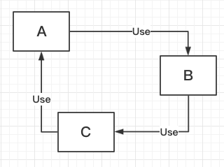
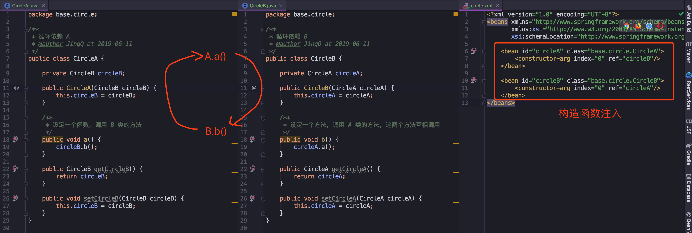
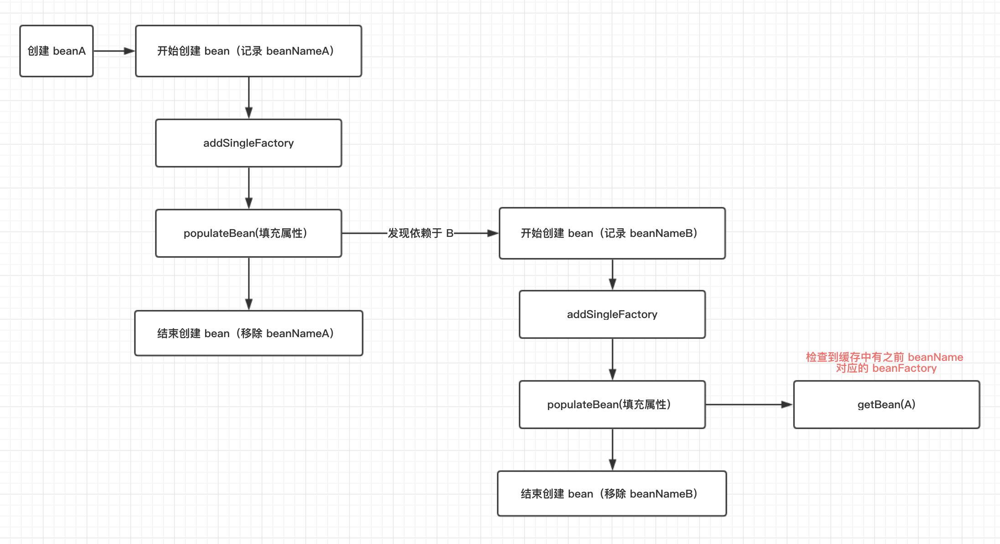

<!-- START doctoc generated TOC please keep comment here to allow auto update -->
<!-- DON'T EDIT THIS SECTION, INSTEAD RE-RUN doctoc TO UPDATE -->
**Table of Contents**  *generated with [DocToc](https://github.com/thlorenz/doctoc)*

- [前言](#%E5%89%8D%E8%A8%80)
- [循环依赖](#%E5%BE%AA%E7%8E%AF%E4%BE%9D%E8%B5%96)
  - [构造器循环依赖](#%E6%9E%84%E9%80%A0%E5%99%A8%E5%BE%AA%E7%8E%AF%E4%BE%9D%E8%B5%96)
  - [property 范围的依赖处理](#property-%E8%8C%83%E5%9B%B4%E7%9A%84%E4%BE%9D%E8%B5%96%E5%A4%84%E7%90%86)
  - [setter 循环依赖](#setter-%E5%BE%AA%E7%8E%AF%E4%BE%9D%E8%B5%96)
  - [代码分析](#%E4%BB%A3%E7%A0%81%E5%88%86%E6%9E%90)
    - [解决场景](#%E8%A7%A3%E5%86%B3%E5%9C%BA%E6%99%AF)
    - [结合关键代码梳理流程](#%E7%BB%93%E5%90%88%E5%85%B3%E9%94%AE%E4%BB%A3%E7%A0%81%E6%A2%B3%E7%90%86%E6%B5%81%E7%A8%8B)
      - [创建原始 bean](#%E5%88%9B%E5%BB%BA%E5%8E%9F%E5%A7%8B-bean)
      - [addSingleFactory](#addsinglefactory)
      - [populateBean 填充属性](#populatebean-%E5%A1%AB%E5%85%85%E5%B1%9E%E6%80%A7)
      - [getSingleton](#getsingleton)
- [总结](#%E6%80%BB%E7%BB%93)
- [参考资料](#%E5%8F%82%E8%80%83%E8%B5%84%E6%96%99)

<!-- END doctoc generated TOC please keep comment here to allow auto update -->


# 前言

还记得上一篇笔记，在 `bean` 加载流程，在创建过程中，出现了依赖循环的监测，如果出现了这个循环依赖，而没有解决的话，代码中将会报错，然后 `Spring` 容器初始化失败。

由于感觉循环依赖是个比较独立的知识点，所以我将它的分析单独写一篇笔记，**来看下什么是循环依赖和如何解决它。**

---

# 循环依赖

循环依赖就是循环引用，就是两个或者多个 `bean` 相互之间的持有对方，最后形成一个环。例如 `A` 引用了 `B`，`B` 引用了 `C`，`C` 引用了 `A`。

可以参照下图理解（**图中展示的类的互相依赖，但循环调用指的是方法之间的环调用，下面代码例子会展示方法环调用**）：



如果学过数据库的同学，可以将循环依赖简单的理解为死锁，互相持有对方的资源，形成一个环，然后不释放资源，导致死锁发生。

在循环调用中，除非出现终结条件，否则将会无限循环，最后导致内存溢出错误。（[我也遇到过一次 OOM，也是无限循环导致的](https://juejin.im/post/5ce9067df265da1bc4142f18)）

---
书中的例子是用了三个类进行环调用，我为了简单理解和演示，使用了两个类进行环调用：

在 `Spring` 中，循环依赖分为以下三种情况：


## 构造器循环依赖





通过上图的配置方法，在初始化的时候就会抛出 `BeanCurrentlyInCreationException` 异常

```java
public static void main(String[] args) {
	// 报错原因： Requested bean is currently in creation: Is there an unresolvable circular reference?
	ApplicationContext context = new ClassPathXmlApplicationContext("circle/circle.xml");
}
```

从上一篇笔记中知道，`Spring` 容器将每一个正在创建的 `bean` 标识符放入一个 “当前创建 bean 池（`prototypesCurrentlyInCreation`)” 中，`bean` 标识符在创建过程中将一直保持在这个池中。

**检测循环依赖的方法：**

分析上面的例子，在实例化 `circleA` 时，将自己 `A` 放入池中，由于依赖了 `circleB`，于是去实例化 `circleB`，`B` 也放入池中，由于依赖了 `A`，接着想要实例化 `A`，发现在创建 `bean`  过程中发现自己已经在 “当前创建 `bean`” 里时，于是就会抛出 `BeanCurrentlyInCreationException` 异常。

如图中展示，这种**通过构造器注入的循环依赖，是无法解决的**。

---
## property 范围的依赖处理

`property` 原型属于一种作用域，所以首先来了解一下作用域 `scope` 的概念：

**在 `Spring` 容器中，在Spring容器中是指其创建的 `Bean` 对象相对于其他 `Bean` 对象的请求可见范围**

我们最常用到的是单例 `singleton` 作用域的 `bean`，`Spring` 容器中只会存在一个共享的 `Bean` 实例，所以我们每次获取同样 `id` 时，只会返回bean的同一实例。

使用单例的好处有两个：

1. 提前实例化 `bean`，将有问题的配置问题提前暴露
2. 将 `bean` 实例放入单例缓存 `singletonFactories` 中，当需要再次使用时，直接从缓存中取，加快了运行效率。

**单一实例会被存储在单例缓存 `singletonFactories` 中，为Spring的缺省作用域.**

看完了单例作用域，来看下 `property` 作用域的概念：在 `Spring` 调用原型 `bean` 时，每次返回的都是一个新对象，相当于 `new Object()`。

**因为 `Spring` 容器对原型作用域的 `bean` 是不进行缓存，因此无法提前暴露一个创建中的 `bean`，所以也是无法解决这种情况的循环依赖。**


---
## setter 循环依赖

对于 `setter` 注入造成的依赖可以通过 `Spring` 容器提前暴露刚完成构造器注入但未完成其他步骤（如 `setter` 注入）的 `bean` 来完成，而且只能解决单例作用域的 `bean` 依赖。

在类的加载中，核心方法 `org.springframework.beans.factory.support.AbstractAutowireCapableBeanFactory#doCreateBean`，在这一步中有对循环依赖的校验和处理。

跟进去方法能够发现，如果 `bean` 是单例，并且允许循环依赖，那么可以通过提前暴露一个单例工厂方法，从而使其他 `bean` 能引用到，最终解决循环依赖的问题。

还是按照上面新建的两个类， `CircleA` 和 `CircleB`，来讲下 `setter` 解决方法：

配置：
```xml
<!--注释 5.3 setter 方法注入-->
<bean id="circleA" class="base.circle.CircleA">
	<property name="circleB" ref="circleB"/>
</bean>

<bean id="circleB" class="base.circle.CircleB">
	<property name="circleA" ref="circleA"/>
</bean>
```


执行 `Demo` 和输出：
```java
public static void main(String[] args) {
	ApplicationContext context = new ClassPathXmlApplicationContext("circle/circle.xml");
	CircleA circleA = (CircleA) context.getBean("circleA");
	circleA.a();
}

在 a 方法中，输出 A，在 b 方法中，输出B，下面是执行 demo 输出的结果：
错误提示是因为两个方法互相调用进行输出，然后打印到一定行数提示 main 函数栈溢出了=-=

A
B
A
B
*** java.lang.instrument ASSERTION FAILED ***: "!errorOutstanding" with message transform method call failed at JPLISAgent.c line: 844
*** java.lang.instrument ASSERTION FAILED ***: "!errorOutstanding" with message transform method call failed at JPLISAgent.c line: 844
*** java.lang.instrument ASSERTION FAILED ***: "!errorOutstanding" with message transform method call failed at JPLISAgent.c line: 844
Exception in thread "main" java.lang.StackOverflowError
```

可以看到通过 `setter` 注入，成功解决了循环依赖的问题，那解决的具体代码是如何实现的呢，下面来分析一下：

---
## 代码分析

为了更好的理解循环依赖，首先来看下这三个变量（也叫缓存，可以全局调用的）的含义和用途：

```java
/** Cache of singleton objects: bean name to bean instance. */
private final Map<String, Object> singletonObjects = new ConcurrentHashMap<>(256);

/** Cache of singleton factories: bean name to ObjectFactory. */
private final Map<String, ObjectFactory<?>> singletonFactories = new HashMap<>(16);

/** Cache of early singleton objects: bean name to bean instance. */
private final Map<String, Object> earlySingletonObjects = new HashMap<>(16);
```


| 变量 | 用途 | 
| ------ | ---- | 
|   singletonObjects     | 用于保存 `BeanName` 和创建 `bean` 实例之间的关系，`bean-name` --> `instanct`     |
|   singletonFactories     | 用于保存 `BeanName` 和创建 `bean` 的 **工厂** 之间的关系，`bean-name` --> `objectFactory`    |
|   earlySingletonObjects     |  也是保存 `beanName` 和创建 `bean` 实例之间的关系，与 `singletonObjects` 的**不同之处在于**，当一个单例 `bean` 被放入到这里之后，那么其他 `bean` 在创建过程中，就能通过 `getBean` 方法获取到，**目的是用来检测循环引用**    |


---

之前讲过类加载的机制了，下面定位到创建 `bean` 时，解决循环依赖的地方：

> org.springframework.beans.factory.support.AbstractAutowireCapableBeanFactory#doCreateBean

```java
// 是否需要提前曝光，用来解决循环依赖时使用
boolean earlySingletonExposure = (mbd.isSingleton() && this.allowCircularReferences &&
		isSingletonCurrentlyInCreation(beanName));
if (earlySingletonExposure) {
	if (logger.isTraceEnabled()) {
		logger.trace("Eagerly caching bean '" + beanName +
				"' to allow for resolving potential circular references");
	}
	// 注释 5.2 解决循环依赖 第二个参数是回调接口，实现的功能是将切面动态织入 bean
	addSingletonFactory(beanName, () -> getEarlyBeanReference(beanName, mbd, bean));
}

protected void addSingletonFactory(String beanName, ObjectFactory<?> singletonFactory) {
Assert.notNull(singletonFactory, "Singleton factory must not be null");
	synchronized (this.singletonObjects) {
		// 判断 singletonObjects 不存在 beanName
		if (!this.singletonObjects.containsKey(beanName)) {
		// 注释 5.4 放入 beanName -> beanFactory，到时在 getSingleton() 获取单例时，可直接获取创建对应 bean 的工厂，解决循环依赖
		this.singletonFactories.put(beanName, singletonFactory);
		// 从提前曝光的缓存中移除，之前在 getSingleton() 放入的
		this.earlySingletonObjects.remove(beanName);
		// 往注册缓存中添加 beanName
		this.registeredSingletons.add(beanName);
	}
}
}
```

先来看 `earlySingletonExposure` 这个变量：
从字面意思理解就是**需要提前曝光的单例**。

有以下三个判断条件：

- **`mbd` 是否是单例**
- **该容器是否允许循环依赖**
- **判断该 `bean` 是否在创建中。**

如果这三个条件都满足的话，就会执行 `addSingletonFactory` 操作。要想着，写的代码都有用处，所以接下来看下这个操作解决的什么问题和在哪里使用到吧

---
### 解决场景

用一开始创建的 `CircleA` 和 `CircleB` 这两个循环引用的类作为例子：



`A` 类中含有属性 `B`，`B` 类中含有属性 `A`，这两个类在初始化的时候经历了以下的步骤：

1. 创建 `beanA`，先记录对应的 `beanName` 然后将 `beanA` 的**创建工厂 beanFactoryA** 放入缓存中
2. 对 ` beanA` 的属性填充方法 `populateBean`，检查到依赖 `beanB`，缓存中没有 `beanB` 的实例或者单例缓存，于是要去实例化 `beanB`。
3. 开始实例化 `beanB`，经历创建 `beanA` 的过程，到了属性填充方法，检查到依赖了 `beanA`。
4. 调用 `getBean(A)` 方法，在这个函数中，不是真正去实例化 `beanA`，而是先去检测缓存中是否有已经创建好的对应的 `bean`，或者已经创建好的 `beanFactory`
5. 检测到 `beanFactoryA` 已经创建好了，而是直接调用 `ObjectFactory` 去创建 `beanA`

---
### 结合关键代码梳理流程

#### 创建原始 bean

```java
BeanWrapper instanceWrapper = createBeanInstance(beanName, mbd, args);
// 原始 bean
final Object bean = instanceWrapper.getWrappedInstance();
```

在这一步中，创建的是原始 `bean`，因为还没到最后一步属性解析，所以这个类里面没有属性值，可以将它想象成 `new ClassA`，同时没有构造函数等赋值的操作，这个原始 `bean` 信息将会在下一步使用到。

---

#### addSingleFactory

```java
// 注释 5.2 解决循环依赖 第二个参数是回调接口，实现的功能是将切面动态织入 bean
addSingletonFactory(beanName, () -> getEarlyBeanReference(beanName, mbd, bean));
```

前面也提到过这个方法，它会将需要提前曝光的单例加入到缓存中，将单例的 `beanName` 和 `beanFactory` 加入到缓存，在之后需要用到的时候，直接从缓存中取出来。

---
#### populateBean 填充属性

刚才第一步时也说过了，一开始创建的只是初始 `bean`，没有属性值，所以在这一步会解析类的属性。在属性解析时，会判断属性的类型，如果判断到是 `RuntimeBeanReference` 类型，将会解析引用。

就像我们写的例子，`CircleA` 引用了 `CircleB`，在加载 `CircleA`时，发现 `CircleB` 依赖，于是乎就要去加载 `CircleB`。

我们来看下代码中的具体流程吧：


```java
protected void populateBean(String beanName, RootBeanDefinition mbd, @Nullable BeanWrapper bw) {
    ...
    if (pvs != null) {
		// 将属性应用到 bean 中，使用深拷贝，将子类的属性一并拷贝
		applyPropertyValues(beanName, mbd, bw, pvs);
	}
}

protected void applyPropertyValues(String beanName, BeanDefinition mbd, BeanWrapper bw, PropertyValues pvs) {
    ...
    String propertyName = pv.getName();
	Object originalValue = pv.getValue();
	// 注释 5.5 解析参数，如果是引用对象，将会进行提前加载
	Object resolvedValue = valueResolver.resolveValueIfNecessary(pv, originalValue);
	...
}

public Object resolveValueIfNecessary(Object argName, @Nullable Object value) {
	// 我们必须检查每个值，看看它是否需要一个运行时引用，然后来解析另一个 bean
	if (value instanceof RuntimeBeanReference) {
		// 注释 5.6 在这一步中，如果判断是引用类型，需要解析引用，加载另一个 bean
		RuntimeBeanReference ref = (RuntimeBeanReference) value;
		return resolveReference(argName, ref);
	}
	...
}
```

跟踪到这里，加载引用的流程比较清晰了，发现是引用类的话，最终会委派 `org.springframework.beans.factory.support.BeanDefinitionValueResolver#resolveReference` 进行引用处理，核心的两行代码如下：

```java
// 注释 5.7 在这里加载引用的 bean
bean = this.beanFactory.getBean(refName);
this.beanFactory.registerDependentBean(refName, this.beanName);
```

在这一步进行 `CircleB` 的加载，但是我们写的例子中，`CircleB` 依赖了 `CircleA`，那它是如何处理的呢，所以这时，我们刚才将 `CircleA` 放入到缓存中的信息就起到了作用。

---
#### getSingleton

还记得之前在类加载时学到的只是么，单例模式每次加载都是取同一个对象，如果在缓存中有，可以直接取出来，在缓存中没有的话才进行加载，所以再来熟悉一下取单例的方法：

```java
protected Object getSingleton(String beanName, boolean allowEarlyReference) {
	Object singletonObject = this.singletonObjects.get(beanName);
	// 检查缓存中是否存在实例
	if (singletonObject == null && isSingletonCurrentlyInCreation(beanName)) {
		// 记住，公共变量都需要加锁操作，避免多线程并发修改
		synchronized (this.singletonObjects) {
			// 如果此 bean 正在加载则不处理
			singletonObject = this.earlySingletonObjects.get(beanName);
			if (singletonObject == null && allowEarlyReference) {
				// 当某些方法需要提前初始化，调用 addSingletonFactory 方法将对应的
				// objectFactory 初始化策略存储在 earlySingletonObjects，并且从 singletonFactories 移除
				ObjectFactory<?> singletonFactory = this.singletonFactories.get(beanName);
				if (singletonFactory != null) {
					singletonObject = singletonFactory.getObject();
					this.earlySingletonObjects.put(beanName, singletonObject);
					this.singletonFactories.remove(beanName);
				}
			}
		}
	}
	return singletonObject;
}
```

虽然 `CircleB` 引用了 `CircleA`，但在之前的方法 `addSingletonFactory` 时，`CircleA` 的 `beanFactory` 就提前暴露。

所以 `CircleB` 在获取单例 `getSingleton()` 时，能够拿到 `CircleA` 的信息，所以 `CircleB` 顺利加载完成，同时将自己的信息加入到缓存和注册表中，接着返回去继续加载 `CircleA`，由于它的依赖已经加载到缓存中，所以 `CircleA` 也能够顺利完成加载，最终整个加载操作完成~

**结合解决场景的流程图和关键代码流程，比较完善的介绍了循环依赖处理方法，下面还有一个 `debug` 流程图，希望能加深你的理解~**


---
# 总结


写这篇总结的目的是为了填坑，因为之前在解析类加载的文章中只是简单的过了一下循环依赖的概念，想要将在类加载中留下的坑填掉。

在分析循环依赖的过程中，发现之前对作用域 `scope` 的不了解，于是补充了一下这个知识点，接着又发现对循环依赖中使用到的缓存和详细处理不熟悉，于是查阅了相关资料，跟踪源码，一步一步进行分析，所以发现越写越多，解决了一个困惑，增加了几个疑问，所以在不断排查和了解中，加深了对 `Spring` 的理解。

同样，在工作中，经常会遇到与其它团队的合作，也会遇到同时需要对方的新接口支持，**例如在 `RPC` 中遇到循环调用，那我建议还是换一种方案，例如通过消息解耦，避免循环调用，实在没办法要循环调用，要记得在方法中加上退出条件，避免无限循环(>_<)**

---

**由于个人技术有限，如果有理解不到位或者错误的地方，请留下评论，我会根据朋友们的建议进行修正**

[spring-analysis-note 码云 Gitee 地址](https://gitee.com/vip-augus/spring-analysis-note.git)

[spring-analysis-note Github 地址](https://github.com/Vip-Augus/spring-analysis-note)


---
# 参考资料
1. [Spring学习（十五）Spring Bean 的5种作用域介绍](https://blog.csdn.net/icarus_wang/article/details/51586776)
2. [Spring IOC 容器源码分析 - 循环依赖的解决办法](https://segmentfault.com/a/1190000015221968)
3. [Spring 源码深度解析》- 郝佳](https://book.douban.com/subject/25866350/)