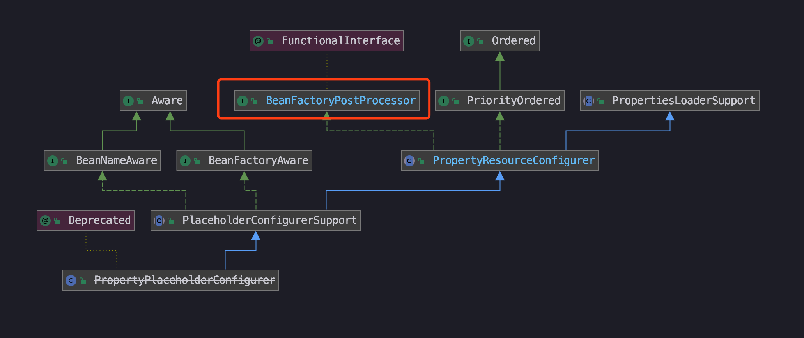
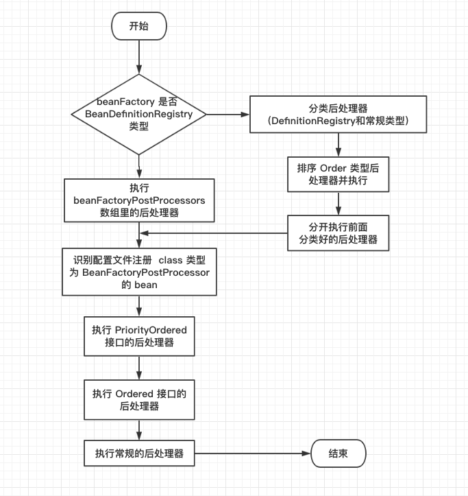

<!-- START doctoc generated TOC please keep comment here to allow auto update -->
<!-- DON'T EDIT THIS SECTION, INSTEAD RE-RUN doctoc TO UPDATE -->
**Table of Contents**  *generated with [DocToc](https://github.com/thlorenz/doctoc)*

- [BeanFactoryPostProcessor](#beanfactorypostprocessor)
  - [是什么](#%E6%98%AF%E4%BB%80%E4%B9%88)
  - [如何使用](#%E5%A6%82%E4%BD%95%E4%BD%BF%E7%94%A8)
    - [官方例子：PropertyPlaceholderConfigurer](#%E5%AE%98%E6%96%B9%E4%BE%8B%E5%AD%90propertyplaceholderconfigurer)
    - [使用自定义 BeanFactoryPostProcessor](#%E4%BD%BF%E7%94%A8%E8%87%AA%E5%AE%9A%E4%B9%89-beanfactorypostprocessor)
  - [在哪注册](#%E5%9C%A8%E5%93%AA%E6%B3%A8%E5%86%8C)
  - [激活 BeanFactoryPostProcessor](#%E6%BF%80%E6%B4%BB-beanfactorypostprocessor)
    - [流程图](#%E6%B5%81%E7%A8%8B%E5%9B%BE)
    - [代码](#%E4%BB%A3%E7%A0%81)
  - [总结](#%E6%80%BB%E7%BB%93)
- [参考资料](#%E5%8F%82%E8%80%83%E8%B5%84%E6%96%99)

<!-- END doctoc generated TOC please keep comment here to allow auto update -->


---
# 前言

结束了前面的基础结构分析，了解到 `Spring` 是如何识别配置文件和进行解析属性，最终将 `bean` 加载到内存中。**同时为了更好得理解 `Spring` 的扩展功能，我们先来巩固一下 `beanFactory` 和 `bean` 的概念，然后再分析新内容后处理器 `PostProcessor` 。**

首先我们先将 `Spring` 想像成一个大容器，然后保存了很多 `bean` 的信息，根据定义：**`bean` 是一个被实例化，组装，并通过 `Spring IoC` 容器所管理的对象**，也可以简单得理解为我们在配置文件配置好元数据，`Spring IoC` 容器会帮我们对 `bean` 进行管理，这些对象在=使用的时候通过 `Spring` 取出就能使用。

**那么是谁帮这个 `Spring` 管理呢，那就是 `BeanFactory`，粗暴点直译为 `bean` 工厂，但其实它才是承担容器功能的幕后实现者，它是一个接口，提供了获取 `bean` 、获取别名 `Alias` 、判断单例、类型是否匹配、是否原型等方法定义，所以需要通过引用，实现具体方法才后才能使用。**

回顾完 `beanFactory` 后，我们再来回顾在前面内容中，看到过很多后处理器 `PostProcessor` 的代码影子，分别是 `BeanFactoryPostProcessor`：主体是 `BeanFactory`， 和 `BeanPostProcessor`：主体是 `Bean`，**这两者都是 `Spring` 用来为使用者提供的扩展功能之一。**

接下来为了更好的分析和了解使用后处理器，实现扩展功能，一起跟踪源码学习吧~

---
# BeanFactoryPostProcessor

## 是什么

`BeanFactoryPostProcessor` 是一个接口，在里面只有一个方法定义：

```java
@FunctionalInterface
public interface BeanFactoryPostProcessor {
	void postProcessBeanFactory(ConfigurableListableBeanFactory beanFactory) throws BeansException;
}
```

**定义：是 `Spring` 对外提供可扩展的接口，能够在容器加载了所有 `bean` 信息（`AbstractApplicationContext#obtainFreshBeanFactory` 方法）之后，`bean` 实例化之前执行，用来修改 `bean` 的定义属性。**

**可以看到，方法参数是 `ConfigurableListableBeanFactory beanFactory` ，说明我们可以通过引用该接口，在方法中实现逻辑，对容器中 `bean` 的定义（配置元数据）进行处理**

同时，执行后处理器是有先后顺序的概念，我们可以通过设置 `order` 属性来控制它们的执行次序，前提是 `BeanFactoryPostProcessor` 实现了 `Order` 接口。

下面一起来看下它的如何使用，以及是如何进行注册和执行~

---
## 如何使用

### 官方例子：PropertyPlaceholderConfigurer

这个类是 `Spring` 容器里自带的后处理器，是用来替换占位符，填充属性到 `bean` 中。

像我们在 `xml` 文件中配置了属性值为 `${max.threads}`，能够通过它来找到 `max.threads` 在配置文件对应的值，然后将属性填充到 `bean` 中。

**虽然在 Spring 5 中，`PropertyPlaceholderConfigurer` 已经打上了不建议使用的标志 `@Deprecated`，看了文件注释，提示我们去使用 `Environment` 来设置属性，但我觉得这个后处理器的思想是一样的，所以还是拿它作为例子进行熟悉。**

先来看下它的继承体系：



~~忽略它被冷落的下划线标签~~

当 `Spring` 加载任何实现了 `BeanFactoryPostProcessor` 接口的 `bean` 配置时，**都会在 `bean` 工厂载入所有 `bean` 的配置之后执行 `postProcessBeanFactory` 方法**。 

可以看到它引用了 `BeanFactoryPostProcessor` 接口，在 `PropertyResourceConfigurer` 父类中实现了 `postProcessBeanFactory`，在方法中依次调用了合并资源 `mergedProps` 方法，属性转换 `convertProperties` 方法和**真正修改 `beanFactory` 中配置元数据的 `processProperties(beanFactory, mergedProps)` 方法**。

因为通过在 `PropertyPlaceholderConfigurer` 的后处理方法 `postProcessBeanFactory`，`BeanFactory` 在实例化任何 `bean` 之前获得配置信息，**从而能够正确解析 `bean` 描述文件中的变量引用**。

**所以通过后处理器，我们能够对 `beanFactory` 中的 `bean` 配置信息在实例化前还有机会进行修改。**

题外话：想到之前我遇到全半角空格的配置问题，程序认为全半角空格不是同一个字符，但肉眼却很难察觉，所以感觉可以在加载配置信息时，通过自定义一个后处理，在实例化之前，将全角空格转成半角空格，这样程序比较时都变成统一样式。**所以后处理器提供的扩展功能可以让我们对想要处理的 `bean` 配置信息进行特定修改**

---
### 使用自定义 BeanFactoryPostProcessor

实现的功能与书中的类似，例如之前西安奔驰汽车维权事件，如果相关网站想要屏蔽这奔驰这两个字，可以通过后处理器进行替换：

**1. 配置文件 factory-post-processor.xml**

```xml
<bean id="carPostProcessor" class="context.CarBeanFactoryPostProcessor">
	<property name="obscenties">
		<!--set 属性-->
		<set>
			<value>奔驰</value>
			<value>特斯拉</value>
		</set>
	</property>
</bean>

<bean id="car" class="base.factory.bean.Car">
	<property name="price" value="10000"/>
	<property name="brand" value="奔驰"/>
</bean>
```

**2. 后处理器 CarBeanFactoryPostProcessor**

```java
public class CarBeanFactoryPostProcessor implements BeanFactoryPostProcessor {

	/**
	 * 敏感词
	 */
	private Set<String> obscenties;

	@Override
	public void postProcessBeanFactory(ConfigurableListableBeanFactory beanFactory) throws BeansException {
		// 从 beanFactory 中获取 bean 名字列表
		String[] beanNames = beanFactory.getBeanDefinitionNames();
		for (String beanName : beanNames) {
			BeanDefinition definition = beanFactory.getBeanDefinition(beanName);
			StringValueResolver valueResolver = strVal -> {
				if (isObscene(strVal)) return "*****";
				return strVal;
			};
			BeanDefinitionVisitor visitor = new BeanDefinitionVisitor(valueResolver);
			// 这一步才是真正处理 bean 的配置信息
			visitor.visitBeanDefinition(definition);
		}

	}

	/**
	 * 判断 value 是否在敏感词列表中
	 * @param value	值
	 * @return		boolean
	 */
	private boolean isObscene(Object value) {
		String potentialObscenity = value.toString().toUpperCase();
		return this.obscenties.contains(potentialObscenity);
	}
}
```


**3. 启动**

```java
public class BeanFactoryPostProcessorBootstrap {

	public static void main(String[] args) {
	    ConfigurableApplicationContext context = new ClassPathXmlApplicationContext("factory.bean/factory-post-processor.xml");
	    // 这两行其实可以不写，因为在 refresh() 方法中，调用了一个函数将后处理器执行了，具体请往下看~
	    BeanFactoryPostProcessor beanFactoryPostProcessor = (BeanFactoryPostProcessor) context.getBean("carPostProcessor");
	    beanFactoryPostProcessor.postProcessBeanFactory(context.getBeanFactory());
	    // 输出 ：Car{maxSpeed=0, brand='*****', price=10000.0}，敏感词被替换了
	    System.out.println(context.getBean("car"));
    }
}
```

通过上面的演示代码，新增一个自定义实现 `BeanFactoryPostProcessor` 的后处理器 `CarBeanFactoryPostProcessor`，在 `postProcessBeanFactory` 方法中进行逻辑处理，最后通过 `visitor.visitBeanDefinition` 修改配置信息。

**查看输出结果，能发现宝马敏感词已经被屏蔽了，实现了后处理器的逻辑功能~**

---
## 在哪注册

按照一般套路，后处理器需要有个地方进行注册，然后才能进行执行，通过代码分析，的确在 `AbstractApplicationContext` 中看到了 `beanFactoryPostProcessors` 数组列表，但往数组中添加后处理器的方法 `addBeanFactoryPostProcessor` 只在单元测试包调用了。

**这让我很迷惑它到底是在哪里进行注册，直到我看到它的执行方法，原来我们定义的后处理器在 `bean` 信息加载时就放入注册表中，然后通过 `beanFactory.getBeanNamesForType(BeanDefinitionRegistryPostProcessor.class, true, false)` 方法获取后处理器列表遍历执行。**

**所以前面的 `beanFactoryPostProcessors` 数组列表，是让我们通过硬编码方法方式，手动添加进去，然后通过 `context.refresh()` 方法后，再执行硬编码的后处理器**

例如下面这个例子

```java
public class HardCodeBeanFactoryPostProcessor implements BeanFactoryPostProcessor {
	@Override
	public void postProcessBeanFactory(ConfigurableListableBeanFactory beanFactory) throws BeansException {
		System.out.println("Hard Code BeanFactory Post Processor execute time");
	}
}

// 硬编码 后处理器执行时间
BeanFactoryPostProcessor hardCodeBeanFactoryPostProcessor = new HardCodeBeanFactoryPostProcessor();
context.addBeanFactoryPostProcessor(hardCodeBeanFactoryPostProcessor);
// 更新上下文
context.refresh();
// 输出：
//Hard Code BeanFactory Post Processor execute time
//Car{maxSpeed=0, brand='*****', price=10000.0}
System.out.println(context.getBean("car"));
```

## 激活 BeanFactoryPostProcessor

看完了怎么使用后，我们来分析下 `Spring` 是如何识别和执行 `BeanFactoryPostProcessor`，入口方法：

> org.springframework.context.support.AbstractApplicationContext#invokeBeanFactoryPostProcessors

实际上，委派了 `PostProcessorRegistrationDelegate.invokeBeanFactoryPostProcessors(beanFactory, getBeanFactoryPostProcessors())` 代理进行执行。由于代码有点长，所以我画了一个流程图，可以结合流程图来分析代码：

### 流程图



### 代码

```java
public static void invokeBeanFactoryPostProcessors(ConfigurableListableBeanFactory beanFactory, List<BeanFactoryPostProcessor> beanFactoryPostProcessors) {
	Set<String> processedBeans = new HashSet<>();
	// beanFactory 默认使用的是 DefaultListableBeanFactory，属于 BeanDefinitionRegistry
	if (beanFactory instanceof BeanDefinitionRegistry) {
		BeanDefinitionRegistry registry = (BeanDefinitionRegistry) beanFactory;
		// 两个后处理器列表
		List<BeanFactoryPostProcessor> regularPostProcessors = new ArrayList<>();
		List<BeanDefinitionRegistryPostProcessor> registryProcessors = new ArrayList<>();
		// 硬编码注册的后处理器
		for (BeanFactoryPostProcessor postProcessor : beanFactoryPostProcessors) {
			// 分类处理
		}
		List<BeanDefinitionRegistryPostProcessor> currentRegistryProcessors = new ArrayList<>();
		// 首先，调用实现 priorityOrder 的 beanDefinition 这就是前面提到过的优先级概念，这一步跟下面的优先级不一样之处，这一步的优先级是带有权重
		String[] postProcessorNames = beanFactory.getBeanNamesForType(BeanDefinitionRegistryPostProcessor.class, true, false);
		for (String ppName : postProcessorNames) {
			if (beanFactory.isTypeMatch(ppName, PriorityOrdered.class)) {
				currentRegistryProcessors.add(beanFactory.getBean(ppName, BeanDefinitionRegistryPostProcessor.class));
				processedBeans.add(ppName);
			}
		}
		// 对后处理器进行排序
		sortPostProcessors(currentRegistryProcessors, beanFactory);
		registryProcessors.addAll(currentRegistryProcessors);
		invokeBeanDefinitionRegistryPostProcessors(currentRegistryProcessors, registry);
		currentRegistryProcessors.clear();
		// Next, invoke the BeanDefinitionRegistryPostProcessors that implement Ordered.
		postProcessorNames = beanFactory.getBeanNamesForType(BeanDefinitionRegistryPostProcessor.class, true, false);
		for (String ppName : postProcessorNames) {
			if (!processedBeans.contains(ppName) && beanFactory.isTypeMatch(ppName, Ordered.class)) {
				currentRegistryProcessors.add(beanFactory.getBean(ppName, BeanDefinitionRegistryPostProcessor.class));
				processedBeans.add(ppName);
			}
		}
		sortPostProcessors(currentRegistryProcessors, beanFactory);
		registryProcessors.addAll(currentRegistryProcessors);
		// 执行 definitionRegistryPostProcessor 接口的方法 ：postProcessBeanDefinitionRegistry
		invokeBeanDefinitionRegistryPostProcessors(currentRegistryProcessors, registry);
		currentRegistryProcessors.clear();
		// Finally, invoke all other BeanDefinitionRegistryPostProcessors until no further ones appear.最后，调用所有其他后处理器，直到不再出现其他 bean 为止
		boolean reiterate = true;
		while (reiterate) {
			reiterate = false;
			postProcessorNames = beanFactory.getBeanNamesForType(BeanDefinitionRegistryPostProcessor.class, true, false);
			for (String ppName : postProcessorNames) {
				if (!processedBeans.contains(ppName)) {
					currentRegistryProcessors.add(beanFactory.getBean(ppName, BeanDefinitionRegistryPostProcessor.class));
					processedBeans.add(ppName);
					reiterate = true;
				}
			}
			sortPostProcessors(currentRegistryProcessors, beanFactory);
			registryProcessors.addAll(currentRegistryProcessors);
			invokeBeanDefinitionRegistryPostProcessors(currentRegistryProcessors, registry);
			currentRegistryProcessors.clear();
		}
		// 执行 postProcessBeanFactory 回调方法
		invokeBeanFactoryPostProcessors(registryProcessors, beanFactory);
		invokeBeanFactoryPostProcessors(regularPostProcessors, beanFactory);
	}
	else {
		invokeBeanFactoryPostProcessors(beanFactoryPostProcessors, beanFactory);
	}
	// 不要在这里初始化 factoryBean:我们需要保留所有常规 bean 未初始化，以便让 bean 工厂后处理程序应用于它们
	// 注释 6.4 在这个步骤中，我们自定义的 carBeanFactoryPostProcessor 才真正注册并执行
	String[] postProcessorNames =
			beanFactory.getBeanNamesForType(BeanFactoryPostProcessor.class, true, false);.
    // 跳过分类的逻辑
	// 首先执行的是带有权重顺序的后处理器
	sortPostProcessors(priorityOrderedPostProcessors, beanFactory);
	invokeBeanFactoryPostProcessors(priorityOrderedPostProcessors, beanFactory);
	// 下一步执行普通顺序的后处理器
	List<BeanFactoryPostProcessor> orderedPostProcessors = new ArrayList<>(orderedPostProcessorNames.size());
	for (String postProcessorName : orderedPostProcessorNames) {
		orderedPostProcessors.add(beanFactory.getBean(postProcessorName, BeanFactoryPostProcessor.class));
	}
	sortPostProcessors(orderedPostProcessors, beanFactory);
	invokeBeanFactoryPostProcessors(orderedPostProcessors, beanFactory);
	// 最后执行的是普通的后处理器
	List<BeanFactoryPostProcessor> nonOrderedPostProcessors = new ArrayList<>(nonOrderedPostProcessorNames.size());
	for (String postProcessorName : nonOrderedPostProcessorNames) {
		nonOrderedPostProcessors.add(beanFactory.getBean(postProcessorName, BeanFactoryPostProcessor.class));
	}
	invokeBeanFactoryPostProcessors(nonOrderedPostProcessors, beanFactory);
	// 清除缓存的合并bean定义，因为后处理程序可能已经修改了原始元数据，例如替换值中的占位符
	beanFactory.clearMetadataCache();
}
```

从上面贴的代码中能够看到，对于 `beanFactoryPostProcessor` 的处理主要分两种情况：

- **`beanFactory`  是 `BeanDefinitionRegistry` 类型**：需要特殊处理
- **`beanFactory`  不是 `BeanDefinitionRegistry` 类型**：进行普通处理

**对于每种情况都需要考虑硬编码注入注册的后处理器（上面已经提到如何进行硬编码）以及通过配置注入的后处理器**

对于 `BeanDefinitionRegistry` 类型的处理器的处理主要包括以下内容：

1. **处理硬编码注册的后处理器**
2. **记录后处理器主要使用以下三个 `List`**
- `registryPostProcessors`：记录通过**硬编码**方式注册的 `BeanDefinitionRegistryPostProcessor`
- `regularPostProcessors`：记录通过**硬编码**方式注册的 `BeanFactoryPostProcessor`
- `regitstryPostProcessorBeans`：记录通过**配置**方式注册的 `BeanDefinitionRegistryPostProcessor`
3. **对于以上后处理器列表，统一调用 `BeanFactoryPostProcessor` 的 `postProcessBeanFactory` 方法**
4. **对 `beanFactoryPostProcessors` 中非 `BeanDefinitionRegistryPostProcessor` 类型的后处理器进行统一的 `postProcessBeanFactory` 方法**
5. **普通 `beanFactory` 处理：其实在这一步中，就是忽略了 `BeanDefinitionRegistryPostProcessor` 类型，对 `BeanFactoryPostProcessor` 进行直接处理。**

流程图中描述了整体调用链路，具体调用方法在代码中的注释也描述出来了，所以结合起来看应该能够理解整体流程~

---
## 总结

本次分析了 `beanFactory` 的后处理器 `BeanFactoryPostProcessor`，了解了 `Spring` 给我们提供的这个扩展接口使用用途和在源码中如何进行激活执行。

**由于个人技术有限，如果有理解不到位或者错误的地方，请留下评论，我会根据朋友们的建议进行修正**

因为我也是一边看书，一边做笔记，下载了源码。
**代码和注释都在里面，小伙伴们可以下载我上传的代码，亲测可运行~**

[spring-analysis-note 码云 Gitee 地址](https://gitee.com/vip-augus/spring-analysis-note.git)

[spring-analysis-note Github 地址](https://github.com/Vip-Augus/spring-analysis-note)

---
# 参考资料

1. [Bean 定义](https://wiki.jikexueyuan.com/project/spring/bean-definition.html)
2. [Sping 的 BeanFactory 容器](http://wiki.jikexueyuan.com/project/spring/ioc-container/spring-bean-fatory-container.html)
3. [Spring拓展接口之BeanFactoryPostProcessor，占位符与敏感信息解密原理](https://www.cnblogs.com/youzhibing/p/10559337.html)


