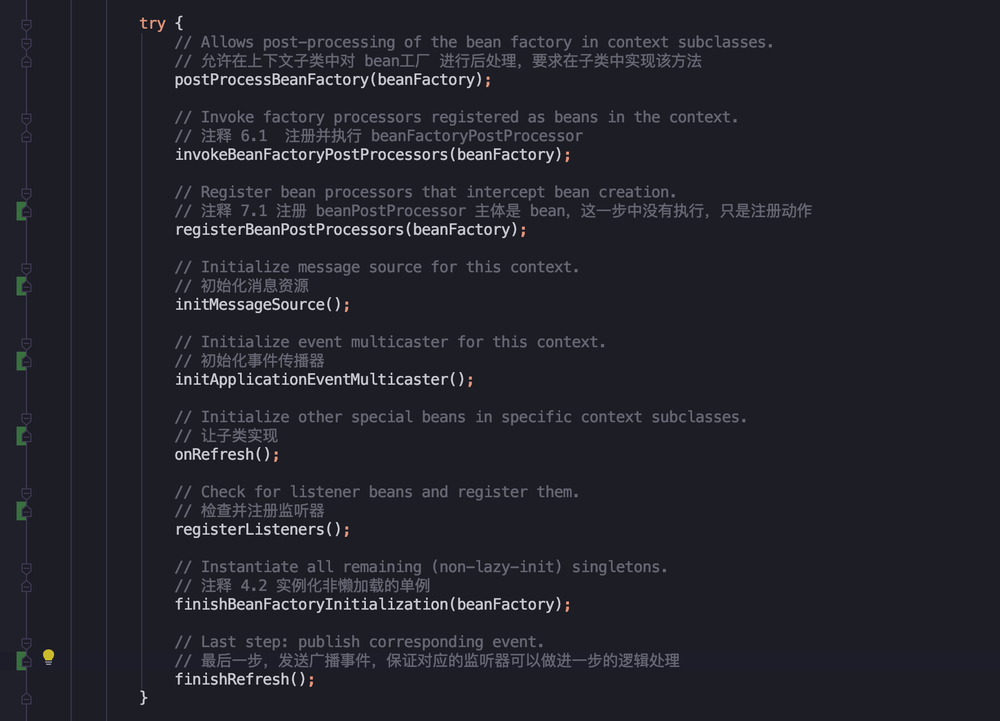

<!-- START doctoc generated TOC please keep comment here to allow auto update -->
<!-- DON'T EDIT THIS SECTION, INSTEAD RE-RUN doctoc TO UPDATE -->
**Table of Contents**  *generated with [DocToc](https://github.com/thlorenz/doctoc)*

- [前言](#%E5%89%8D%E8%A8%80)
- [BeanPostProcessor](#beanpostprocessor)
  - [如何使用](#%E5%A6%82%E4%BD%95%E4%BD%BF%E7%94%A8)
    - [新建一个 bean 后处理器](#%E6%96%B0%E5%BB%BA%E4%B8%80%E4%B8%AA-bean-%E5%90%8E%E5%A4%84%E7%90%86%E5%99%A8)
    - [在配置文件中注册 bean-post-processor.xml](#%E5%9C%A8%E9%85%8D%E7%BD%AE%E6%96%87%E4%BB%B6%E4%B8%AD%E6%B3%A8%E5%86%8C-bean-post-processorxml)
    - [启动代码和打印结果](#%E5%90%AF%E5%8A%A8%E4%BB%A3%E7%A0%81%E5%92%8C%E6%89%93%E5%8D%B0%E7%BB%93%E6%9E%9C)
  - [注册 BeanPostProcessor](#%E6%B3%A8%E5%86%8C-beanpostprocessor)
  - [小结](#%E5%B0%8F%E7%BB%93)
- [初始化消息资源](#%E5%88%9D%E5%A7%8B%E5%8C%96%E6%B6%88%E6%81%AF%E8%B5%84%E6%BA%90)
- [事件监听](#%E4%BA%8B%E4%BB%B6%E7%9B%91%E5%90%AC)
  - [定义监听事件 Event](#%E5%AE%9A%E4%B9%89%E7%9B%91%E5%90%AC%E4%BA%8B%E4%BB%B6-event)
  - [定义监听器 Listener](#%E5%AE%9A%E4%B9%89%E7%9B%91%E5%90%AC%E5%99%A8-listener)
  - [配置文件](#%E9%85%8D%E7%BD%AE%E6%96%87%E4%BB%B6)
  - [测试代码](#%E6%B5%8B%E8%AF%95%E4%BB%A3%E7%A0%81)
  - [消息监听代码分析](#%E6%B6%88%E6%81%AF%E7%9B%91%E5%90%AC%E4%BB%A3%E7%A0%81%E5%88%86%E6%9E%90)
    - [初始化 ApplicationEvenMulticaster](#%E5%88%9D%E5%A7%8B%E5%8C%96-applicationevenmulticaster)
    - [注册监听器](#%E6%B3%A8%E5%86%8C%E7%9B%91%E5%90%AC%E5%99%A8)
    - [publishEvent](#publishevent)
- [总结](#%E6%80%BB%E7%BB%93)
- [参考资料](#%E5%8F%82%E8%80%83%E8%B5%84%E6%96%99)

<!-- END doctoc generated TOC please keep comment here to allow auto update -->


# 前言

在上一篇文章中，深入分析和学习了 `BeanFactoryPostProcessor` ，主体是 `BeanFactory` 的后处理器，这次来学习主体是 `Bean` 的后处理器：`BeanPostProcessor`。

**定义：它也是 `Spring` 对外提供的接口，用来给用户扩展自定义的功能。执行的时机在 `bean` 实例化阶段前后**

本篇思路：
1. `BeanPostProcessor` 定义
2. 如何使用
3. 代码实现分析
4. 介绍剩余的扩展功能


与 `BeanFactoryPostProcessor` 不同的是，`BeanFactoryPostProcessor` 的注册和执行都在同一个方法内，而 `BeanPostProcessor` 分开两个方法，分为**注册**和**调用**两个步骤。

**常规的 `BeanFactory` 中是没有实现后处理器的自动注册，所以在调用的时候没有进行手动注册是无法使用的，但在 `ApplicationContext` 中添加了自动注册功能（在这个 `registerBeanPostProcessors` 方法中），最后在 `bean` 实例化时执行 `BeanPostProcessor` 对应的方法。**

本次主要介绍 `BeanPostProcessor`，同时也会将剩下的 `context` 扩展功能一起学习~


---
# BeanPostProcessor

经过上一篇文章的学习，应该对 `bean` 的后处理理解起来更顺利，下面直奔主题，来看下它是如何使用和结合源码分析

---
## 如何使用

### 新建一个 bean 后处理器

这个后处理器需要引用 `InstantiationAwareBeanPostProcessor` 接口（实际继承自 `BeanPostProcessor`），然后重载以下两个方法：

```java
public class CarBeanPostProcessor implements InstantiationAwareBeanPostProcessor {

	@Override
	public Object postProcessBeforeInitialization(Object bean, String beanName) throws BeansException {
		// 这里没有区分 bean 类型，只是用来测试打印的顺序和时间
		System.out.println("Bean name : " + beanName + ", before Initialization, time : " + System.currentTimeMillis());
		return null;
	}

	@Override
	public Object postProcessAfterInitialization(Object bean, String beanName) throws BeansException {
		System.out.println("Bean name : " + beanName + ", after Initialization, time : " + System.currentTimeMillis());
		return null;
	}
}
```

---
### 在配置文件中注册 bean-post-processor.xml

在配置文件配置我们写的自定义后处理器和两个普通 `bean`，用来测试打印时间和顺序

```xml
<?xml version="1.0" encoding="UTF-8"?>
<beans xmlns="http://www.springframework.org/schema/beans"
       xmlns:xsi="http://www.w3.org/2001/XMLSchema-instance"
       xsi:schemaLocation="http://www.springframework.org/schema/beans http://www.springframework.org/schema/beans/spring-beans.xsd">
	<!-- beanPostProcessor -->
	<bean id="carPostProcessor" class="context.bean.CarBeanPostProcessor"/>

	<!--用以下两个 bean 进行测试打印时间和顺序-->
	<bean id="car" class="base.factory.bean.Car">
		<property name="price" value="10000"/>
		<property name="brand" value="奔驰"/>
	</bean>

	<bean id="book" class="domain.ComplexBook"/>

</beans>
```

---
### 启动代码和打印结果

```java
public class CarBeanPostProcessorBootstrap {

	public static void main(String[] args) {
		ApplicationContext context = new ClassPathXmlApplicationContext("factory.bean/bean-post-processor.xml");
		Car car = (Car) context.getBean("car");
		ComplexBook book = (ComplexBook) context.getBean("book");
		System.out.println(car);
		System.out.println(book);
	}
}
```

输出：

```
Bean name : car, before Initialization, time : 1560772863996
Bean name : car, after Initialization, time : 1560772863996
Bean name : book, before Initialization, time : 1560772863999
Bean name : book, after Initialization, time : 1560772863999
Car{maxSpeed=0, brand='奔驰', price=10000.0}
domain.ComplexBook@77be656f
```

从输出接口看出，打印顺序是先框架内部，再到应用层，框架内部中，在顺序实例化每个 `bean` 时，前面也提到**执行时机：先执行 `postProcessBeforeInitialization` 方法，然后实例化 `bean` 后，执行 `postProcessAfterInitialization`。**

所以我们重载的两个接口按照前后顺序打印出来了~

---
## 注册 BeanPostProcessor

上面介绍了使用例子，应该不难理解，接着来看下源码注册的方法：

> org.springframework.context.support.AbstractApplicationContext#registerBeanPostProcessors

实际委托给了 `PostProcessorRegistrationDelegate.registerBeanPostProcessors(beanFactory, this);`

```java
public static void registerBeanPostProcessors(
			ConfigurableListableBeanFactory beanFactory, AbstractApplicationContext applicationContext) {
		// 注释 7.2 从注册表中取出 class 类型为 BeanPostProcessor 的 bean 名称列表
		String[] postProcessorNames = beanFactory.getBeanNamesForType(BeanPostProcessor.class, true, false);

		int beanProcessorTargetCount = beanFactory.getBeanPostProcessorCount() + 1 + postProcessorNames.length;
		beanFactory.addBeanPostProcessor(new BeanPostProcessorChecker(beanFactory, beanProcessorTargetCount));
		// 将带有 权限顺序、顺序和其余的 beanPostProcessor 分开
		List<BeanPostProcessor> priorityOrderedPostProcessors = new ArrayList<>();
		// 类型是 MergedBeanDefinitionPostProcessor
		List<BeanPostProcessor> internalPostProcessors = new ArrayList<>();
		List<String> orderedPostProcessorNames = new ArrayList<>();
		List<String> nonOrderedPostProcessorNames = new ArrayList<>();
		for (String ppName : postProcessorNames) {
            // 分类，添加到对应数组中
			...
		}
		// 首先，注册实现了 PriorityOrdered 接口的 bean 后处理器
		sortPostProcessors(priorityOrderedPostProcessors, beanFactory);
		registerBeanPostProcessors(beanFactory, priorityOrderedPostProcessors);
		// 下一步，注册实现了 Ordered 接口的 bean 后处理器
		List<BeanPostProcessor> orderedPostProcessors = new ArrayList<>(orderedPostProcessorNames.size());
		for (String ppName : orderedPostProcessorNames) {
			BeanPostProcessor pp = beanFactory.getBean(ppName, BeanPostProcessor.class);
			orderedPostProcessors.add(pp);
			if (pp instanceof MergedBeanDefinitionPostProcessor) {
				internalPostProcessors.add(pp);
			}
		}
		sortPostProcessors(orderedPostProcessors, beanFactory);
		registerBeanPostProcessors(beanFactory, orderedPostProcessors);
		// 现在，注册常规 bean 后处理器，其实就是不带顺序
		List<BeanPostProcessor> nonOrderedPostProcessors = new ArrayList<>(nonOrderedPostProcessorNames.size());
		for (String ppName : nonOrderedPostProcessorNames) {
			BeanPostProcessor pp = beanFactory.getBean(ppName, BeanPostProcessor.class);
			nonOrderedPostProcessors.add(pp);
			if (pp instanceof MergedBeanDefinitionPostProcessor) {
				internalPostProcessors.add(pp);
			}
		}
		registerBeanPostProcessors(beanFactory, nonOrderedPostProcessors);
		// 最后，重新注册 MergedBeanDefinitionPostProcessor 类型的后处理器
		// 看起来是重复注册了，但是每次注册调用的底层方法都会先移除已存在的 beanPostProcessor，然后再加进去，最后还是保存唯一
		sortPostProcessors(internalPostProcessors, beanFactory);
		registerBeanPostProcessors(beanFactory, internalPostProcessors);
		// 添加 ApplicationContext 探测器
		beanFactory.addBeanPostProcessor(new ApplicationListenerDetector(applicationContext));
	}
```

跟之前的 `BeanFactoryPostProcessor` 处理是不是很相似，也是进行分类，将带有权重顺序、顺序和普通 `BeanPostProcessor` 添加到对应的列表后，然后排序，统一注册到 `beanPostProcessors` 列表末尾。

将 `BeanPostProcessor` 与之前的 `BeanFactoryPostProcessor` 进行对比后发现，少了硬编码注册的代码，只处理了配置文件方式的注册 `bean`。通过书中阐释，对少了硬编码的处理有些理解：

> 对于 BeanFactoryPostProcessor 的处理，在一个方法内实现了注册和实现，所以需要载入配置中的定义，并进行激活；而对于 BeanPostProcessor 并不需要马上调用，**硬编码的方式实现的功能是将后处理器提取并调用，对于 BeanPostProcessor，注册阶段不需要调用，所以没有考虑处理硬编码**，在这里只需要将配置文件的 BeanPostProcessor 提取出来并注册进入 beanFactory 就可以了。

而且我在测试过程，想在应用代码中进行硬编码注册，**发现由于 `ClassPathXmlApplicationContext` 最后一个方法是实例化非延迟加载的 `bean`，在上下文创建好时，`BeanPostProcessor` 就已经执行完成了，于是硬编码注册的后处理器无法执行**，只能通过设定延迟加载或者在配置文件配置中进行注册，或者其它 BeanFactory 能支持硬编码。

剩下顺序 `Order` 类型的后处理器注册 `BeanFactoryPostProcessor` 类似就不重复多讲解了，这段代码的逻辑挺清晰的~

---
## 小结

结束两个扩展功能，`BeanFactoryPostProcessor` 和 `BeanPostProcessor` 的学习使用后，还有其它的扩展功能没学习到，**在一开始基础机构篇就提到剩下的方法：**



这这些扩展功能中，个人感觉**事件传播器、监听器和发送广播事件**这三个会用得比较多，所以下面的内容会花比较大篇幅讲这三个扩展。

---
# 初始化消息资源

根据书中的内容介绍，这个消息资源 `messageSource` 是跟 `Spring` 国际化相关。

例如中美之间的中英文差别，在不同地区显示不同的资源。对于有国际化需求的系统，要为每种提供一套相应的**资源文件**，并以规范化命名的形式保存在特定的目录中，由系统自动根据客户端的语言或者配置选择合适的资源文件。

举个🌰：
定义了两个资源文件，简单配置如下

- 中文地区： test=测试
- 英文地区： test=test

**所以可以通过 `Applicationcontext.getMessage()` 方法访问国际化信息，在不同的环境中获取对应的数据。**

由于个人感觉这种配置相关的，可以通过 `profile` 切换来实现，所以没有去细看和使用，具体实现和使用请感兴趣的同学们深入了解吧。

---
# 事件监听

事件传播器的使用很像我们设计模式中的**观察者模式**，被观察者变动后通知观察者进行相应的逻辑处理。

在了解 `Spring` 如何初始化事件传播器之前，来看下 `Spring` 监听的简单用法。

## 定义监听事件 Event

新建一个类，继承于 `ApplicationEvent`，并且需要在构造方法中调用父类的构造函数 `supre(source)`：

```java
public class CarEvent extends ApplicationEvent {

	/**
	 * 自定义一个消息
	 */
	private String msg;

	public CarEvent(Object source) {
		super(source);
	}

	public CarEvent(Object source, String msg) {
		super(source);
		this.msg = msg;
	}
}
```

---
## 定义监听器 Listener

新建一个类，引用 `ApplicationListener` 接口，然后重载 `onApplicationEvent` 方法：

```java
public class CarEventListener implements ApplicationListener {
	@Override
	public void onApplicationEvent(ApplicationEvent event) {
		if (event instanceof CarEvent) {
			CarEvent carEvent = (CarEvent) event;
			System.out.println("source : " + event.getSource() + ",  custom message : " + carEvent.getMsg());
		}
	}
}
```

由于 `Spring` 的消息监听器不像 `kafka` 等主流 `MQ` 可以指定发送队列或者监听主题，只要发送消息后，所有注册的监听器都会收到消息进行处理，所以这边加了一个判断，如果是我业务上需要的消息，才会进行处理。

---
## 配置文件

```xml
<bean id="testListener" class="context.event.CarEventListener"/>
```

将刚才写的监听器注册到 `Spring` 容器中

---
## 测试代码

```java
public class EventBootstrap {
	public static void main(String[] args) {
		ApplicationContext context = new ClassPathXmlApplicationContext("factory.bean/bean-post-processor.xml");
		// 第一个参数是来源，第二个参数是自定义
		CarEvent carEvent = new CarEvent("hello",  "world");
		context.publishEvent(carEvent);
		// 消息发送之后，打印以下内容
		// source : hello,  custom message : world
	}
}
```

由于在配置文件中注册了监听器，然后在启动代码汇总初始化了监听事件，最终通过 `context` 发送消息，发现输出结果与预想的一致。

这种观察者模式实现很经典，使用起来也很简单，下面来结合源码分析一下 `Spring` 是如何实现消息监听的功能。

---
## 消息监听代码分析

**从源码中分析，发现主要是下面三个步骤：**

### 初始化 ApplicationEvenMulticaster

```java
protected void initApplicationEventMulticaster() {
	ConfigurableListableBeanFactory beanFactory = getBeanFactory();
	// 如有有自己注册class Name 是 applicationEventMulticaster，使用自定义广播器
	if (beanFactory.containsLocalBean(APPLICATION_EVENT_MULTICASTER_BEAN_NAME)) {
		this.applicationEventMulticaster =
				beanFactory.getBean(APPLICATION_EVENT_MULTICASTER_BEAN_NAME, ApplicationEventMulticaster.class);
		}
	}
	else {
		// 没有自定义，使用默认的事件广播器
		this.applicationEventMulticaster = new SimpleApplicationEventMulticaster(beanFactory);
		beanFactory.registerSingleton(APPLICATION_EVENT_MULTICASTER_BEAN_NAME, this.applicationEventMulticaster);
	}
}
```

**广播器的作用是用来广播消息**，在默认的广播器 `SimpleApplicationEventMulticaster` 类中发现了这个方法 `multicastEvent`：

```java
public void multicastEvent(final ApplicationEvent event, @Nullable ResolvableType eventType) {
	ResolvableType type = (eventType != null ? eventType : resolveDefaultEventType(event));
	Executor executor = getTaskExecutor();
	// 遍历注册的消息监听器
	for (ApplicationListener<?> listener : getApplicationListeners(event, type)) {
		if (executor != null) {
			executor.execute(() -> invokeListener(listener, event));
		}
		else {
			invokeListener(listener, event);
		}
	}
}
```

**可以看到，在广播事件时，会遍历所有注册的监听器进行调用 `invokeListener` 方法，底层调用的是监听器重载的 `listener.onApplicationEvent(event)`，所以再次强调一次，如果使用 `Spring` 自带的事件监听，请在业务处理方判断事件来源，避免处理错误。**

---
### 注册监听器

在上一步中，已经初始化好了广播器，所以下一步来看下，监听器的注册流程，入口方法如下：

> org.springframework.context.support.AbstractApplicationContext#registerListeners

```java
protected void registerListeners() {
	// 这里是硬编码注册的监听器
	for (ApplicationListener<?> listener : getApplicationListeners()) {
		getApplicationEventMulticaster().addApplicationListener(listener);
	}
	// 不要在这里初始化 factoryBean : 我们需要保留所有常规 bean 未初始化，以便让后处理程序应用于它们!
	// 这一步是配置文件中注册的监听器
	String[] listenerBeanNames = getBeanNamesForType(ApplicationListener.class, true, false);
	for (String listenerBeanName : listenerBeanNames) {
		getApplicationEventMulticaster().addApplicationListenerBean(listenerBeanName);
	}

	// 发布早期的应用程序事件，现在我们终于有了一个多播器=-=
	Set<ApplicationEvent> earlyEventsToProcess = this.earlyApplicationEvents;
	this.earlyApplicationEvents = null;
	if (earlyEventsToProcess != null) {
		for (ApplicationEvent earlyEvent : earlyEventsToProcess) {
			getApplicationEventMulticaster().multicastEvent(earlyEvent);
		}
	}
}
```

这一个方法代码不多，也没啥嵌套功能，按照注释顺序将流程梳理了一遍，将我们注册的监听器加入到 `applicationEventMulticaster` 列表中，等待之后调用。

---
### publishEvent

广播器和监听器都准备好了，剩下的就是发送事件，通知监听器做相应的处理：

> org.springframework.context.support.AbstractApplicationContext#publishEvent(java.lang.Object, org.springframework.core.ResolvableType)

核心是这行代码：

```java
getApplicationEventMulticaster().multicastEvent(applicationEvent, eventType);
```

通过获取事件广播器，调用 `multicastEvent` 方法，进行广播事件，这一步前面也介绍过了，不再细说。

---
# 总结

这次学习，省略了书中的一些内容，有关属性编辑器、`SPEL` 语言和初始化非延迟加载等内容，请感兴趣的同学继续深入了解~

**我们也能从 `Spring` 提供的这些扩展功能中学习到，通过预留后处理器，可以在 `bean` 实例化之前修改配置信息，或者做其他的自定义操作，例如替换占位符、过滤敏感信息等；**

**也可以通过广播事件，定义事件和监听器，在监听器中实现业务逻辑，由于不是直接调用监听器，而是通过事件广播器进行中转，达到了代码解耦的效果。**

**所以在之后的代码设计和编写中，在整体设计上，有必要的话，考虑在更高的抽象层要预留扩展功能，然后让子类重载或者实现，实现扩展的功能。**

---
**由于个人技术有限，如果有理解不到位或者错误的地方，请留下评论，我会根据朋友们的建议进行修正**

**代码和注释都在里面，小伙伴们可以下载我上传的代码，亲测可运行~**

[Gitee 地址：https://gitee.com/vip-augus/spring-analysis-note.git](https://gitee.com/vip-augus/spring-analysis-note.git)

[Github 地址：https://github.com/Vip-Augus/spring-analysis-note](https://github.com/Vip-Augus/spring-analysis-note)

---
# 参考资料

1. Spring 源码深度解析 / 郝佳编著. -- 北京 : 人民邮电出版社