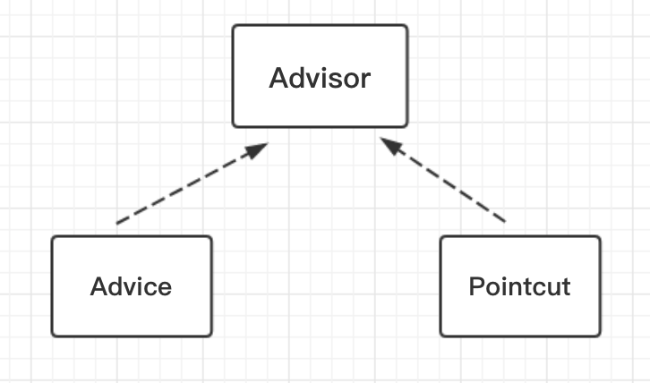
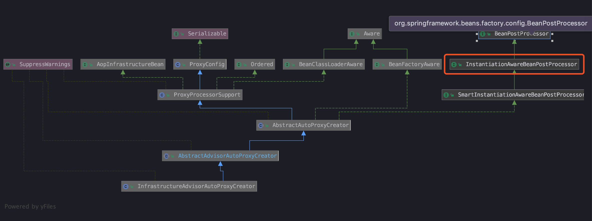
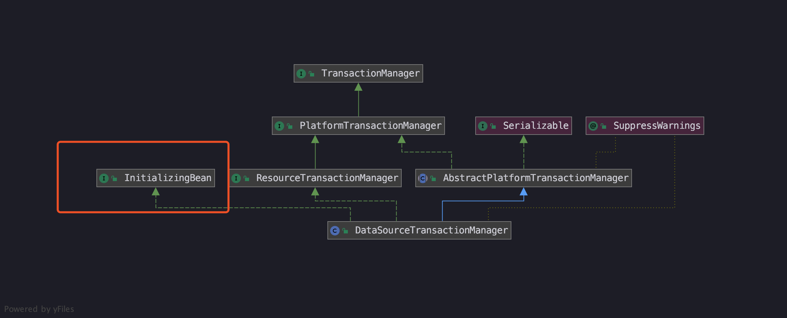

<!-- START doctoc generated TOC please keep comment here to allow auto update -->
<!-- DON'T EDIT THIS SECTION, INSTEAD RE-RUN doctoc TO UPDATE -->
**Table of Contents**  *generated with [DocToc](https://github.com/thlorenz/doctoc)*

- [使用例子](#%E4%BD%BF%E7%94%A8%E4%BE%8B%E5%AD%90)
- [注解属性 @Transactional](#%E6%B3%A8%E8%A7%A3%E5%B1%9E%E6%80%A7-transactional)
  - [事务的传播性 Propagation](#%E4%BA%8B%E5%8A%A1%E7%9A%84%E4%BC%A0%E6%92%AD%E6%80%A7-propagation)
  - [事务的隔离性 Isolation](#%E4%BA%8B%E5%8A%A1%E7%9A%84%E9%9A%94%E7%A6%BB%E6%80%A7-isolation)
- [Spring 中实现逻辑](#spring-%E4%B8%AD%E5%AE%9E%E7%8E%B0%E9%80%BB%E8%BE%91)
  - [解析](#%E8%A7%A3%E6%9E%90)
    - [注册 InfrastructureAdvisorAutoProxyCreator](#%E6%B3%A8%E5%86%8C-infrastructureadvisorautoproxycreator)
      - [判断目标方法是否适合 canApply](#%E5%88%A4%E6%96%AD%E7%9B%AE%E6%A0%87%E6%96%B9%E6%B3%95%E6%98%AF%E5%90%A6%E9%80%82%E5%90%88-canapply)
      - [匹配标签 match](#%E5%8C%B9%E9%85%8D%E6%A0%87%E7%AD%BE-match)
    - [小结](#%E5%B0%8F%E7%BB%93)
  - [运行](#%E8%BF%90%E8%A1%8C)
    - [事务增强器 TransactionInterceptor](#%E4%BA%8B%E5%8A%A1%E5%A2%9E%E5%BC%BA%E5%99%A8-transactioninterceptor)
      - [事务管理器](#%E4%BA%8B%E5%8A%A1%E7%AE%A1%E7%90%86%E5%99%A8)
      - [事务开启](#%E4%BA%8B%E5%8A%A1%E5%BC%80%E5%90%AF)
      - [获取 TransactionStatus](#%E8%8E%B7%E5%8F%96-transactionstatus)
        - [获取事务](#%E8%8E%B7%E5%8F%96%E4%BA%8B%E5%8A%A1)
      - [处理已经存在的事务](#%E5%A4%84%E7%90%86%E5%B7%B2%E7%BB%8F%E5%AD%98%E5%9C%A8%E7%9A%84%E4%BA%8B%E5%8A%A1)
        - [PROPAGATION_NEVER](#propagation_never)
        - [PROPAGATION_NOT_SUPPORTED](#propagation_not_supported)
        - [事务挂起](#%E4%BA%8B%E5%8A%A1%E6%8C%82%E8%B5%B7)
        - [PROPAGATION_REQUIRES_NEW](#propagation_requires_new)
        - [PROPAGATION_NESTED](#propagation_nested)
      - [事务创建](#%E4%BA%8B%E5%8A%A1%E5%88%9B%E5%BB%BA)
      - [小结](#%E5%B0%8F%E7%BB%93-1)
      - [事务回滚 & 提交](#%E4%BA%8B%E5%8A%A1%E5%9B%9E%E6%BB%9A--%E6%8F%90%E4%BA%A4)
- [总结](#%E6%80%BB%E7%BB%93)
- [参考资料](#%E5%8F%82%E8%80%83%E8%B5%84%E6%96%99)

<!-- END doctoc generated TOC please keep comment here to allow auto update -->

---
# 前言

业务系统的数据，一般最后都会落入到数据库中，例如 `MySQL`、`Oracle` 等主流数据库，不可避免的，在数据更新时，有可能会遇到错误，这时需要将之前的数据更新操作撤回，避免错误数据。

**`Spring` 的声明式事务能帮我们处理回滚操作，让我们不需要去关注数据库底层的事务操作，可以不用在出现异常情况下，在 try / catch / finaly 中手写回滚操作。**

**`Spring` 的事务保证程度比行业中其它技术（例如 `TCC` / `2PC` / `3PC` 等）稍弱一些，但使用 `Spring` 事务已经满足大部分场景，所以它的使用和配置规则也是值得学习的。**

接下来一起学习 `Spring` 事务是如何使用以及实现原理吧。

---
# 使用例子

1.创建数据库表

```sql
create table test.user(
id int auto_increment	
primary key,
name varchar(20) null, age int(3) null)
engine=InnoDB charset=utf8;
```

2.创建对应数据库表的 PO

```java
public class JdbcUser {

	private Integer id;

	private String name;

	private Integer age;
	
	...(使用 ctrl + N 进行代码补全 setter 和 getter)
}
```

3.创建表与实体间的映射

**在使用 `JdbcTemplate` 时很纠结，在 `Java` 类中写了很多硬编码 `SQL`，与 `MyBatis` 使用方法不一样，为了示例简单，使用了 `JdbcTemplate`，不过还是建议朋友们用 `MyBatis`，让代码风格整洁。**

```java
public class UserRowMapper implements RowMapper {


	@Override
	public Object mapRow(ResultSet rs, int rowNum) throws SQLException {
		JdbcUser user = new JdbcUser();
		user.setId(rs.getInt("id"));
		user.setName(rs.getString("name"));
		user.setAge(rs.getInt("age"));
		return user;
	}
}
```

4.创建数据操作接口

```java
public interface UserDao {

	/**
	 * 插入
	 * @param user	用户信息
	 */
	void insertUser(JdbcUser user);

	/**
	 * 根据 id 进行删除
	 * @param id	主键
	 */
	void deleteById(Integer id);

	/**
	 * 查询
	 * @return	全部
	 */
	List<JdbcUser> selectAll();
}
```

5.创建数据操作接口实现类

跟书中例子不一样，没有在接口上加入事务注解，而是在公共方法上进行添加，可以在每个方法上自定义传播事件、隔离级别。

```java
public class UserJdbcTemplate implements UserDao {

	private DataSource dataSource;

	private JdbcTemplate jdbcTemplate;


	@Override
	@Transactional(propagation = Propagation.REQUIRED)
	public void insertUser(JdbcUser user) {
		String sql = "insert into user (id, name, age) values (?, ?, ?)";
		jdbcTemplate.update(sql, user.getId(), user.getName(), user.getAge());
		System.out.println("Create record : " + user.toString());
	}

	@Override
	@Transactional
	public void deleteById(Integer id) {
		String sql = "delete from user where id = ?";
		jdbcTemplate.update(sql, id);
		System.out.println("Delete record, id = " + id);
		// 事务测试，抛出异常，让上面的插入操作回滚
		throw new RuntimeException("aa");
	}


	@Override
	public List<JdbcUser> selectAll() {
		String sql = "select * from user";
		List<JdbcUser> users = jdbcTemplate.query(sql, new UserRowMapper());
		return users;
	}


	public void setDataSource(DataSource dataSource) {
		// 使用 setter 注入参数时，同时初始化 jdbcTemplate
		this.dataSource = dataSource;
		this.jdbcTemplate = new JdbcTemplate(dataSource);
	}

}
```

6.创建配置文件

```xml
<?xml version="1.0" encoding="UTF-8"?>
<beans xmlns="http://www.springframework.org/schema/beans"
	   xmlns:xsi="http://www.w3.org/2001/XMLSchema-instance"
	   xmlns:tx="http://www.springframework.org/schema/tx"
	   xsi:schemaLocation="http://www.springframework.org/schema/beans
	   http://www.springframework.org/schema/beans/spring-beans.xsd
	   http://www.springframework.org/schema/tx
	   http://www.springframework.org/schema/tx/spring-tx.xsd">

	<!-- 数据源 MySQL -->
	<bean id="dataSource" class="org.springframework.jdbc.datasource.DriverManagerDataSource">
		<property name="driverClassName" value="com.mysql.jdbc.Driver"/>
		<property name="url" value="jdbc:mysql://localhost:3306/test?characterEncoding=utf8"/>
		<property name="username" value="root"/>
		<property name="password" value="12345678"/>
	</bean>

	<bean id="userJdbcTemplate" class="transaction.UserJdbcTemplate">
		<property name="dataSource" ref="dataSource"/>
	</bean>

	<!-- 开启事务，如果将这行去掉，将不会创建事务  -->
	<tx:annotation-driven/>
	<bean id="transactionManager" class="org.springframework.jdbc.datasource.DataSourceTransactionManager">
		<property name="dataSource" ref="dataSource"/>
	</bean>
</beans>
```

7.添加依赖

记得添加数据库连接和 `jdbc`、`tx` 这两个 `spring` 模块的依赖

```gradle
optional(project(":spring-jdbc"))  // for Quartz support
optional(project(":spring-tx"))  // for Quartz support
compile group: 'mysql', name: 'mysql-connector-java', version: '5.1.6'
```

 8.启动代码

```java
public class TransactionBootstrap {

	public static void main(String[] args) {
			ApplicationContext context = new ClassPathXmlApplicationContext("transaction/transaction.xml");
			UserJdbcTemplate jdbcTemplate = (UserJdbcTemplate) context.getBean("userJdbcTemplate");
			System.out.println("--- Records Creation start ----");
			JdbcUser user = new JdbcUser(4, "test", 21);
			jdbcTemplate.insertUser(user);
	}
}
```

通过上面的代码，我做了两个测试：

1. **配置文件中，没开启事务。**也就是 `<tx:annotation-driven/>` 这一行被注释了，虽然我们执行的方法中抛出了 `RuntimeExcepton`，但是数据库中依旧被插入了数据。
2. **配置文件中，开启事务。**将上面的注释去掉，删掉数据库中的记录，重新执行启动代码，发现数据没有被插入， 在程序抛出异常情况下，`Spring` 成功执行了事务，回滚了插入操作。

---

# 注解属性 @Transactional

**具体位置在：`org.springframework.transaction.annotation.Transactional`**

|属性|类型|作用|
|--|--|--|
| value | String | 可选的限定描述符，指定使用的事务管理器 |
| propagation | 枚举：Propagation | 可选的事务传播行为 |
| isolation | 枚举：Isolation | 可选的事务隔离级别设置|
| readOnly | boolean | 设置读写或只读事务，默认是只读 |
| rollbackFor | Class 数组，必须继承自 Throwable | 导致事务回滚的异常类数组 |
| rollbackForClassName | 类名称数组，必须继承自 Throwable |  | 导致事务回滚的异常类名字数组 |
| noRollbackFor | Class 数组，必须继承自 Throwable | 不会导致事务回滚的异常类数组 |
| noRollbackForClassName | 类名称数组，必须继承自 Throwable | | 不会导致事务回滚的异常类名字数组 |


---
## 事务的传播性 Propagation

- **REQUIRED**

这是默认的传播属性，如果外部调用方有事务，将会加入到事务，没有的话新建一个。

- **PROPAGATION_SUPPORTS**

如果当前存在事务，则加入到该事务；如果当前没有事务，则以非事务的方式继续运行。

- **PROPAGATION_NOT_SUPPORTED**

以非事务方式运行，如果当前存在事务，则把当前事务挂起。

- **PROPAGATION_NEVER**

以非事务方式运行，如果当前存在事务，则抛出异常。

---

## 事务的隔离性 Isolation

- **READ_UNCOMMITTED**

最低级别，只能保证不读取
物理上损害的数据，允许脏读

- **READ_COMMITTED**

只能读到已经提交的数据

- **REPEATABLE_READ**

可重复读

- **SERIALIZABLE**

串行化读，读写相互阻塞


**这里只是简单描述了一下这两个主要属性，因为底层与数据库相关，可以看下我之前整理过的** [MySQL锁机制](https://juejin.im/post/5ce8eee45188253114078f2a)


---

# Spring 中实现逻辑

**介绍完如何使用还有关键属性设定，本着知其然，知其所以然的学习精神，来了解代码是如何实现的吧。**

---
## 解析

之前在解析自定义标签时提到，`AOP` 和 `TX` 都使用了自定义标签，**按照我们上一篇 `AOP` 的学习，再来一遍解析自定义标签的套路：事务自定义标签。**

定位到 `TxNamespaceHandler` 类的初始化方法：

```java
@Override
public void init() {
	registerBeanDefinitionParser("advice", new TxAdviceBeanDefinitionParser());
	// 使用 AnnotationDrivenBeanDefinitionParser 解析器，解析 annotation-driven 标签
	registerBeanDefinitionParser("annotation-driven", new AnnotationDrivenBeanDefinitionParser());
	registerBeanDefinitionParser("jta-transaction-manager", new JtaTransactionManagerBeanDefinitionParser());
}
```

根据上面的方法，`Spring` 在初始化时候，如果遇到诸如 `<tx:annotation-driven>` 开头的配置后，将会使用 `AnnotationDrivenBeanDefinitionParser` 解析器的 `parse` 方法进行解析。

```java
public BeanDefinition parse(Element element, ParserContext parserContext) {
	registerTransactionalEventListenerFactory(parserContext);
	String mode = element.getAttribute("mode");
	// AspectJ 另外处理
	if ("aspectj".equals(mode)) {
		// mode="aspectj"
		registerTransactionAspect(element, parserContext);
		if (ClassUtils.isPresent("javax.transaction.Transactional", getClass().getClassLoader())) {
			registerJtaTransactionAspect(element, parserContext);
		}
	}
	else {
		// mode="proxy"
		AopAutoProxyConfigurer.configureAutoProxyCreator(element, parserContext);
	}
	return null;
}
```

`Spring` 中的事务默认是以 `AOP` 为基础，如果需要使用 `AspectJ` 的方式进行事务切入，需要在 `mode` 属性中配置:

```xml
<tx:annotation-driven mode="aspectj"/>
```

本篇笔记主要围绕着默认实现方式，动态 `AOP` 来学习，如果对于 `AspectJ` 实现感兴趣请查阅更多资料~

---

### 注册 InfrastructureAdvisorAutoProxyCreator

与 `AOP` 一样，在解析时，会创建一个自动创建代理器，在事务 `TX` 模块中，使用的是 `InfrastructureAdvisorAutoProxyCreator`。

首先来看，在默认配置情况下，`AopAutoProxyConfigurer.configureAutoProxyCreator(element, parserContext)` 做了什么操作：

```java
private static class AopAutoProxyConfigurer {
	public static void configureAutoProxyCreator(Element element, ParserContext parserContext) {
		// 注册 InfrastructureAdvisorAutoProxyCreator 自动创建代理器
		AopNamespaceUtils.registerAutoProxyCreatorIfNecessary(parserContext, element);
		// txAdvisorBeanName = org.springframework.transaction.config.internalTransactionAdvisor
		String txAdvisorBeanName = TransactionManagementConfigUtils.TRANSACTION_ADVISOR_BEAN_NAME;
		if (!parserContext.getRegistry().containsBeanDefinition(txAdvisorBeanName)) {
			Object eleSource = parserContext.extractSource(element);
			// Create the TransactionAttributeSource definition.
			// 创建 TransactionAttributeSource 的 bean
			RootBeanDefinition sourceDef = new RootBeanDefinition(
					"org.springframework.transaction.annotation.AnnotationTransactionAttributeSource");
			// 注册 bean，并使用 Spring 中的定义规则生成 beanName
			String sourceName = parserContext.getReaderContext().registerWithGeneratedName(sourceDef);
			// 创建 TransactionInterceptor 的 bean
			RootBeanDefinition interceptorDef = new RootBeanDefinition(TransactionInterceptor.class);
			interceptorDef.getPropertyValues().add("transactionAttributeSource", new RuntimeBeanReference(sourceName));
			String interceptorName = parserContext.getReaderContext().registerWithGeneratedName(interceptorDef);
			// 创建 TransactionAttributeSourceAdvisor 的 bean
			RootBeanDefinition advisorDef = new RootBeanDefinition(BeanFactoryTransactionAttributeSourceAdvisor.class);
			// 将 sourceName 的 bean 注入 advisor 的 transactionAttributeSource 属性中
			advisorDef.getPropertyValues().add("transactionAttributeSource", new RuntimeBeanReference(sourceName));
			// 将 interceptorName 的 bean 注入到 advisor 的 adviceBeanName 属性中
			advisorDef.getPropertyValues().add("adviceBeanName", interceptorName);
			if (element.hasAttribute("order")) {
				// 如果配置了 order 属性，则加入到 bean 中
				advisorDef.getPropertyValues().add("order", element.getAttribute("order"));
			}
			// 以 txAdvisorBeanName 名字注册 advisorDef
			parserContext.getRegistry().registerBeanDefinition(txAdvisorBeanName, advisorDef);
			// 创建 CompositeComponentDefinition
			CompositeComponentDefinition compositeDef = new CompositeComponentDefinition(element.getTagName(), eleSource);
			compositeDef.addNestedComponent(new BeanComponentDefinition(sourceDef, sourceName));
			compositeDef.addNestedComponent(new BeanComponentDefinition(interceptorDef, interceptorName));
			compositeDef.addNestedComponent(new BeanComponentDefinition(advisorDef, txAdvisorBeanName));
			parserContext.registerComponent(compositeDef);
		}
	}
}
```

**在这里注册了代理类和三个 `bean`，这三个关键 `bean` 支撑了整个事务功能，为了待会更好的理解这三者的关联关系，我们先来回顾下 `AOP` 的核心概念：**

1. **Pointcut**
定义一个切点，可以在这个被拦截的方法前后进行切面逻辑。
2. **Advice**
用来定义拦截行为，在这里实现增强的逻辑，它是一个祖先接口 `org.aopalliance.aop.Advice`。还有其它继承接口，例如 `MethodBeforeAdvice` ，特定指方法执行前的增强。
3. **Advisor**
用来封装切面的所有信息，主要是上面两个，它用来充当 `Advice` 和 `Pointcut` 的适配器。



回顾完 `AOP` 的概念后，继续来看下这三个关键 `bean`:

- **TransactionInterceptor**: 实现了 `Advice` 接口，在这里定义了拦截行为。
- **AnnotationTransactionAttributeSource**：封装了目标方法是否被拦截的逻辑，虽然没有实现 `Pointcut` 接口，但是在后面目标方法判断的时候，实际上还是委托给了 `AnnotationTransactionAttributeSource.getTransactionAttributeSource`，通过适配器模式，返回了 `Pointcut` 切点信息。
- **TransactionAttributeSourceAdvisor**: 实现了 `Advisor` 接口，包装了上面两个信息。

**这三个 `bean` 组成的结构与 `AOP` 切面环绕实现的结构一致，所以先学习 `AOP` 的实现，对事务的了解会有所帮助**

---

接着看我们的自动创建代理器是如何创建的：

> AopNamespaceUtils.registerAutoProxyCreatorIfNecessary(parserContext, element)

```java
public static void registerAutoProxyCreatorIfNecessary(
		ParserContext parserContext, Element sourceElement) {
	BeanDefinition beanDefinition = AopConfigUtils.registerAutoProxyCreatorIfNecessary(
			parserContext.getRegistry(), parserContext.extractSource(sourceElement));
	useClassProxyingIfNecessary(parserContext.getRegistry(), sourceElement);
	registerComponentIfNecessary(beanDefinition, parserContext);
}

private static void registerComponentIfNecessary(@Nullable BeanDefinition beanDefinition, ParserContext parserContext) {
	if (beanDefinition != null) {
	    // 注册的 beanName 是 org.springframework.aop.config.internalAutoProxyCreator
		parserContext.registerComponent(
				new BeanComponentDefinition(beanDefinition, AopConfigUtils.AUTO_PROXY_CREATOR_BEAN_NAME));
	}
}
```

**在这一步中，注册了一个 `beanName` 是 `org.springframework.aop.config.internalAutoProxyCreator` 的 `bean`：`InfrastructureAdsivorAutoProxyCreator`，下图是它的继承体系图：**



**可以看到，它实现了 `InstantiationAwareBeanPostProcessor` 这个接口，也就是说在 `Spring` 容器中，所有 `bean` 实例化时，`Spring` 都会保证调用其 `postProcessAfterInitialization` 方法。**

与上一篇介绍的 `AOP` 代理器一样，在实例化 `bean` 的时候，调用了代理器父类 `AbstractAutoProxyCreator` 的 `postProcessAfterInitialization` 方法：

```java
public Object postProcessAfterInitialization(@Nullable Object bean, String beanName) {
	if (bean != null) {
		// 组装 key
		Object cacheKey = getCacheKey(bean.getClass(), beanName);
		if (this.earlyProxyReferences.remove(cacheKey) != bean) {
			// 如果适合被代理，则需要封装指定的 bean
			return wrapIfNecessary(bean, beanName, cacheKey);
		}
	}
	return bean;
}
```

其中关于 `wrapIfNecessory` 方法，在上一篇 `AOP` 中已经详细讲过，这里讲下这个方法做了什么工作：

1. **找出指定 `bean` 对应的增强器**
2. **根据找出的增强器创建代理**

与创建 `AOP` 代理相似的过程就不再重复说，讲下它们的不同点：

---
#### 判断目标方法是否适合 canApply

> AopUtils#canApply(Advisor, Class<?>, boolean)

```java
public static boolean canApply(Advisor advisor, Class<?> targetClass, boolean hasIntroductions) {
	if (advisor instanceof IntroductionAdvisor) {
		return ((IntroductionAdvisor) advisor).getClassFilter().matches(targetClass);
	}
	else if (advisor instanceof PointcutAdvisor) {
		PointcutAdvisor pca = (PointcutAdvisor) advisor;
		return canApply(pca.getPointcut(), targetClass, hasIntroductions);
	}
	else {
		// It doesn't have a pointcut so we assume it applies.
		return true;
	}
}
```

**我们在前面看到，`TransactionAttributeSourceAdvisor` 的父类是 `PointcutAdvisor`，所以在目标方法判断的时候，会取出切点信息 `pca.getPointcut()`。**

**我们之前注入的切面类型 `bean` 是 `AnnotationTransactionAttributeSource`，通过下面的方法包装，最后返回对象类型是 `TransactionAttributeSourcePointcut` 的切点信息**

```java
private final TransactionAttributeSourcePointcut pointcut = new TransactionAttributeSourcePointcut() {
	@Override
	@Nullable
	protected TransactionAttributeSource getTransactionAttributeSource() {
		// 实现父类的方法，在子类中进行了扩展，返回之前在标签注册时的AnnotationTransactionAttributeSource
		return transactionAttributeSource;
	}
};
```

---
#### 匹配标签 match

**在匹配 `match` 操作中，区别的是 `AOP` 识别的是 `@Before` 、`@After`，而我们的事务 `TX` 识别的是 `@Transactional` 标签。**

判断是否是事务方法的入口方法在这：

> org.springframework.transaction.interceptor.TransactionAttributeSourcePointcut#matches

```java
@Override
public boolean matches(Method method, Class<?> targetClass) {
	// 事务切点匹配的方法
	TransactionAttributeSource tas = getTransactionAttributeSource();
	return (tas == null || tas.getTransactionAttribute(method, targetClass) != null);
}
```

那它到底到哪一步解析事务注解的呢，继续跟踪代码，答案是：

> AnnotationTransactionAttributeSource#determineTransactionAttribute

```java
protected TransactionAttribute determineTransactionAttribute(AnnotatedElement element) {
	for (TransactionAnnotationParser parser : this.annotationParsers) {
		TransactionAttribute attr = parser.parseTransactionAnnotation(element);
		if (attr != null) {
			return attr;
		}
	}
	return null;
}
```

在这一步中，遍历注册的注解解析器进行解析，由于我们关注的是事务解析，所以直接定位到事务注解的解析器：

> SpringTransactionAnnotationParser#parseTransactionAnnotation(AnnotatedElement)

```java
public TransactionAttribute parseTransactionAnnotation(AnnotatedElement element) {
	// 解析事务注解的属性
	AnnotationAttributes attributes = AnnotatedElementUtils.findMergedAnnotationAttributes(
			element, Transactional.class, false, false);
	if (attributes != null) {
		return parseTransactionAnnotation(attributes);
	}
	else {
		return null;
	}
}
```

首先判断是否含有 `@Transactional` 注解，如果有的话，才继续调用 `parse` 解析方法：

```java
protected TransactionAttribute parseTransactionAnnotation(AnnotationAttributes attributes) {
	RuleBasedTransactionAttribute rbta = new RuleBasedTransactionAttribute();
	// 注释 9.4 解析事务注解的每一个属性
	Propagation propagation = attributes.getEnum("propagation");
	rbta.setPropagationBehavior(propagation.value());
	Isolation isolation = attributes.getEnum("isolation");
	rbta.setIsolationLevel(isolation.value());
	rbta.setTimeout(attributes.getNumber("timeout").intValue());
	rbta.setReadOnly(attributes.getBoolean("readOnly"));
	rbta.setQualifier(attributes.getString("value"));
	List<RollbackRuleAttribute> rollbackRules = new ArrayList<>();
	for (Class<?> rbRule : attributes.getClassArray("rollbackFor")) {
		rollbackRules.add(new RollbackRuleAttribute(rbRule));
	}
	for (String rbRule : attributes.getStringArray("rollbackForClassName")) {
		rollbackRules.add(new RollbackRuleAttribute(rbRule));
	}
	for (Class<?> rbRule : attributes.getClassArray("noRollbackFor")) {
		rollbackRules.add(new NoRollbackRuleAttribute(rbRule));
	}
	for (String rbRule : attributes.getStringArray("noRollbackForClassName")) {
		rollbackRules.add(new NoRollbackRuleAttribute(rbRule));
	}
	rbta.setRollbackRules(rollbackRules);
	return rbta;
}
```

----
### 小结

通过上面的步骤，完成了对应类或者方法的事务属性解析。

主要步骤在于寻找增强器，以及判断这些增强器是否与方法或者类匹配。

如果某个 `bean` 属于可被事务增强时，也就是适用于增强器 `BeanFactoryTransactionAttributeSourceAdvisor` 进行增强。

**之前我们注入了 `TransactionInterceptor` 到 `BeanFactoryTransactionAttributeSourceAdvisor` 中，所以在调用事务增强器增强的代理类时，会执行 `TransactionInterceptor` 进行增强。同时，也就是在 `TransactionInterceptor` 类中的 `invoke` 方法中完成整个事务的逻辑。**

---
## 运行

---
### 事务增强器 TransactionInterceptor

`TransactionInterceptor` 支撑着整个事务功能的架构。跟之前 `AOP` 的 `JDK` 动态代理 分析的一样，`TransactionInterceptor` 拦截器继承于 `MethodInterceptor`，所以我们要从它的关键方法 `invoke()` 看起：

```java
public Object invoke(MethodInvocation invocation) throws Throwable {
	// 注释 9.5 执行事务拦截器，完成整个事务的逻辑
	Class<?> targetClass = (invocation.getThis() != null ? AopUtils.getTargetClass(invocation.getThis()) : null);
	// Adapt to TransactionAspectSupport's invokeWithinTransaction...
	return invokeWithinTransaction(invocation.getMethod(), targetClass, invocation::proceed);
}
```

**实际调用了父类的方法：`TransactionAspectSupport#invokeWithinTransaction`**

```java
protected Object invokeWithinTransaction(Method method, @Nullable Class<?> targetClass,
		final InvocationCallback invocation) throws Throwable {
	// 如果transaction属性为null，则该方法是非事务性的
	TransactionAttributeSource tas = getTransactionAttributeSource();
	// 获取对应事务属性
	final TransactionAttribute txAttr = (tas != null ? tas.getTransactionAttribute(method, targetClass) : null);
	// 获取事务管理器
	final PlatformTransactionManager tm = determineTransactionManager(txAttr);
	// 构造方法唯一标识（类.方法）
	final String joinpointIdentification = methodIdentification(method, targetClass, txAttr);
	if (txAttr == null || !(tm instanceof CallbackPreferringPlatformTransactionManager)) {
		// 声明式事务处理
		// 标准事务划分 : 使用 getTransaction 和 commit / rollback 调用
		TransactionInfo txInfo = createTransactionIfNecessary(tm, txAttr, joinpointIdentification);
		Object retVal;
		try {
			//传入的是回调函数对象： invocation.proceed。 执行被增强的方法
			retVal = invocation.proceedWithInvocation();
		}
		catch (Throwable ex) {
			// 异常回滚
			completeTransactionAfterThrowing(txInfo, ex);
			throw ex;
		}
		finally {
			// 清除信息
			cleanupTransactionInfo(txInfo);
		}
		// 提交事务
		commitTransactionAfterReturning(txInfo);
		return retVal;
	}
	else {
		// 编程式事务处理
		final ThrowableHolder throwableHolder = new ThrowableHolder();
		// It's a CallbackPreferringPlatformTransactionManager: pass a TransactionCallback in.
		try {
			Object result = ((CallbackPreferringPlatformTransactionManager) tm).execute(txAttr, status -> {
				TransactionInfo txInfo = prepareTransactionInfo(tm, txAttr, joinpointIdentification, status);
			...
			return result;
		}
	}
}
```

贴出的代码有删减，简略了错误异常的 `try / catch` 和编程式事务处理的逻辑。**因为我们更多使用到的是声明式事务处理，就是在 `XML` 文件配置或者 `@Transactional` 注解编码，实际通过 `AOP` 实现，而编程式事务处理是通过 `Transaction Template` 实现，比较少使用到，所以省略了这部分处理代码。**

---
#### 事务管理器

通过该方法，确定要用于给定事务的特定事务管理器

> TransactionAspectSupport#determineTransactionManager

```java
protected PlatformTransactionManager determineTransactionManager(@Nullable TransactionAttribute txAttr) {
	// Do not attempt to lookup tx manager if no tx attributes are set
	// 注释 9.6 寻找事务管理器
	if (txAttr == null || this.beanFactory == null) {
		// 如果没有事务属性或者 BeanFactory 为空时，从缓存里面寻找
		return asPlatformTransactionManager(getTransactionManager());
	}

	String qualifier = txAttr.getQualifier();
	// 如果注解配置中指定了事务管理器，直接取出使用
	if (StringUtils.hasText(qualifier)) {
		return determineQualifiedTransactionManager(this.beanFactory, qualifier);
	}
	else if (StringUtils.hasText(this.transactionManagerBeanName)) {
		return determineQualifiedTransactionManager(this.beanFactory, this.transactionManagerBeanName);
	}
	else {
		// 上面步骤都没找到，最后才去容器中，根据 className 来寻找
		PlatformTransactionManager defaultTransactionManager = asPlatformTransactionManager(getTransactionManager());
		...
		return defaultTransactionManager;
	}
}
```

由于最开始我们在 `XML` 文件中配置过 `transactionManager` 属性，所以该方法在我们例子中将会返回类型是 `DataSourceTransactionManager` 的事务管理器，下面是 `DataSourceTransactionManager` 的继承体系：



它实现了 `InitializingBean` 接口，不过只是在 `afterPropertiesSet()` 方法中，简单校验 `dataSource` 是否为空，不细说这个类。

---
#### 事务开启

> TransactionAspectSupport#createTransactionIfNecessary

```java
protected TransactionInfo createTransactionIfNecessary(PlatformTransactionManager tm, TransactionAttribute txAttr, final String joinpointIdentification) {
	// 如果没有名称指定则使用方法唯一标识，并使用 DelegatingTransactionAttribute 包装 txAttr
	if (txAttr != null && txAttr.getName() == null) {
		txAttr = new DelegatingTransactionAttribute(txAttr) {
			@Override
			public String getName() {
				return joinpointIdentification;
			}
		};
	}

	TransactionStatus status = null;
	if (txAttr != null) {
		if (tm != null) {
			// 获取 TransactionStatus
			status = tm.getTransaction(txAttr);
		}
	}
	// 根据指定的属性与 status 准备一个 TransactionInfo
	return prepareTransactionInfo(tm, txAttr, joinpointIdentification, status);
}
```

在创建事务方法中，主要完成以下三件事：

1. **使用 `DelegatingTransactionAttribute` 包装 `txAttr` 实例**
2. **获取事务：`tm.getTransaction(txAttr)`**
3. **构建事务信息：`prepareTransactionInfo(tm, txAttr, joinpointIdentification, status)`**

核心方法在第二点和第三点，分别摘取核心进行熟悉。

---
#### 获取 TransactionStatus

> status = tm.getTransaction(txAttr);

由于代码较长，直接来总结其中几个关键点

##### 获取事务

创建对应的事务实例，我们使用的是 `DataSourceTransactionManager` 中的 `doGetTransaction` 方法，创建基于 `JDBC` 的事务实例。

```java
protected Object doGetTransaction() {
	DataSourceTransactionObject txObject = new DataSourceTransactionObject();
	txObject.setSavepointAllowed(isNestedTransactionAllowed());
	// 如果当前线程已经记录数据库链接则使用原有链接
	ConnectionHolder conHolder =
			(ConnectionHolder) TransactionSynchronizationManager.getResource(obtainDataSource());
	// false 表示非新创建连接
	txObject.setConnectionHolder(conHolder, false);
	return txObject;
}
```

**其中在同一个线程中，判断是否有重复的事务，是在 `TransactionSynchronizationManager.getResource(obtainDataSource())` 中完成的，关键判断逻辑是下面这个：**

```java
private static final ThreadLocal<Map<Object, Object>> resources =
			new NamedThreadLocal<>("Transactional resources");
			
private static Object doGetResource(Object actualKey) {
	Map<Object, Object> map = resources.get();
	if (map == null) {
		return null;
	}
	Object value = map.get(actualKey);
	// Transparently remove ResourceHolder that was marked as void...
	if (value instanceof ResourceHolder && ((ResourceHolder) value).isVoid()) {
		map.remove(actualKey);
		// Remove entire ThreadLocal if empty...
		if (map.isEmpty()) {
			resources.remove();
		}
		value = null;
	}
	return value;
}
```

**结论：`resources` 是一个 `ThreadLocal` 线程私有对象，每个线程独立存储，所以判断是否存在事务，判断的依据是当前线程、当前数据源(DataSource)中是否存在活跃的事务 - `map.get(actualKey)`。**

---
#### 处理已经存在的事务

**根据前面说的，判断当前线程是否存在事务，判断依据为当前线程记录的连接不为空且连接中(connectionHolder)中的 `transactionActive` 属性不为空，如果当前线程存在事务，将根据不同的事务传播特性进行处理。具体代码逻辑如下：**

```java
if (isExistingTransaction(transaction)) {
	// Existing transaction found -> check propagation behavior to find out how to behave.
	// 当前线程存在事务，分情况进行处理
	return handleExistingTransaction(def, transaction, debugEnabled);
}
```

---
##### PROPAGATION_NEVER

在配置中配置设定为 `PROPAGATION_NEVER`，表示该方法需要在非事务的环境下运行，但处于事务处理的状态（可能是外部带事务的方法调用了非事务的方法），将会抛出异常：
```java
if (definition.getPropagationBehavior() == TransactionDefinition.PROPAGATION_NEVER) {
		throw new IllegalTransactionStateException(
				"Existing transaction found for transaction marked with propagation 'never'");
	}
```

---
##### PROPAGATION_NOT_SUPPORTED

如果有事务存在，将事务挂起，而不是抛出异常：

```java
if (definition.getPropagationBehavior() == TransactionDefinition.PROPAGATION_NOT_SUPPORTED) {
	Object suspendedResources = suspend(transaction);
	boolean newSynchronization = (getTransactionSynchronization() == SYNCHRONIZATION_ALWAYS);
	return prepareTransactionStatus(
			definition, null, false, newSynchronization, debugEnabled, suspendedResources);
}
```

---
##### 事务挂起

**对于挂起操作，主要目的是记录原有事务的状态，以便于后续操作对事务的恢复：**

实际上，`suspend()` 方法调用的是事务管理器 `DataSourceTransactionManager` 中的 `doSuspend()` 方法

```java
protected Object doSuspend(Object transaction) {
	DataSourceTransactionObject txObject = (DataSourceTransactionObject) transaction;
	//  将数据库连接设置为 null
	txObject.setConnectionHolder(null);
	return TransactionSynchronizationManager.unbindResource(obtainDataSource());
}
```

最后调用的关键方法是 `TransactionSynchronizationManager#doUnbindResource`

```java
private static Object doUnbindResource(Object actualKey) {
	Map<Object, Object> map = resources.get();
	if (map == null) {
		return null;
	}
	Object value = map.remove(actualKey);
	if (map.isEmpty()) {
		resources.remove();
	}
	if (value instanceof ResourceHolder && ((ResourceHolder) value).isVoid()) {
		value = null;
	}
	if (value != null && logger.isTraceEnabled()) {
        Thread.currentThread().getName() + "]");
	}
	return value;
}
```

看了第七条参考资料中的文章，结合代码理解了**事务挂起的操作：移除当前线程、数据源活动事务对象的一个过程**

那它是如何实现事务挂起的呢，答案是在 `doSuspend()` 方法中的 `txObject.setConnectionHolder(null)`，将 `connectionHolder` 设置为 `null`。

**一个 `connectionHolder` 表示一个数据库连接对象，如果它为 `null`，表示在下次需要使用时，得从缓存池中获取一个连接，新连接的自动提交是 `true`。**

---
##### PROPAGATION_REQUIRES_NEW

**表示当前方法必须在它自己的事务里运行，一个新的事务将被启动，而如果有一个事务正在运行的话，则这个方法运行期间被挂起。**

```java
SuspendedResourcesHolder suspendedResources = suspend(transaction);
try {
	boolean newSynchronization = (getTransactionSynchronization() != SYNCHRONIZATION_NEVER);
	DefaultTransactionStatus status = newTransactionStatus(
			definition, transaction, true, newSynchronization, debugEnabled, suspendedResources);
	// 新事务的建立
	doBegin(transaction, definition);
	prepareSynchronization(status, definition);
	return status;
}
catch (RuntimeException | Error beginEx) {
	resumeAfterBeginException(transaction, suspendedResources, beginEx);
	throw beginEx;
}
```

与前一个方法相同的是，在 `PROPAGATION_REQUIRES_NEW` 广播特性下，也会使用 `suspend` 方法将原事务挂起。**方法 `doBegin()`，是事务开启的核心。**

---
##### PROPAGATION_NESTED

**表示如果当前正有一个事务在运行中，则该方法应该运行在一个嵌套的事务中，被嵌套的事务可以独立于封装事务进行提交或者回滚，如果封装事务不存在，行为就像 `PROPAGATION_REQUIRES_NEW`。**

在代理处理上，有两个分支，与 `PROPAGATION_REQUIRES_NEW` 相似的不贴出来，讲下使用 `savepoint` 保存点的方式事务处理：

```java
if (definition.getPropagationBehavior() == TransactionDefinition.PROPAGATION_NESTED) {
	// 嵌入式事务的处理
	if (useSavepointForNestedTransaction()) {
		DefaultTransactionStatus status =
				prepareTransactionStatus(definition, transaction, false, false, debugEnabled, null);
		// 创建 savepoint
		status.createAndHoldSavepoint();
		return status;
	}
}
```

学习过数据库的朋友应该清楚 **`savepoint`，可以利用保存点回滚部分事务，从而使事务处理更加灵活和精细**。跟踪代码，发现创建保存点调用的方法是 `org.hsqldb.jdbc.JDBCConnection#setSavepoint(java.lang.String)`，感兴趣的可以往下继续深入学习~

---
#### 事务创建

**其实在前面方法中，都出现过这个方法 `doBegin()`，在这个方法中创建事务，顺便设置数据库的隔离级别、`timeout` 属性和设置 `connectionHolder`：**

> DataSourceTransactionManager#doBegin

```java
protected void doBegin(Object transaction, TransactionDefinition definition) {
	DataSourceTransactionObject txObject = (DataSourceTransactionObject) transaction;
	Connection con = null;
	if (!txObject.hasConnectionHolder() ||
			txObject.getConnectionHolder().isSynchronizedWithTransaction()) {
		Connection newCon = obtainDataSource().getConnection();

		txObject.setConnectionHolder(new ConnectionHolder(newCon), true);
	}

	txObject.getConnectionHolder().setSynchronizedWithTransaction(true);
	con = txObject.getConnectionHolder().getConnection();
	// 设置隔离级别
	Integer previousIsolationLevel = DataSourceUtils.prepareConnectionForTransaction(con, definition);
	txObject.setPreviousIsolationLevel(previousIsolationLevel);

	// configured the connection pool to set it already).
	// 更改自动提交设置，由 spring 进行控制
	if (con.getAutoCommit()) {
		txObject.setMustRestoreAutoCommit(true);
		con.setAutoCommit(false);
	}
	// 准备事务连接
	prepareTransactionalConnection(con, definition);
	// 设置判断当前线程是否存在事务的依据
	txObject.getConnectionHolder().setTransactionActive(true);

	int timeout = determineTimeout(definition);
	if (timeout != TransactionDefinition.TIMEOUT_DEFAULT) {
		txObject.getConnectionHolder().setTimeoutInSeconds(timeout);
	}

	// Bind the connection holder to the thread.
	if (txObject.isNewConnectionHolder()) {
		// 将当前获取到的连接绑定到当前线程
		TransactionSynchronizationManager.bindResource(obtainDataSource(), txObject.getConnectionHolder());
		}
	}
}
```

> 结论：Spring 事务的开启，就是将数据库自动提交属性设置为 false

---
#### 小结

在声明式的事务处理中，主要有以下几个处理步骤：

1. **获取事务的属性**：`tas.getTransactionAttribute(method, targetClass)`
2. **加载配置中配置的 `TransactionManager`**：`determineTransactionManager(txAttr);`
3. **不同的事务处理方式使用不同的逻辑**：关于声明式事务和编程式事务，可以查看这篇文章-[Spring编程式和声明式事务实例讲解](https://juejin.im/post/5b010f27518825426539ba38)
4. **在目标方法执行前获取事务并收集事务信**息：`createTransactionIfNecessary(tm, txAttr, joinpointIdentification)`
5. **执行目标方法**：`invocation.proceed()`
6. **出现异常，尝试异常处理**：`completeTransactionAfterThrowing(txInfo, ex);`
7. **提交事务前的事务信息消除**：`cleanupTransactionInfo(txInfo)`
8. **提交事务**：`commitTransactionAfterReturning(txInfo)`


---
#### 事务回滚 & 提交

这两步操作，主要调用了底层数据库连接的 `API`，所以没有细说。

---
# 总结

本篇文章简单记录了如何使用 `Spring` 的事务，以及在代码中如何实现。

**在之前的使用场景中，只用到了默认配置的声明式事务 `@Transactional`，不了解其它属性设置的含义，也不知道在默认配置下，如果是同一个类中的方法自调用是不支持事务。**

**所以，经过这一次学习和总结，在下一次使用时，就能够知道不同属性设置能解决什么问题，例如修改广播特性 `PROPAGATION`，让事务支持方法自调用，还有设置事务超时时间 `timeout`、隔离级别等属性。**

---

**由于个人技术有限，如果有理解不到位或者错误的地方，请留下评论，我会根据朋友们的建议进行修正**

[Gitee 地址 https://gitee.com/vip-augus/spring-analysis-note.git](https://gitee.com/vip-augus/spring-analysis-note.git)

[Github 地址 https://github.com/Vip-Augus/spring-analysis-note](https://github.com/Vip-Augus/spring-analysis-note)

---
# 参考资料

1. [透彻的掌握 Spring 中@transactional 的使用](https://www.ibm.com/developerworks/cn/java/j-master-spring-transactional-use/index.html#icomments)
2. [Spring—@Transactional注解](http://www.tianwj.com/2018/07/02/Spring%E2%80%94-Transactional%E6%B3%A8%E8%A7%A3/)
3. [spring 中常用的两种事务配置方式以及事务的传播性、隔离级别](https://blog.csdn.net/qh_java/article/details/51811533)
4. [Spring事务之切点解析详解](https://my.oschina.net/zhangxufeng/blog/1943983)
5. [Spring中的Advisor，Advice，Pointcut](https://xq0804200134.iteye.com/blog/1669190)
6. [Spring编程式和声明式事务实例讲解](https://juejin.im/post/5b010f27518825426539ba38)
7. [spring-transaction](https://github.com/seaswalker/spring-analysis/blob/master/note/spring-transaction.md)
8. [savepoint原理](https://www.cnblogs.com/justfortaste/p/5054368.html)
9. Spring 源码深度解析 / 郝佳编著. -- 北京 : 人民邮电出版社


