<!-- START doctoc generated TOC please keep comment here to allow auto update -->
<!-- DON'T EDIT THIS SECTION, INSTEAD RE-RUN doctoc TO UPDATE -->
**Table of Contents**  *generated with [DocToc](https://github.com/thlorenz/doctoc)*

- [如何使用](#%E5%A6%82%E4%BD%95%E4%BD%BF%E7%94%A8)
- [ContextLoaderContext](#contextloadercontext)
- [DispatcherServlet 初始化](#dispatcherservlet-%E5%88%9D%E5%A7%8B%E5%8C%96)
  - [容器初始化](#%E5%AE%B9%E5%99%A8%E5%88%9D%E5%A7%8B%E5%8C%96)
    - [WebApplicationContext 的初始化](#webapplicationcontext-%E7%9A%84%E5%88%9D%E5%A7%8B%E5%8C%96)
    - [根容器查找](#%E6%A0%B9%E5%AE%B9%E5%99%A8%E6%9F%A5%E6%89%BE)
    - [根据 contextAttribute 寻找](#%E6%A0%B9%E6%8D%AE-contextattribute-%E5%AF%BB%E6%89%BE)
    - [重新创建实例](#%E9%87%8D%E6%96%B0%E5%88%9B%E5%BB%BA%E5%AE%9E%E4%BE%8B)
      - [获取上下文类 contextClass](#%E8%8E%B7%E5%8F%96%E4%B8%8A%E4%B8%8B%E6%96%87%E7%B1%BB-contextclass)
      - [configureAndRefreshWebApplicationContext](#configureandrefreshwebapplicationcontext)
      - [ApplicationContextInitializer](#applicationcontextinitializer)
      - [加载 Spring 配置](#%E5%8A%A0%E8%BD%BD-spring-%E9%85%8D%E7%BD%AE)
      - [注册 mvc 解析器](#%E6%B3%A8%E5%86%8C-mvc-%E8%A7%A3%E6%9E%90%E5%99%A8)
  - [mvc 初始化](#mvc-%E5%88%9D%E5%A7%8B%E5%8C%96)
    - [默认策略](#%E9%BB%98%E8%AE%A4%E7%AD%96%E7%95%A5)
    - [multipartResolver 文件上传相关](#multipartresolver-%E6%96%87%E4%BB%B6%E4%B8%8A%E4%BC%A0%E7%9B%B8%E5%85%B3)
    - [LocalResolver 与国际化相关](#localresolver-%E4%B8%8E%E5%9B%BD%E9%99%85%E5%8C%96%E7%9B%B8%E5%85%B3)
    - [ThemeResolver 主题更换相关](#themeresolver-%E4%B8%BB%E9%A2%98%E6%9B%B4%E6%8D%A2%E7%9B%B8%E5%85%B3)
    - [HandlerMapping 与匹配处理器相关](#handlermapping-%E4%B8%8E%E5%8C%B9%E9%85%8D%E5%A4%84%E7%90%86%E5%99%A8%E7%9B%B8%E5%85%B3)
    - [HandlerAdapter 适配器](#handleradapter-%E9%80%82%E9%85%8D%E5%99%A8)
    - [HandlerExceptionResolver 处理器异常解决器](#handlerexceptionresolver-%E5%A4%84%E7%90%86%E5%99%A8%E5%BC%82%E5%B8%B8%E8%A7%A3%E5%86%B3%E5%99%A8)
    - [RequestToViewNameTranslator 处理逻辑视图名称](#requesttoviewnametranslator-%E5%A4%84%E7%90%86%E9%80%BB%E8%BE%91%E8%A7%86%E5%9B%BE%E5%90%8D%E7%A7%B0)
    - [ViewResolver 视图渲染](#viewresolver-%E8%A7%86%E5%9B%BE%E6%B8%B2%E6%9F%93)
    - [FlashMapManager 存储属性](#flashmapmanager-%E5%AD%98%E5%82%A8%E5%B1%9E%E6%80%A7)
  - [RequestMappingHandler](#requestmappinghandler)
    - [MappingRegistry](#mappingregistry)
  - [RequestMappingHandlerAdapter](#requestmappinghandleradapter)
- [DispatcherServlet 的逻辑处理](#dispatcherservlet-%E7%9A%84%E9%80%BB%E8%BE%91%E5%A4%84%E7%90%86)
  - [请求上下文](#%E8%AF%B7%E6%B1%82%E4%B8%8A%E4%B8%8B%E6%96%87)
  - [请求分发 doDispatch](#%E8%AF%B7%E6%B1%82%E5%88%86%E5%8F%91-dodispatch)
    - [寻找处理器 mappedHandler](#%E5%AF%BB%E6%89%BE%E5%A4%84%E7%90%86%E5%99%A8-mappedhandler)
    - [寻找适配器 HandlerAdapter](#%E5%AF%BB%E6%89%BE%E9%80%82%E9%85%8D%E5%99%A8-handleradapter)
  - [请求处理](#%E8%AF%B7%E6%B1%82%E5%A4%84%E7%90%86)
    - [Session 代码块](#session-%E4%BB%A3%E7%A0%81%E5%9D%97)
    - [自定义参数解析](#%E8%87%AA%E5%AE%9A%E4%B9%89%E5%8F%82%E6%95%B0%E8%A7%A3%E6%9E%90)
    - [逻辑处理](#%E9%80%BB%E8%BE%91%E5%A4%84%E7%90%86)
    - [返回值解析](#%E8%BF%94%E5%9B%9E%E5%80%BC%E8%A7%A3%E6%9E%90)
  - [视图渲染](#%E8%A7%86%E5%9B%BE%E6%B8%B2%E6%9F%93)
    - [render](#render)
- [总结](#%E6%80%BB%E7%BB%93)
- [题外话](#%E9%A2%98%E5%A4%96%E8%AF%9D)
- [参考资料](#%E5%8F%82%E8%80%83%E8%B5%84%E6%96%99)

<!-- END doctoc generated TOC please keep comment here to allow auto update -->


---
# 前言

**经过前面的 `AOP`（面向切面编程） 和 `Transaction`（事务管理），这次来到了 `MVC`（Web 应用，进行请求分发和处理）**

**Spring MVC 定义：**

> 分离了控制器（Controller）、模型（Model）、分配器（Adapter）、视图（View）和处理程序对象（Handler，实际上调用的是 Controller 中定义的逻辑）。
>
> 基于 Servlet 功能实现，通过实现了 Servlet 接口的 DispatcherServlet 来封装其核心功能实现，通过将请求分派给处理程序，同时带有可配置的处理程序映射、视图解析、本地语言、主题解析以及上传文件支持。

**同样老套路，本篇按照以下思路展开：**

**(1) 介绍如何使用**

**(2) 辅助工具类 `ContextLoaderContext`**

**(3) `DispatcherServlet` 初始化**

**(4) `DispatcherServlet` 处理请求**

---
# 如何使用

代码结构如下：(详细代码可在文章末尾下载）

```UML
├── java
│   ├── domains
│   └── web
│       └── controller
│           └── BookController.java
├── resources
│   └── configs
└── webapp
│   └── WEB-INF
│       ├── views
│       │   ├── bookView.jsp
│       │   └── index.jsp
├──     ├── applicationContext.xml
│       ├── spring-mvc.xml
│       └── web.xml
└── build.gradle
```

（1）**配置 `web.xml`**

在该文件中，主要配置了两个关键点：

**1. `contextConfigLocation` ：使 `Web` 和 `Spring` 的配置文件相结合的关键配置**

**2. `DispatcherServlet` : 包含了 `SpringMVC` 的请求逻辑，使用该类拦截 `Web` 请求并进行相应的逻辑处理**

```xml
<?xml version="1.0" encoding="UTF-8"?>
<web-app xmlns="http://xmlns.jcp.org/xml/ns/javaee"
         xmlns:xsi="http://www.w3.org/2001/XMLSchema-instance"
         xsi:schemaLocation="http://xmlns.jcp.org/xml/ns/javaee http://xmlns.jcp.org/xml/ns/javaee/web-app_3_1.xsd"
         version="3.1">
    <!-- 使用 ContextLoaderListener时,告诉它 Spring 配置文件地址 -->
    <context-param>
        <param-name>contextConfigLocation</param-name>
        <param-value>/WEB-INF/applicationContext.xml</param-value>
    </context-param>

    <!-- 使用监听器加载 applicationContext 文件 -->
    <listener>
        <listener-class>org.springframework.web.context.ContextLoaderListener</listener-class>
    </listener>

    <!-- 配置 DispatcherServlet -->
    <servlet>
        <servlet-name>dispatcherServlet</servlet-name>
        <servlet-class>org.springframework.web.servlet.DispatcherServlet</servlet-class>
        <init-param>
            <param-name>contextConfigLocation</param-name>
            <param-value>/WEB-INF/spring-mvc.xml</param-value>
        </init-param>
    </servlet>
    <servlet-mapping>
        <servlet-name>dispatcherServlet</servlet-name>
        <url-pattern>/</url-pattern>
    </servlet-mapping>
</web-app>
```

使用 `IDEA` 时，尽量选择默认条件和自动扫描加载 `Web` 配置文件，然后添加 `tomcat` 进行启动，具体配置请查阅 [idea 创建java web项目ssm-gradle](https://www.jianshu.com/p/7fe31ea61dda)

---
(2) 配置 `applicationContext.xml`

```xml
<?xml version="1.0" encoding="UTF-8"?>
<beans xmlns="http://www.springframework.org/schema/beans"
       xmlns:xsi="http://www.w3.org/2001/XMLSchema-instance"
       xmlns:context="http://www.springframework.org/schema/context"
       xsi:schemaLocation="http://www.springframework.org/schema/beans
       http://www.springframework.org/schema/beans/spring-beans.xsd
       http://www.springframework.org/schema/context
       http://www.springframework.org/schema/context/spring-context.xsd">

	<!--这里比较简单，只是通知 Spring 扫描对应包下的 bean -->
    <context:component-scan base-package="web.controller"/>

</beans>
```

可以在这里自定义想要加载的 `bean`，或者设置数据库数据源、事务管理器等等 `Spring` 应用配置。

---
(3) 配置 `spring-mvc.xml`

```xml
<?xml version="1.0" encoding="UTF-8"?>
<beans xmlns="http://www.springframework.org/schema/beans"
       xmlns:xsi="http://www.w3.org/2001/XMLSchema-instance" xmlns:mvc="http://www.springframework.org/schema/mvc"
       xmlns:context="http://www.springframework.org/schema/context"
       xsi:schemaLocation="http://www.springframework.org/schema/beans
       http://www.springframework.org/schema/beans/spring-beans.xsd http://www.springframework.org/schema/mvc
       http://www.springframework.org/schema/mvc/spring-mvc.xsd http://www.springframework.org/schema/context
       http://www.springframework.org/schema/context/spring-context.xsd">

    <!--扫描包,自动注入bean-->
    <context:component-scan base-package="web.controller"/>
    <!--使用注解开发spring mvc-->
    <mvc:annotation-driven/>

    <!--视图解析器-->
    <bean class="org.springframework.web.servlet.view.InternalResourceViewResolver">
        <property name="prefix" value="/WEB-INF/views/"/>
        <property name="suffix" value=".jsp"/>
    </bean>

</beans>
```

使用了 `InternalResourceViewResolver`，它是一个辅助 `Bean`，这样配置的意图是：
**在 `ModelAndView` 返回的视图名前加上 `prefix` 指定的前缀和 `suffix` 的后缀（我理解为用来解析和返回视图，以及将视图层进行统一管理，放到指定路径中）**

---
(4) 创建 `BookController`

```java
@Controller
public class BookController {

	@RequestMapping(value = "/", method = RequestMethod.GET)
	public String welcome() {
		return "index";
	}

	@RequestMapping(value = "bookView", method = RequestMethod.GET)
	public String helloView(Model model) {
		ComplexBook book1 = new ComplexBook("Spring 源码深度分析", "技术类");
		ComplexBook book2 = new ComplexBook("雪国", "文学类");
		List<ComplexBook> list = new ArrayList<>(2);
		list.add(book1);
		list.add(book2);
		model.addAttribute("bookList", list);
		return "bookView";
	}

	@RequestMapping(value = "plain")
	@ResponseBody
	public String plain(@PathVariable String name) {
		return name;
	}
}
```

可以看出，与书中示例并不一样，使用的是更贴合我们实际开发中用到的 `@RequestMapping` 等注解作为例子。根据请求的 `URL` 路径，匹配到对应的方法进行处理。

---
(5) 创建 `jsp` 文件

```html
index.jsp
<html>
<head>
    <title>Hello World!</title>
</head>
<body>
<h1>Hello JingQ!</h1>
</body>
</html>

---
bookView.jsp
<%@ taglib prefix="c" uri="http://java.sun.com/jsp/jstl/core" %>
<%@ page contentType="text/html;charset=UTF-8" language="java" %>
<html>
<head>
    <title>Book Shop</title>
</head>
<body>
<c:forEach items="${bookList}" var="book">
    <c:out value="${book.name}"/>
    <c:out value="${book.tag}"/>
</c:forEach>
</body>
</html>
```

按照现在前后端分离的大趋势，我其实并不想用 `jsp` 视图技术作为例子，但考虑到之前入门时也接触过，也为了跟我一样不会写前端的同学更好理解，所以还是记录一下如何使用 `jsp`。

---
(6) 添加依赖 `build.gradle`

```gradle
// 引入 spring-web 和 spring-webmvc，如果不是跟我一样使用源码进行编译，请到 mvn 仓库中寻找对应依赖
optional(project(":spring-web"))
optional(project(":spring-webmvc"))

// 引入这个依赖，使用 jsp 语法 https://mvnrepository.com/artifact/javax.servlet/jstl
compile group: 'javax.servlet', name: 'jstl', version: '1.2'
```

---
(7) 启动 `Tomcat`
如何配置和启动，网上也有很多例子，参考资料 3 是个不错的例子，下面是请求处理结果：

> http://localhost:8080/bookView   (使用了 JSP 视图进行渲染）

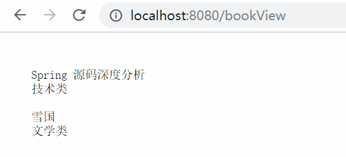

> http://localhost:8080/plain/value （前后端分离的话，常用的是这种，最后可以返回简单字符或者 json 格式的对象等）

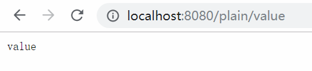

在刚才的 `web.xml` 中有两个关键配置，所以现在学习下这两个配置具体是干啥的。

---
# ContextLoaderContext

**作用：在启动 `web` 容器时，自动装载 `ApplicationContext` 的配置信息。**

下面是它的继承体系图：

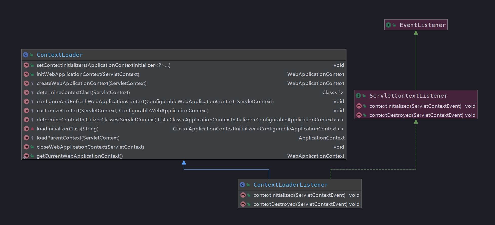

这是一个辅助工具类，可以用来传递配置信息参数，在 `web.xml` 中，将路径以 `context-param` 的方式注册并使用 `ContextLoaderListener` 进行监听读取。 

**从图中能看出，它实现了 `ServletContextListener` 这个接口，只要在 `web.xml` 配置了这个监听器，容器在启动时，就会执行 `contextInitialized(ServletContextEvent)` 这个方法，进行应用上下文初始化。**

```java
public void contextInitialized(ServletContextEvent event) {
	initWebApplicationContext(event.getServletContext());
}
```

每个 `Web` 应用都会有一个 `ServletContext` 贯穿生命周期（**在应用启动时创建，关闭时销毁**），跟 `Spring` 中 `ApplicationContext` 类似，在全局范围内有效。

实际上初始化的工作，是由父类 `ContextLoader` 完成的：(简略版）

```java
public WebApplicationContext initWebApplicationContext(ServletContext servletContext) {
    // demo 中用到的根容器是 Spring 容器 WebApplicationContext.class.getName() + ".ROOT"
	if (servletContext.getAttribute(WebApplicationContext.ROOT_WEB_APPLICATION_CONTEXT_ATTRIBUTE) != null) {
		// web.xml 中存在多次 ContextLoader 定义
		throw new IllegalStateException();
	}
	long startTime = System.currentTimeMillis();
    // 将上下文存储在本地实例变量中，以保证在 ServletContext 关闭时可用。
    if (this.context == null) {
    	// 初始化 context
    	this.context = createWebApplicationContext(servletContext);
    }
    if (this.context instanceof ConfigurableWebApplicationContext) {
    	ConfigurableWebApplicationContext cwac = (ConfigurableWebApplicationContext) this.context;
    	if (!cwac.isActive()) {
    		if (cwac.getParent() == null) {
    			ApplicationContext parent = loadParentContext(servletContext);
    			cwac.setParent(parent);
    		}
    		configureAndRefreshWebApplicationContext(cwac, servletContext);
    	}
    }
    // 记录在 ServletContext 中
    servletContext.setAttribute(WebApplicationContext.ROOT_WEB_APPLICATION_CONTEXT_ATTRIBUTE, this.context);
    ClassLoader ccl = Thread.currentThread().getContextClassLoader();
    if (ccl == ContextLoader.class.getClassLoader()) {
    	currentContext = this.context;
    }
    else if (ccl != null) {
    	currentContextPerThread.put(ccl, this.context);
    }
    if (logger.isInfoEnabled()) {
    	// 计数器，计算初始化耗时时间
    	long elapsedTime = System.currentTimeMillis() - startTime;
    	logger.info("Root WebApplicationContext initialized in " + elapsedTime + " ms");
    }
    return this.context;
}
```

该函数主要是体现了创建 `WebApplicationContext` 实例的一个功能架构，实现的大致步骤如下：

**1. `WebApplicationContext` 存在性的验证：** 
只能初始化一次，如果有多个声明，将会扰乱 `Spring` 的执行逻辑，所以有多个声明将会报错。
**2. 创建 `WebApplicationContext` 实例：** 
`createWebApplicationContext(servletContext);`

```java
protected Class<?> determineContextClass(ServletContext servletContext) {
    // defaultStrategies 是个静态变量，在静态代码块中初始化
    contextClassName = defaultStrategies.getProperty(WebApplicationContext.class.getName());
	return ClassUtils.forName(contextClassName, ContextLoader.class.getClassLoader());
}

/**
 * 默认策略
 */
private static final Properties defaultStrategies;
static {
	try {
		// 从 ContextLoader.properties 文件中加载默认策略
		// 在这个目录下：org/springframework/web/context/ContextLoader.properties
		ClassPathResource resource = new ClassPathResource(DEFAULT_STRATEGIES_PATH, ContextLoader.class);
		defaultStrategies = PropertiesLoaderUtils.loadProperties(resource);
	}
	catch (IOException ex) {
		throw new IllegalStateException("Could not load 'ContextLoader.properties': " + ex.getMessage());
	}
}


org.springframework.web.context.WebApplicationContext=org.springframework.web.context.support.XmlWebApplicationContext
```

如果按照默认策略，它将会从配置文件 `ContextLoader.properties` 中读取需要创建的实现类：`XmlWebApplicationContext`

**3. 将实例记录在 `servletContext` 中**
**4. 映射当前的类加载器与创建的实例到全局变量 `currentContextPerThread` 中**

通过以上步骤，完成了创建 `WebApplicationContext` 实例，它继承自 `ApplicaitonContext`，在父类的基础上，追加了一些特定于 `web` 的操作和属性，可以把它当成我们之前初始化 `Spring` 容器时所用到的 `ClassPathApplicaitonContext` 那样使用。

---
# DispatcherServlet 初始化

该类是 `spring-mvc` 的核心，该类进行真正逻辑实现，`DisptacherServlet` 实现了 `Servlet` 接口。

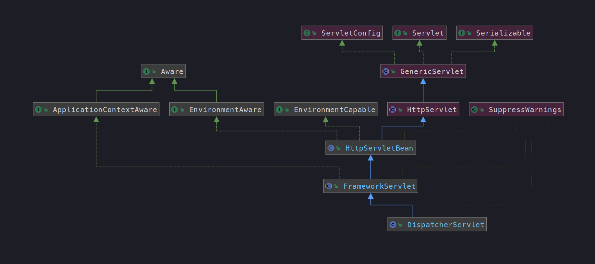

**介绍：**

> `servlet` 是一个 `Java` 编写的程序，基于 `Http` 协议，例如我们常用的 `Tomcat`，也是按照 `servlet` 规范编写的一个 `Java` 类
>
> `servlet` 的生命周期是由 `servlet` 的容器来控制，**分为三个阶段：初始化、运行和销毁。**


在 `servlet` 初始化阶段会调用其 `init` 方法：

> HttpServletBean#init

```java
public final void init() throws ServletException {
	// 解析 init-param 并封装到 pvs 变量中
	PropertyValues pvs = new ServletConfigPropertyValues(getServletConfig(), this.requiredProperties);
	// 将当前的这个 Servlet 类转换为一个 BeanWrapper，从而能够以 Spring 的方式对 init—param 的值注入
	BeanWrapper bw = PropertyAccessorFactory.forBeanPropertyAccess(this);
	ResourceLoader resourceLoader = new ServletContextResourceLoader(getServletContext());
	// 注册自定义属性编辑器，一旦遇到 Resource 类型的属性将会使用 ResourceEditor 进行解析
	bw.registerCustomEditor(Resource.class, new ResourceEditor(resourceLoader, getEnvironment()));
	// 空实现，留给子类覆盖
	initBeanWrapper(bw);
	bw.setPropertyValues(pvs, true);
	// 初始化 servletBean （让子类实现，这里它的实现子类是 FrameworkServlet）
	initServletBean();
}
```

在这里初始化 `DispatcherServlet`，主要是通过将当前的 `servlet` 类型实例转换为 `BeanWrapper` 类型实例，以便使用 `Spring` 中提供的注入功能进行相应属性的注入。

从上面注释，可以看出初始化函数的逻辑比较清晰，**封装参数、转换成 `BeanWrapper` 实例、注册自定义属性编辑器、属性注入，以及关键的初始化 `servletBean`。**

---
## 容器初始化

下面看下初始化关键逻辑：

> FrameworkServlet#initServletBean

剥离了日志打印后，剩下的两行关键代码

```java
protected final void initServletBean() throws ServletException {
	// 仅剩的两行关键代码
	this.webApplicationContext = initWebApplicationContext();
	// 留给子类进行覆盖实现，但我们例子中用的 DispatcherServlet 并没有覆盖，所以先不用管它
	initFrameworkServlet();
}
```

---
### WebApplicationContext 的初始化

> FrameworkServlet#initWebApplicationContext

该函数的主要工作就是创建或刷新 `WebApplicationContext` 实例并对 `servlet` 功能所使用的变量进行初始化。

```java
protected WebApplicationContext initWebApplicationContext() {
	// 从根容器开始查找
	WebApplicationContext rootContext =
			WebApplicationContextUtils.getWebApplicationContext(getServletContext());
	WebApplicationContext wac = null;
	if (this.webApplicationContext != null) {
		// 有可能在 Spring 加载 bean 时，DispatcherServlet 作为 bean 加载进来了
		// 直接使用在构造函数被注入的 context 实例
		wac = this.webApplicationContext;
		if (wac instanceof ConfigurableWebApplicationContext) {
			ConfigurableWebApplicationContext cwac = (ConfigurableWebApplicationContext) wac;
			if (!cwac.isActive()) {
				if (cwac.getParent() == null) {
					cwac.setParent(rootContext);
				}
				// 刷新上下文环境
				configureAndRefreshWebApplicationContext(cwac);
			}
		}
	}
	if (wac == null) {
		// 根据 contextAttribute 属性加载 WebApplicationContext
		wac = findWebApplicationContext();
	}
	if (wac == null) {
		// 经过上面步骤都没找到，那就来创建一个
		wac = createWebApplicationContext(rootContext);
	}
	if (!this.refreshEventReceived) {
		synchronized (this.onRefreshMonitor) {
			// 刷新，初始化很多策略方法
			onRefresh(wac);
		}
	}
	if (this.publishContext) {
		// Publish the context as a servlet context attribute.
		String attrName = getServletContextAttributeName();
		getServletContext().setAttribute(attrName, wac);
	}
	return wac;
}
``` 

---
### 根容器查找

我们最常用到的 `spring-mvc`，是 `spring` 容器和 `web` 容器共存，这时 `rootContext` 父容器就是 `spring` 容器。

在前面的 `web.xml` 配置的监听器 `ContextLaoderListener`，已经将 `Spring` 父容器进行了加载

> WebApplicationContextUtils#getWebApplicationContext(ServletContext)

```java
public static WebApplicationContext getWebApplicationContext(ServletContext sc) {
	// key 值 ：WebApplicationContext.class.getName() + ".ROOT"
	// (ServletContext) sc.getAttribute(attrName) ,
	return getWebApplicationContext(sc, WebApplicationContext.ROOT_WEB_APPLICATION_CONTEXT_ATTRIBUTE);
}
```

同时，根据上面代码，了解到 `Spring` 父容器，是以 `key` 值为 : `WebApplicationContext.class.getName() + ".ROOT"` 保存到 `ServletContext` 上下文中。

---
### 根据 contextAttribute 寻找

虽然有默认 `key`，但用户可以重写初始化逻辑（在 `web.xml` 文件中设定 `servlet` 参数 `contextAttribute`），使用自己创建的 `WebApplicaitonContext`，并在 `servlet` 的配置中通过初始化参数 `contextAttribute` 指定 `key`。

```java
protected WebApplicationContext findWebApplicationContext() {
	String attrName = getContextAttribute();
	if (attrName == null) {
		return null;
	}
	// attrName 就是用户在`web.xml` 文件中设定的 `servlet` 参数 `contextAttribute`
	WebApplicationContext wac =
			WebApplicationContextUtils.getWebApplicationContext(getServletContext(), attrName);
	if (wac == null) {
		throw new IllegalStateException("No WebApplicationContext found: initializer not registered?");
	}
	return wac;
}
```

---
### 重新创建实例

通过前面的方法都没找到，那就来重新创建一个新的实例：

> FrameworkServlet#createWebApplicationContext(WebApplicationContext)

```java
protected WebApplicationContext createWebApplicationContext(@Nullable WebApplicationContext parent) {
	return createWebApplicationContext((ApplicationContext) parent);
}

protected WebApplicationContext createWebApplicationContext(@Nullable ApplicationContext parent) {
	// 允许我们自定义容器的类型，通过 contextClass 属性进行配置
	// 但是类型必须要继承 ConfigurableWebApplicationContext，不然将会报错
	Class<?> contextClass = getContextClass();
	if (!ConfigurableWebApplicationContext.class.isAssignableFrom(contextClass)) {
		throw new ApplicationContextException();
	}
	// 通过反射来创建 contextClass
	ConfigurableWebApplicationContext wac =
			(ConfigurableWebApplicationContext) BeanUtils.instantiateClass(contextClass);
	wac.setEnvironment(getEnvironment());
	wac.setParent(parent);
	// 获取 contextConfigLocation 属性，配置在 servlet 初始化函数中
	String configLocation = getContextConfigLocation();
    wac.setConfigLocation(configLocation);
	// 初始化 Spring 环境包括加载配置环境
	configureAndRefreshWebApplicationContext(wac);
	return wac;
}
```

---
#### 获取上下文类 contextClass

**默认使用的是 `XmlWebApplicationContext`，但如果需要配置自定义上下文，可以在 `web.xml` 中的 `<init-param>` 标签中修改 `contextClass` 属性对应的 `value`，但需要注意图中提示：**

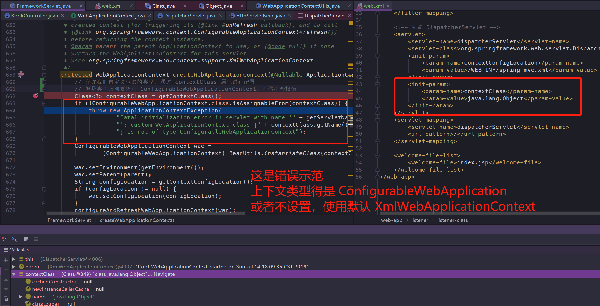

---
#### configureAndRefreshWebApplicationContext

使用该方法，用来对已经创建的 `WebApplicaitonContext` 进行配置以及刷新

```java
protected void configureAndRefreshWebApplicationContext(ConfigurableWebApplicationContext wac) {
    // 遍历 ApplicationContextInitializer，执行 initialize 方法
	applyInitializers(wac);
	// 关键的刷新，加载配置文件及整合 parent 到 wac
	wac.refresh();
}
```

---
#### ApplicationContextInitializer

该类可以通过 `<init-param>` 的 `contextInitializerClasses` 进行自定义配置：

```xml
<init-param>
    <param-name>contextInitializerClasses</param-name>
    <param-value>自定义类，需继承于 `ApplicationContextInitializer`</param-value>
</init-param>
```

正如代码中的顺序一样，是在 `mvc` 容器创建前，执行它的 `void initialize(C applicationContext)` 方法：

```java
protected void applyInitializers(ConfigurableApplicationContext wac) {
    AnnotationAwareOrderComparator.sort(this.contextInitializers);
	for (ApplicationContextInitializer<ConfigurableApplicationContext> initializer : this.contextInitializers) {
		initializer.initialize(wac);
	}
}
```

所有如果没有配置的话，默认情况下 `contextInitializers` 列表为空，表示没有 `ApplicationContextInitializer` 需要执行。

---
#### 加载 Spring 配置

`wac.refresh()`，实际调用的是我们之前就很熟悉的刷新方法：

> org.springframework.context.support.AbstractApplicationContext#refresh

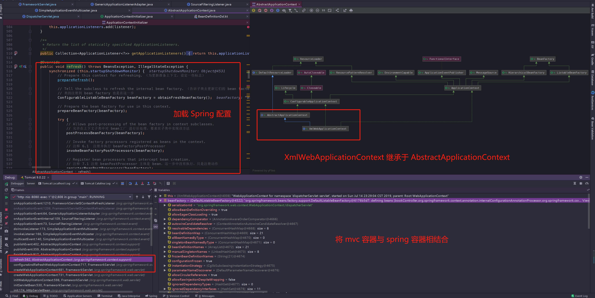

从图中能够看出，刷新方法的代码逻辑与之前一样，通过父类 `AbstractApplicationContext` 的 `refresh` 方法，进行了配置文件的加载。

在例子中的 `web.xml` 配置中，指定了加载 `spring-mvc.xml` 配置文件

```xml
<!-- 配置 DispatcherServlet -->
<servlet>
	<servlet-name>dispatcherServlet</servlet-name>
	<servlet-class>org.springframework.web.servlet.DispatcherServlet</servlet-class>
	<init-param>
		<param-name>contextConfigLocation</param-name>
		<param-value>/WEB-INF/spring-mvc.xml</param-value>
	</init-param>
</servlet>
```


---
#### 注册 mvc 解析器

由于我们配置了 `contextConfigLocation`，指定了加载资源的路径，所以在 `XmlWebApplicationContext` 初始化的时候，加载的 `Spring` 配置文件路径是我们指定 `spring-mvc.xml`：

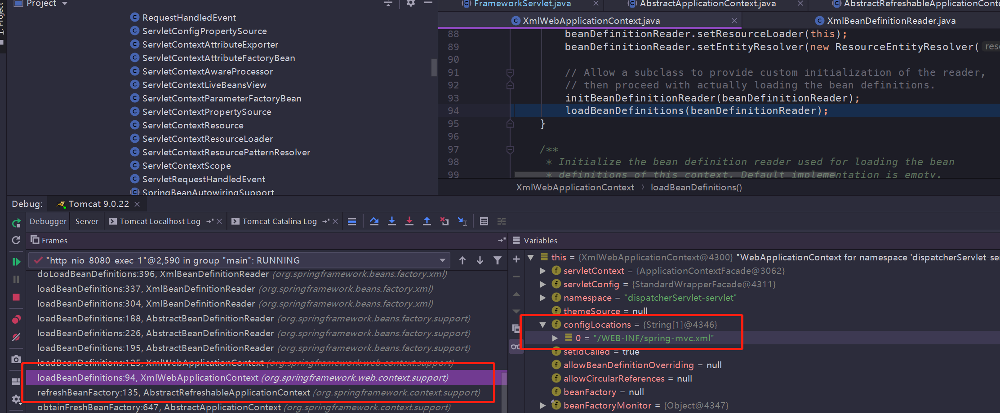

在 `spring-mvc.xml` 配置中，主要配置了三项

```xml
<!--扫描包,自动注入bean-->
<context:component-scan base-package="web.controller"/>
<!--使用注解开发spring mvc-->
<mvc:annotation-driven/>

<!--视图解析器-->
<bean class="org.springframework.web.servlet.view.InternalResourceViewResolver">
    <property name="prefix" value="/WEB-INF/views/"/>
    <property name="suffix" value=".jsp"/>
</bean>
```

同样老套路，使用了 `<mvc:annotation>` 自定义注解的话，要注册相应的解析器后，`Spring` 容器才能解析元素：

> org.springframework.web.servlet.config.MvcNamespaceHandler

```java
public void init() {
	// MVC 标签解析需要注册的解析器
	registerBeanDefinitionParser("annotation-driven", new AnnotationDrivenBeanDefinitionParser());
	registerBeanDefinitionParser("default-servlet-handler", new DefaultServletHandlerBeanDefinitionParser());
	registerBeanDefinitionParser("interceptors", new InterceptorsBeanDefinitionParser());
	registerBeanDefinitionParser("resources", new ResourcesBeanDefinitionParser());
	registerBeanDefinitionParser("view-controller", new ViewControllerBeanDefinitionParser());
	registerBeanDefinitionParser("redirect-view-controller", new ViewControllerBeanDefinitionParser());
	registerBeanDefinitionParser("status-controller", new ViewControllerBeanDefinitionParser());
	registerBeanDefinitionParser("view-resolvers", new ViewResolversBeanDefinitionParser());
	registerBeanDefinitionParser("tiles-configurer", new TilesConfigurerBeanDefinitionParser());
	registerBeanDefinitionParser("freemarker-configurer", new FreeMarkerConfigurerBeanDefinitionParser());
	registerBeanDefinitionParser("groovy-configurer", new GroovyMarkupConfigurerBeanDefinitionParser());
	registerBeanDefinitionParser("script-template-configurer", new ScriptTemplateConfigurerBeanDefinitionParser());
	registerBeanDefinitionParser("cors", new CorsBeanDefinitionParser());
}
```

可以看到，`mvc` 提供了很多便利的注解，有拦截器、资源、视图等解析器，但我们常用的到的是 `anntation-driven` 注解驱动，这个注解通过 `AnnotationDrivenBeanDefinitionParser` 类进行解析，其中会注册两个重要的 `bean` :

```java
class AnnotationDrivenBeanDefinitionParser implements BeanDefinitionParser {

	public static final String HANDLER_MAPPING_BEAN_NAME = RequestMappingHandlerMapping.class.getName();

	public static final String HANDLER_ADAPTER_BEAN_NAME = RequestMappingHandlerAdapter.class.getName();
	...
}
```

**跳过其他熟悉的 `Spring` 初始化配置，通过上面的步骤，完成了 `Spring` 配置文件的解析，将扫描到的 `bean` 加载到了 `Spring` 容器中。**

那么下面就正式进入 `mvc` 的初始化。

---
## mvc 初始化

**`onRefresh` 方法是 `FrameworkServlet` 类中提供的模板方法，在子类 `DispatcherServlet` 进行了重写，主要用来刷新 `Spring` 在 `Web` 功能实现中所必须用到的全局变量：**

```java
protected void onRefresh(ApplicationContext context) {
	initStrategies(context);
}

protected void initStrategies(ApplicationContext context) {
	// 初始化 multipartResolver 文件上传相关
	initMultipartResolver(context);
	// 初始化 LocalResolver 与国际化相关
	initLocaleResolver(context);
	// 初始化 ThemeResolver 与主题更换相关
	initThemeResolver(context);
	// 初始化 HandlerMapping 与匹配处理器相关
	initHandlerMappings(context);
	// 初始化 HandlerAdapter 处理当前 Http 请求的处理器适配器实现，根据处理器映射返回相应的处理器类型
	initHandlerAdapters(context);
	// 初始化 HandlerExceptionResolvers，处理器异常解决器
	initHandlerExceptionResolvers(context);
	// 初始化 RequestToViewNameTranslator，处理逻辑视图名称
	initRequestToViewNameTranslator(context);
	// 初始化 ViewResolver 选择合适的视图进行渲染
	initViewResolvers(context);
	// 初始化 FlashMapManager 使用 flash attributes 提供了一个请求存储属性，可供其他请求使用（重定向时常用）
	initFlashMapManager(context);
}
```

该函数是实现 `mvc` 的关键所在，先来大致介绍一下初始化的套路：

1. **寻找用户自定义配置**
2. **没有找到，使用默认配置**

**显然，`Spring` 给我们提供了高度的自定义，可以手动设置想要的解析器，以便于扩展功能。**

**如果没有找到用户配置的 `bean`，那么它将会使用默认的初始化策略: `getDefaultStrategies` 方法**

---
### 默认策略

> DispatcherServlet#getDefaultStrategies（缩减版）

```java
protected <T> List<T> getDefaultStrategies(ApplicationContext context, Class<T> strategyInterface) {
	// 策略接口名称
	String key = strategyInterface.getName();
	// 默认策略列表
	String value = defaultStrategies.getProperty(key);
	String[] classNames = StringUtils.commaDelimitedListToStringArray(value);
	List<T> strategies = new ArrayList<>(classNames.length);
	for (String className : classNames) {
		// 实例化
		Class<?> clazz = ClassUtils.forName(className, DispatcherServlet.class.getClassLoader());
		Object strategy = createDefaultStrategy(context, clazz);
		strategies.add((T) strategy);
	}
	return strategies;
}

// 默认策略列表
private static final Properties defaultStrategies;

static {
	// 路径名称是：DispatcherServlet.properties
	try {
		ClassPathResource resource = new ClassPathResource(DEFAULT_STRATEGIES_PATH, DispatcherServlet.class);
		defaultStrategies = PropertiesLoaderUtils.loadProperties(resource);
	}
}
```

**从静态默认策略属性 `defaultStrategies` 的加载过程中，读取的是 `DispatcherServlet.properties` 文件内容，看完下面列出来的信息，相信你跟我一样恍然大悟，了解 `Spring` 配置了哪些默认策略：**

```properties
org.springframework.web.servlet.LocaleResolver=org.springframework.web.servlet.i18n.AcceptHeaderLocaleResolver

org.springframework.web.servlet.ThemeResolver=org.springframework.web.servlet.theme.FixedThemeResolver

org.springframework.web.servlet.HandlerMapping=org.springframework.web.servlet.handler.BeanNameUrlHandlerMapping,\
	org.springframework.web.servlet.mvc.method.annotation.RequestMappingHandlerMapping,\
	org.springframework.web.servlet.function.support.RouterFunctionMapping

org.springframework.web.servlet.HandlerAdapter=org.springframework.web.servlet.mvc.HttpRequestHandlerAdapter,\
	org.springframework.web.servlet.mvc.SimpleControllerHandlerAdapter,\
	org.springframework.web.servlet.mvc.method.annotation.RequestMappingHandlerAdapter,\
	org.springframework.web.servlet.function.support.HandlerFunctionAdapter


org.springframework.web.servlet.HandlerExceptionResolver=org.springframework.web.servlet.mvc.method.annotation.ExceptionHandlerExceptionResolver,\
	org.springframework.web.servlet.mvc.annotation.ResponseStatusExceptionResolver,\
	org.springframework.web.servlet.mvc.support.DefaultHandlerExceptionResolver

org.springframework.web.servlet.RequestToViewNameTranslator=org.springframework.web.servlet.view.DefaultRequestToViewNameTranslator

org.springframework.web.servlet.ViewResolver=org.springframework.web.servlet.view.InternalResourceViewResolver

org.springframework.web.servlet.FlashMapManager=org.springframework.web.servlet.support.SessionFlashMapManager
```

接下来看看它们各自的初始化过程以及使用场景：

---
### multipartResolver 文件上传相关 

```java
private void initMultipartResolver(ApplicationContext context) {
    try {
		this.multipartResolver = context.getBean(MULTIPART_RESOLVER_BEAN_NAME, MultipartResolver.class);
	catch (NoSuchBeanDefinitionException ex) {
		// Default is no multipart resolver.
		this.multipartResolver = null;
    }
}
```

默认情况下，`Spring` 是没有 `mulitpart` 处理，需要自己设定

```xml
<!--上传下载-->
<bean id="multipartResolver" class="org.springframework.web.multipart.commons.CommonsMultipartResolver"/>
```

注册的 `id` 为 `multipartResolver`

---
### LocalResolver 与国际化相关 

`LocalResolver` 接口定义了如何获取客户端的地区

```java
private void initLocaleResolver(ApplicationContext context) {
	try {
	    this.localeResolver = context.getBean(LOCALE_RESOLVER_BEAN_NAME, LocaleResolver.class);
	}
	catch (NoSuchBeanDefinitionException ex) {
    	// We need to use the default.
    	this.localeResolver = getDefaultStrategy(context, LocaleResolver.class);
    }
}
```

通过寻找 `id` 为 `localeResolver` 的 `bean`，如果没有的话，将会使用默认的策略进行加载 `AcceptHeaderLocaleResolver`，它是基于 `URL` 参数来控制国际化，例如使用 `<a href="?locale=zh_CN">`  来设定简体中文，默认参数名为 `locale`。

当然还有其他两种，基于 `session` 和基于 `cookie` 的配置，想要深入了解的可以去细看~

---
### ThemeResolver 主题更换相关 

主题是一组静态资源（例如样式表 css 和图片 image），也可以理解为应用皮肤，使用 `Theme` 更改主题风格，改善用户体验。

默认注册的 `id` 是 `themeResolver`，类型是 `FixedThemeResolver`，表示使用的是一个固定的主题，以下是它的继承体系图：

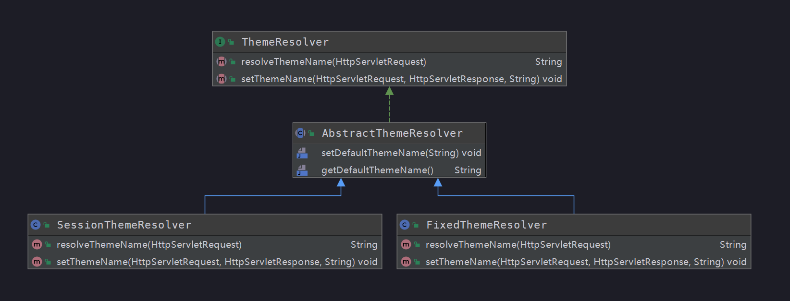

工作原理是通过拦截器拦截，配置对应的主题解析器，然后返回主题名称，还是使用上面的解析器作为例子：

> FixedThemeResolver#resolveThemeName

```java
public String resolveThemeName(HttpServletRequest request) {
	return getDefaultThemeName();
}

public String getDefaultThemeName() {
	return this.defaultThemeName;
}
```

---
### HandlerMapping 与匹配处理器相关 

首先判断 `detectAllHandlerMappings` 变量是否为 `true`，表示是否需要加载容器中所有的 `HandlerMapping`，`false` 将会加载用户配置的。

**如注释所说，至少得保证有一个 `HandlerMapping`，如果前面两个分支都没寻找到，那么就进行默认策略加载。**

```java
private void initHandlerMappings(ApplicationContext context) {
	this.handlerMappings = null;
	if (this.detectAllHandlerMappings) {
		// 默认情况下，寻找应用中所有的 HandlerMapping ，包括祖先容器（其实就是 Spring 容器啦）
		Map<String, HandlerMapping> matchingBeans =
				BeanFactoryUtils.beansOfTypeIncludingAncestors(context, HandlerMapping.class, true, false);
		if (!matchingBeans.isEmpty()) {
			this.handlerMappings = new ArrayList<>(matchingBeans.values());
			// handlerMapping 有优先级，需要排序
			AnnotationAwareOrderComparator.sort(this.handlerMappings);
		}
	}
	else {
		// 从上下文中，获取名称为 handlerMapping 的 bean
		HandlerMapping hm = context.getBean(HANDLER_MAPPING_BEAN_NAME, HandlerMapping.class);
		this.handlerMappings = Collections.singletonList(hm);

	}
	// 需要保证，至少有一个 HandlerMapping
	// 如果前面两步都没找到 mapping，将会由这里加载默认策略
	if (this.handlerMappings == null) {
		this.handlerMappings = getDefaultStrategies(context, HandlerMapping.class);
	}
}
```

通过 `Debug` 得知，之前在加载 `Spring` 配置时，就已经注入了 `RequestMappingHandlerMapping` 和 `BeanNameUrlHandlerMapping`

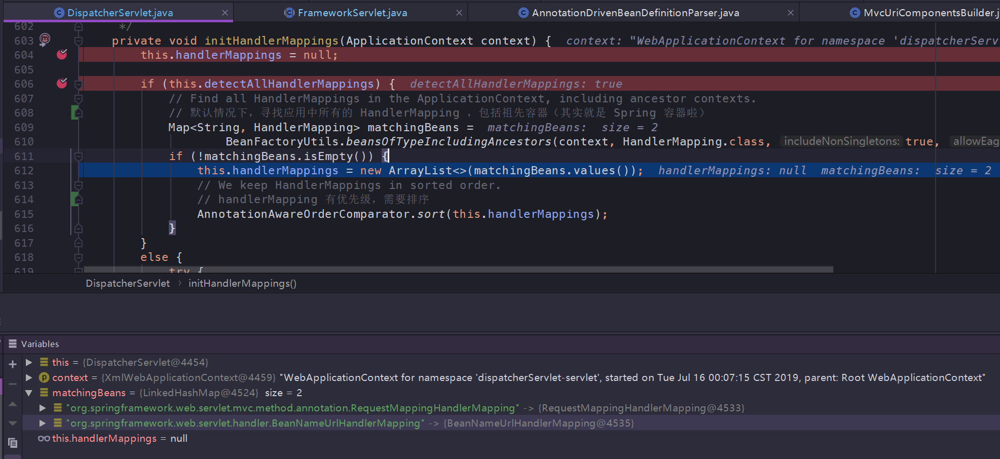

---
### HandlerAdapter 适配器 

套路与前面的一样，使用的默认策略是：`HttpRequestHandlerAdapter` 、`SimpleControllerHandlerAdapter`、 `RequestMappingHandlerAdapter` 和 `HandlerFunctionAdapter`。

说到适配器，可以将它理解为，将一个类的接口适配成用户所期待的，将两个接口不兼容的工作类，通过适配器连接起来。

---
### HandlerExceptionResolver 处理器异常解决器 

套路也与前面一样，使用的默认策略是：`ExceptionHandlerExceptionResolver`、 `ResponseStatusExceptionResolver` 和 `DefaultHandlerExceptionResolver`。

实现了 `HandlerExceptionResolver` 接口的 `resolveException` 方法，在方法内部对异常进行判断，然后尝试生成 `ModelAndView` 返回。

```java
public ModelAndView resolveException(
		HttpServletRequest request, HttpServletResponse response, @Nullable Object handler, Exception ex) {
	if (shouldApplyTo(request, handler)) {
		prepareResponse(ex, response);
		ModelAndView result = doResolveException(request, response, handler, ex);
		return result;
	}
	else {
		return null;
	}
}
```

---
### RequestToViewNameTranslator 处理逻辑视图名称 

初始化代码逻辑与前面一样，使用的默认策略是：`DefaultRequestToViewNameTranslator`

**使用场景：当 `Controller` 处理器方法没有返回逻辑视图名称时，`Spring` 通过该类的约定，提供一个逻辑视图名称。**

由于本地测试不出来，所以引用参考资料 7 的例子：

> DefaultRequestToViewNameTranslator的转换例子:
>
> http://localhost:8080/gamecast/display.html -> display(视图)

---
### ViewResolver 视图渲染 

套路还是跟前面一样，默认策略使用的是：`InternalResourceViewResolver`

同时，这也是 `demo` 中，我们手动配置的视图解析器

---
### FlashMapManager 存储属性

默认使用的是：`SessionFlashMapManager`，通过与 `FlashMap` 配合使用，**用于在重定向时保存/传递参数**。

例如 `Post/Redirect/Get` 模式，`Flash attribute` 在重定向之前暂存（根据类名，可以知道范围是 `session` 级别有效），以便重定向之后还能使用。

---
## RequestMappingHandler

**该类作用：配合 `@Controller` 和 `@RequestMapping` 注解使用，通过 `URL` 来找到对应的处理器。**

前面在 `spring-mvc.xml` 文件加载时，初始化了两个重要配置，其中一个就是下面要说的 `RequestMappingHandler`，先来看它的继承体系图：

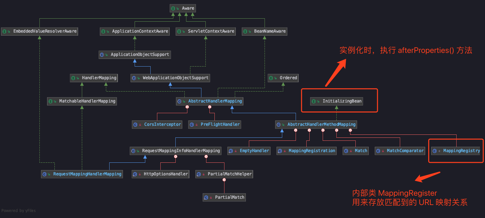

从继承图中看到，它实现了 `InitializingBean` 接口，所以在初始化时，将会执行 `afterPropertiesSet` 方法（图片中注释写错方法，请以下面为准），核心调用的初始化方法是父类 `AbstractHandlerMethodMapping#initHandlerMethods` 方法

> AbstractHandlerMethodMapping#initHandlerMethods

```java
protected void initHandlerMethods() {
	// 获取容器中所有 bean 名字
	for (String beanName : this.detectHandlerMethodsInAncestorContexts ?
				BeanFactoryUtils.beanNamesForTypeIncludingAncestors(obtainApplicationContext(), Object.class) :
				obtainApplicationContext().getBeanNamesForType(Object.class)) {
		if (!beanName.startsWith(SCOPED_TARGET_NAME_PREFIX)) {
		    // 如果前缀不是 scopedTarget.
	        // 执行 detectHandlerMethods() 方法
			Class<?> beanType = obtainApplicationContext().getType(beanName);
			if (beanType != null && isHandler(beanType)) {
			    detectHandlerMethods(beanName);
		    }
		}
	}
	// 打印数量，可以当成空实现
	handlerMethodsInitialized(getHandlerMethods());
}

protected void detectHandlerMethods(Object handler) {
	Class<?> handlerType = (handler instanceof String ?
			obtainApplicationContext().getType((String) handler) : handler.getClass());
	if (handlerType != null) {
		Class<?> userType = ClassUtils.getUserClass(handlerType);
		// 通过反射，获取类中所有方法
		// 筛选出 public 类型，并且带有 @RequestMapping 注解的方法
		Map<Method, T> methods = MethodIntrospector.selectMethods(userType,
				(MethodIntrospector.MetadataLookup<T>) method -> {
					// 通过 RequestMappingHandlerMapping.getMappingForMethod 方法组装成 RequestMappingInfo（映射关系）
					return getMappingForMethod(method, userType);
					
			});
		methods.forEach((method, mapping) -> {
			Method invocableMethod = AopUtils.selectInvocableMethod(method, userType);
			// 通过 mappingRegistry 进行注册上面获取到的映射关系
			registerHandlerMethod(handler, invocableMethod, mapping);
		});
	}
}
```

梳理一下代码逻辑，`initHandlerMethods` 方法将会扫描注册 `bean` 下所有公共 `public` 方法，如果带有 `@RequestMapping` 注解的，将会组装成 `RequestMappingInfo` 映射关系，然后将它注册到 `mappingRegistry` 变量中。之后可以通过映射关系，输入 `URL` 就能够找到对应的处理器 `Controller`。

---
### MappingRegistry

**该类是 `AbstractHandlerMethodMapping` 的内部类，是个工具类，用来保存所有 `Mapping` 和 `handler method`，通过暴露加锁的公共方法，避免了多线程对该类的内部变量的覆盖修改。**

下面是注册的逻辑：

```java
public void register(T mapping, Object handler, Method method) {
	this.readWriteLock.writeLock().lock();
	try {
		// 包装 bean 和方法
		HandlerMethod handlerMethod = createHandlerMethod(handler, method);
		// 校验
		validateMethodMapping(handlerMethod, mapping);
		this.mappingLookup.put(mapping, handlerMethod);
		List<String> directUrls = getDirectUrls(mapping);
		for (String url : directUrls) {
			this.urlLookup.add(url, mapping);
		}
		String name = null;
		if (getNamingStrategy() != null) {
			name = getNamingStrategy().getName(handlerMethod, mapping);
			addMappingName(name, handlerMethod);
		}
		// 跨域参数
		CorsConfiguration corsConfig = initCorsConfiguration(handler, method, mapping);
		if (corsConfig != null) {
			this.corsLookup.put(handlerMethod, corsConfig);
		}
		// 将映射关系放入  Map<T, MappingRegistration<T>> registry
		this.registry.put(mapping, new MappingRegistration<>(mapping, handlerMethod, directUrls, name));
	}
	finally {
		this.readWriteLock.writeLock().unlock();
	}
}
```

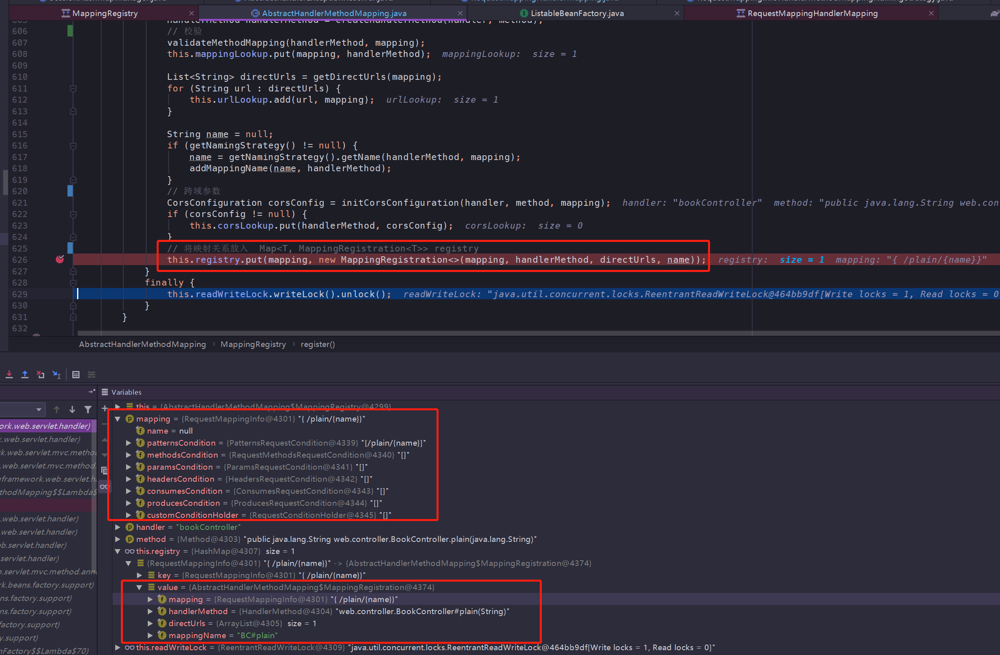

通过前面的包装和校验方法，最后映射关系将会放入这里 `Map<T, MappingRegistration<T>> registry`。它是一个泛型的 `Map`，**`key` 类型是 `RequestMappingInfo`，保存了 `@RequestMapping` 各种属性的集合，`value` 类型是 `AbstractHandlerMethodMapping`，保存的是我们的映射关系。**

**从图中可以看出，如果输入的 `URL` 是 `/plain/{name}`，将会找到对应的处理方法 `web.controller.BookController#plain{String}`。**

---
## RequestMappingHandlerAdapter
而另一个重要的配置就是处理器适配器 `RequestMappingHandlerAdapter`，由于它的继承体系与 `RequestMappingHandler` 类似，所以我们直接来看它在加载时执行的方法

> RequestMappingHandlerAdapter#afterPropertiesSet

```java
public void afterPropertiesSet() {
	// 首先执行这个方法，可以添加 responseBody 切面 bean
	initControllerAdviceCache();
	// 参数处理器
	if (this.argumentResolvers == null) {
		List<HandlerMethodArgumentResolver> resolvers = getDefaultArgumentResolvers();
		this.argumentResolvers = new HandlerMethodArgumentResolverComposite().addResolvers(resolvers);
	}
	// 处理 initBinder 注解
	if (this.initBinderArgumentResolvers == null) {
		List<HandlerMethodArgumentResolver> resolvers = getDefaultInitBinderArgumentResolvers();
		this.initBinderArgumentResolvers = new HandlerMethodArgumentResolverComposite().addResolvers(resolvers);
	}
	// 初始化结果处理器
	if (this.returnValueHandlers == null) {
		List<HandlerMethodReturnValueHandler> handlers = getDefaultReturnValueHandlers();
		this.returnValueHandlers = new HandlerMethodReturnValueHandlerComposite().addHandlers(handlers);
	}
}
```

**所以看到这个适配器中，初始化了很多工具变量，用来处理 `@ControllerAdvice` 、`InitBinder` 等注解和参数。不过核心还是待会要讲到的 `handleInternal()` 方法，它将适配处理器调用，然后返回 `ModelView` 视图。**

---
# DispatcherServlet 的逻辑处理

请求处理的入口定义在 `HttpServlet`，主要有以下几个方法：

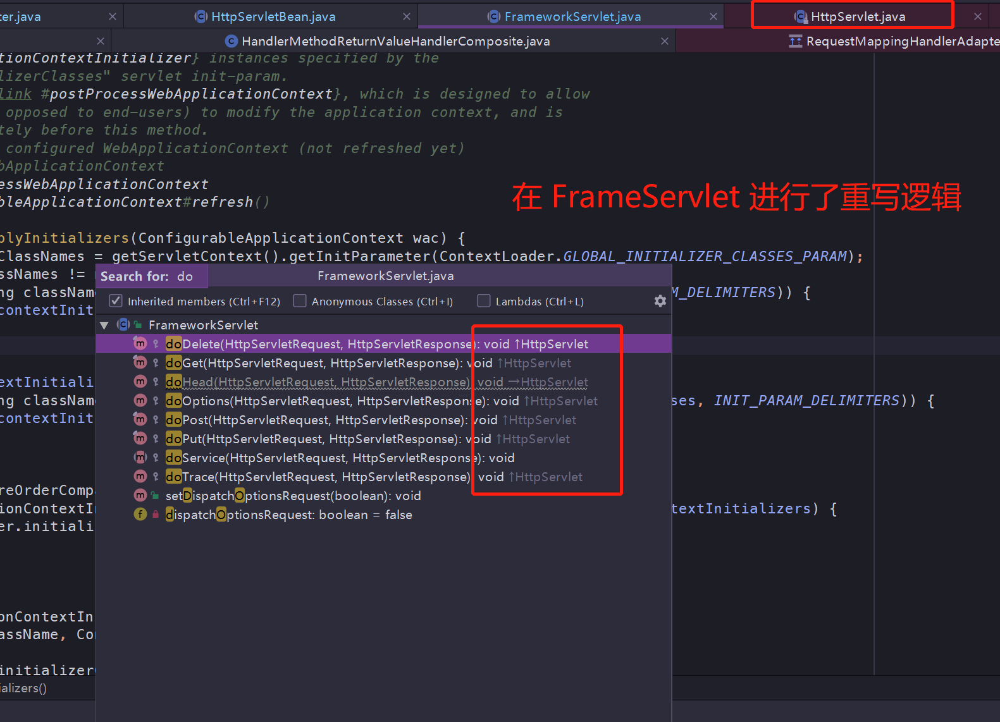

当然，父类 `HttpServlet` 只是给出了定义，直接调用父类这些方法将会报错，所以 `FrameworkServlet` 将它们覆盖重写了处理逻辑：

```java
protected final void doGet(HttpServletRequest request, HttpServletResponse response) {
	// 注解 10. 具体调用的是 processRequest 方法
	processRequest(request, response);
}

protected final void doPost(HttpServletRequest request, HttpServletResponse response) {
	processRequest(request, response);
}
```

**可以看到 `doGet` 、`doPost` 这些方法，底层调用的都是 `processRequest` 方法进行处理，关键方法是委托给子类 `DispatcherServlet` 的 `doServie()` 方法**

> DispatcherServlet#doService

```java
protected void doService(HttpServletRequest request, HttpServletResponse response) throws Exception {
	logRequest(request);
	// 暂存请求参数
	Map<String, Object> attributesSnapshot = null;
	...
	// 经过前面的准备（属性、辅助变量），进入请求处理过程
	doDispatch(request, response);
}
```

**请求分发和处理逻辑的核心是在 `doDispatch(request, response)` 方法中，在进入这个方法前，还有些准备工作需要执行。**

---
## 请求上下文

在 `processRequest` 的 `doServie()` 方法执行前，主要做了这以下准备工作：

（1） 为了保证当前线程的 `LocaleContext` 以及 `RequestAttributes` 可以在当前请求后还能恢复，提取当前线程的两个属性。
（2） 根据当前 `request` 创建对应的 `LocaleContext` 以及 `RequestAttributes`，绑定到当前线程
（3） 往 `request` 对象中设置之前加载过的 `localeResolver`、`flashMapManager` 等辅助工具变量

---
## 请求分发 doDispatch

经过前面的配置设置，`doDispatch` 函数展示了请求的完成处理过程：

> DispatcherServlet#doDispatch

```java
protected void doDispatch(HttpServletRequest request, HttpServletResponse response) {
	HttpServletRequest processedRequest = request;
	HandlerExecutionChain mappedHandler = null;	
	// 注释 10. 检查是否 MultipartContent 类型
	processedRequest = checkMultipart(request);
	// 根据 request 信息寻找对应的 Handler
	mappedHandler = getHandler(processedRequest);
	if (mappedHandler == null) {
		// 没有找到 handler，通过 response 向用户返回错误信息
		noHandlerFound(processedRequest, response);
		return;
	}
	// 根据当前的 handler 找到对应的 HandlerAdapter 适配器
	HandlerAdapter ha = getHandlerAdapter(mappedHandler.getHandler());
	// 如果当前 handler 支持 last-modified 头处理
	String method = request.getMethod();
	boolean isGet = "GET".equals(method);
	if (isGet || "HEAD".equals(method)) {
		long lastModified = ha.getLastModified(request, mappedHandler.getHandler());
		if (new ServletWebRequest(request, response).checkNotModified(lastModified) && isGet) {
			return;
		}
	}
	// 拦截器的 preHandler 方法的调用
	if (!mappedHandler.applyPreHandle(processedRequest, response)) {
		return;
	}
	// 真正激活 handler 进行处理，并返回视图
	mv = ha.handle(processedRequest, response, mappedHandler.getHandler());
	if (asyncManager.isConcurrentHandlingStarted()) {
		return;
	}
	// 视图名称转换（有可能需要加上前后缀）
	applyDefaultViewName(processedRequest, mv);
	// 应用所有拦截器的 postHandle 方法
	mappedHandler.applyPostHandle(processedRequest, response, mv);
	// 处理分发的结果（如果有 mv，进行视图渲染和跳转）
	processDispatchResult(processedRequest, response, mappedHandler, mv, dispatchException);	
}
```

上面贴出来的代码略有缩减，不过从上面示例中能看出，整体的逻辑都挺清晰的，主要步骤如下：

**1. 寻找处理器 `mappedandler`**
**2. 根据处理器，寻找对应的适配器 `HandlerAdapter`**
**3. 激活 `handler`，调用处理方法**
**4. 返回结果（如果有 mv，进行视图渲染和跳转）**

---
### 寻找处理器 mappedHandler

**以 `demo` 说明，寻找处理器，就是根据 `URL` 找到对应的 `Controller` 方法**

> DispatcherServlet#getHandler

```java
protected HandlerExecutionChain getHandler(HttpServletRequest request) throws Exception {
	if (this.handlerMappings != null) {
		// 遍历注册的全部 handlerMapping
		for (HandlerMapping mapping : this.handlerMappings) {
			HandlerExecutionChain handler = mapping.getHandler(request);
			if (handler != null) {
				return handler;
			}
		}
	}
	return null;
}
```

实际上，在这一步遍历了所有注册的 `HandlerMapping`，然后委派它们去寻找处理器，如果找到了合适的，就不再往下寻找，直接返回。

**同时，`HandlerMapping` 之间有优先级的概念，根据 `mvc` 包下 `AnnotationDrivenBeanDefinitionParser` 的注释：**

> **This class registers the following {@link HandlerMapping HandlerMappings}**
> **@link RequestMappingHandlerMapping**
> **ordered at 0 for mapping requests to annotated controller methods.**

说明了 `RequestMappingHandlerMapping` 的优先级是最高的，优先使用它来寻找适配器。

具体寻找调用的方法：

> AbstractHandlerMapping#getHandler

```java
public final HandlerExecutionChain getHandler(HttpServletRequest request) throws Exception {
	// 根据 Request 获取对应的 handler
	Object handler = getHandlerInternal(request);
	// 将配置中的对应拦截器加入到执行链中，以保证这些拦截器可以有效地作用于目标对象
	HandlerExecutionChain executionChain = getHandlerExecutionChain(handler, request);
	if (hasCorsConfigurationSource(handler)) {
		CorsConfiguration config = (this.corsConfigurationSource != null ? this.corsConfigurationSource.getCorsConfiguration(request) : null);
		CorsConfiguration handlerConfig = getCorsConfiguration(handler, request);
		config = (config != null ? config.combine(handlerConfig) : handlerConfig);
		executionChain = getCorsHandlerExecutionChain(request, executionChain, config);
	}
	return executionChain;
}
```

(1) `getHandlerInternal(request)` 函数作用：

根据 `request` 信息获取对应的 `Handler`，也就是我们例子中的，通过 `URL` 找到匹配的 `Controller` 并返回。

(2) `getHandlerExcetionChain` 函数作用：

将适应该 `URL` 对应拦截器 `MappedInterceptor` 加入 `addInterceptor()` 到执行链 `HandlerExecutionChain` 中。

(3) `CorsConfiguration`

这个参数涉及到跨域设置，具体看下这篇文章：[SpringBoot下如何配置实现跨域请求？](https://blog.csdn.net/Colton_Null/article/details/75195230)

---
### 寻找适配器 HandlerAdapter

前面已经找到了对应的处理器了，下一步就得找到它对应的适配器

> DispatcherServlet#getHandlerAdapter

```java
protected  getHandlerAdapter(Object handler) throws ServletException {
	if (this.handlerAdapters != null) {
		for (HandlerAdapter adapter : this.handlerAdapters) {
			if (adapter.supports(handler)) {
				return adapter;
			}
		}
	}
}
```

同样，`HandlerAdapter` 之间也有优先级概念，由于第 0 位是 `RequestMappingHandlerAdapter`，而它的 `supports` 方法总是返回 `true`，所以毫无疑问返回了它

---
## 请求处理 

通过适配器包装了一层，处理请求的入口如下：

> RequestMappingHandlerAdapter#handleInternal

```java
protected ModelAndView handleInternal(HttpServletRequest request,
		HttpServletResponse response, HandlerMethod handlerMethod) throws Exception {
	ModelAndView mav;
	checkRequest(request);
	// Execute invokeHandlerMethod in synchronized block if required.
	if (this.synchronizeOnSession) {
		HttpSession session = request.getSession(false);
		if (session != null) {
			Object mutex = WebUtils.getSessionMutex(session);
			synchronized (mutex) {
				mav = invokeHandlerMethod(request, response, handlerMethod);
			}
		}
		else {
			// No HttpSession available -> no mutex necessary
			mav = invokeHandlerMethod(request, response, handlerMethod);
		}
	}
	else {
		// No synchronization on session demanded at all...
		// 执行适配中真正的方法
		mav = invokeHandlerMethod(request, response, handlerMethod);
	}
	if (!response.containsHeader(HEADER_CACHE_CONTROL)) {
		if (getSessionAttributesHandler(handlerMethod).hasSessionAttributes()) {
			applyCacheSeconds(response, this.cacheSecondsForSessionAttributeHandlers);
		}
		else {
			prepareResponse(response);
		}
	}
	return mav;
}
```

通过 `invokeHandlerMethod` 方法，调用对应的 `Controller` 方法逻辑，包装成 `ModelAndView`。

---
### Session 代码块

**判断 synchronizeOnSession 是否开启，开启的话，同一个 session 的请求将会串行执行（Object mutex = WebUtils.getSessionMutex(session)）**

---
### 自定义参数解析

解析逻辑由 `RequestParamMethodArgumentResolver` 完成，具体请查看 [spring-mvc](https://github.com/seaswalker/spring-analysis/blob/master/note/spring-mvc.md#%E8%87%AA%E5%AE%9A%E4%B9%89%E5%8F%82%E6%95%B0)

---
### 逻辑处理


> InvocableHandlerMethod#invokeForRequest

```java
public Object invokeForRequest(NativeWebRequest request, @Nullable ModelAndViewContainer mavContainer,
		Object... providedArgs) throws Exception {
	Object[] args = getMethodArgumentValues(request, mavContainer, providedArgs);
	return doInvoke(args);
}
```

通过给定的参数，`doInvoke` 使用了反射操作，执行了 `Controller` 方法的逻辑。

---
### 返回值解析

**拿 `http://localhost:8080/bookView` 作为例子，经过前面的逻辑处理后，返回的只是试图名称 `bookView`，在这时，使用到了 `ViewNameMethodReturnValueHandler`**

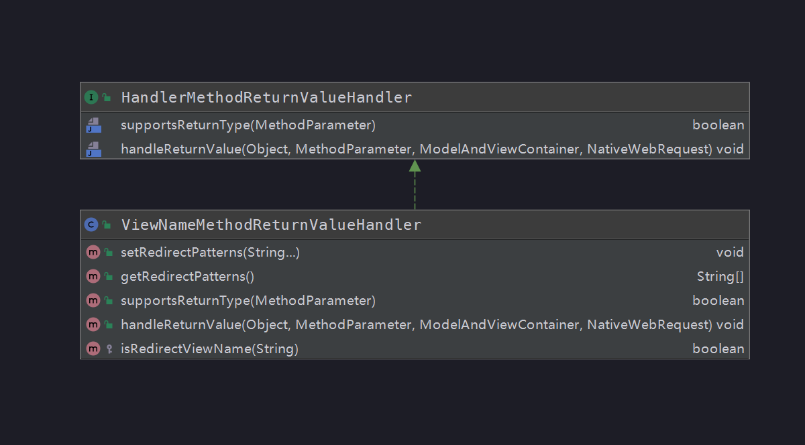

可以看到它实现了 `HandlerMethodReturnValueHandler` 接口的两个方法

> ViewNameMethodReturnValueHandler#supportsReturnType; 表示支持处理的返回类型

```java
public boolean supportsReturnType(MethodParameter returnType) {
	Class<?> paramType = returnType.getParameterType();
	return (void.class == paramType || CharSequence.class.isAssignableFrom(paramType));
}
```

> ViewNameMethodReturnValueHandler#handleReturnValue; 返回处理值，给 mavContainer 设置视图名称 viewName

```java
public void handleReturnValue(@Nullable Object returnValue, MethodParameter returnType,
		ModelAndViewContainer mavContainer, NativeWebRequest webRequest) throws Exception {
	if (returnValue instanceof CharSequence) {
		String viewName = returnValue.toString();
		mavContainer.setViewName(viewName);
		if (isRedirectViewName(viewName)) {
			mavContainer.setRedirectModelScenario(true);
		}
	}
}
```

**最后在适配器中包装成了 `ModelAndView` 对象**

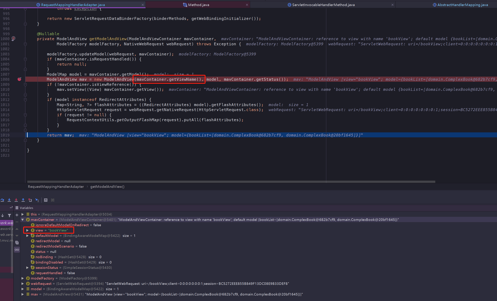

---
## 视图渲染

根据处理器执行完成后，适配器包装成了 `ModelAndView` 返回给 `DispatcherServlet` 继续进行处理，来到了视图渲染的步骤：

> DispatcherServlet#processDispatchResult

```java
private void processDispatchResult(HttpServletRequest request, HttpServletResponse response,
		@Nullable HandlerExecutionChain mappedHandler, @Nullable ModelAndView mv,
		@Nullable Exception exception) throws Exception {
	boolean errorView = false;
	// 跳过了异常判断 =-=
	// Did the handler return a view to render?
	if (mv != null && !mv.wasCleared()) {
		// 如果视图不为空并且 clear 属性为 false， 进行视图渲染
		render(mv, request, response);
		if (errorView) {
			WebUtils.clearErrorRequestAttributes(request);
		}
	}
	if (WebAsyncUtils.getAsyncManager(request).isConcurrentHandlingStarted()) {
		// Concurrent handling started during a forward
		return;
	}
	if (mappedHandler != null) {
		mappedHandler.triggerAfterCompletion(request, response, null);
	}
}
```

---
### render

还记得我们使用的是 `jsp` 视图进行渲染么，引用的依赖是 `jstl`，所以视图渲染的是 `JstlView` 类提供的方法，以下是它的继承体系：

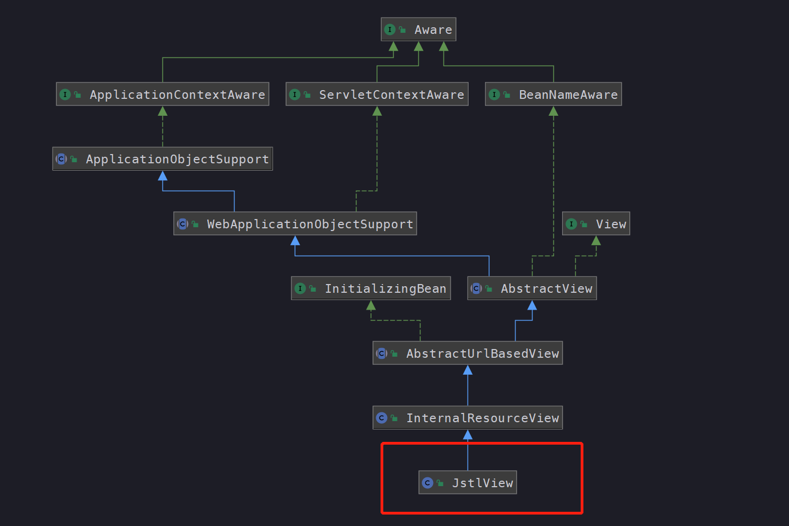

渲染调用的是其父类的方法：

> InternalResourceView#renderMergedOutputModel
>
> 在给定指定模型的情况下呈现内部资源。这包括将模型设置为请求属性

```java
protected void renderMergedOutputModel(Map<String, Object> model, HttpServletRequest request, HttpServletResponse response) throws Exception {
	// Expose the model object as request attributes.
	exposeModelAsRequestAttributes(model, request);
	// Expose helpers as request attributes, if any.
	exposeHelpers(request);
	// Determine the path for the request dispatcher.
	String dispatcherPath = prepareForRendering(request, response);
	// Obtain a RequestDispatcher for the target resource (typically a JSP).
	RequestDispatcher rd = getRequestDispatcher(request, dispatcherPath);
	if (rd == null) {
		throw new ServletException("");
	}
	// If already included or response already committed, perform include, else forward.
	if (useInclude(request, response)) {
		response.setContentType(getContentType());
		rd.include(request, response);
	}
	else {
		// Note: The forwarded resource is supposed to determine the content type itself.
		rd.forward(request, response);
	}
}
```

最后发现渲染调用的是第三方依赖 `org.apache.catalina.core.ApplicationDispatcher` 进行视图绘制，所以不再跟踪下去。

**所以整个视图渲染过程，就是在前面将 `Model` 视图对象中的属性设置到请求 `request` 中，最后通过原生（tomcat）的 `ApplicationDispatcher` 进行转发，渲染成视图。**

---
# 总结

本篇比较完整的描述了 `spring-mvc` 的框架体系，结合 `demo` 和代码，将调用链路梳理了一遍，了解了每个环节注册的工具类或解析器，了解了 `Spring` 容器和 `Web` 容器是如何合并使用，也了解到 `mvc` 初始化时加载的默认策略和请求完整的处理逻辑。

总结起来，就是我们在开头写下的内容：

**(1) 介绍如何使用**

**(2) 辅助工具类 `ContextLoaderContext`**

**(3) `DispatcherServlet` 初始化**

**(4) `DispatcherServlet` 处理请求**

---
# 题外话

本篇笔记写得比之前的都要吃力，`mvc` 模块基本使用了之前总结过的知识点，一边学一边复习之前的知识，而且由于个人在开发环境遇到了阻塞，**秉着 [自己都不能成功运行的代码，是不能提交的] 原则**，处理了挺长时间。

在跟踪每个知识点时，越深入发现坑越多，想要将它描述完整，在学习理解和总结中不断循环，所以本篇花了很多时间，同时也有很多知识点没有去深入学习，例如 `demo` 中出现的 `@RequestBody`、`@PathVarible` 等注解是如何解析和返回结果处理，留个坑。

**同时这篇笔记也是目前 `Spring` 源码学习的最后一篇技术总结，期望能得到朋友们的支持，如果写的不对的地方或者建议，请与我联系，我将完善和补充~**

---

**由于个人技术有限，如果有理解不到位或者错误的地方，请留下评论，我会根据朋友们的建议进行修正**

[Gitee 地址 https://gitee.com/vip-augus/spring-analysis-note.git](https://gitee.com/vip-augus/spring-analysis-note.git)

[Github 地址 https://github.com/Vip-Augus/spring-analysis-note](https://github.com/Vip-Augus/spring-analysis-note)

---
# 参考资料

1. [idea中web.xml报错 Servlet should have a mapping](https://blog.csdn.net/haerxiong/article/details/55666872)
2. [SpringMVC 使用总结](https://blog.csdn.net/Thousa_Ho/article/details/70876854)
3. [idea 创建java web项目ssm-gradle](https://www.jianshu.com/p/7fe31ea61dda)
4. [Spring 源码深度解析 / 郝佳编著. -- 北京 : 人民邮电出版社](https://book.douban.com/subject/25866350/)
5. [Spring MVC【入门】就这一篇！](https://www.jianshu.com/p/91a2d0a1e45a)
6. [DispatcherServlet](http://blog.didispace.com/books/spring-mvc-4-tutorial/publish/21-2/the-dispatcher-servlet.html)
7. [spring-mvc](https://github.com/seaswalker/spring-analysis/blob/master/note/spring-mvc.md#%E8%87%AA%E5%AE%9A%E4%B9%89%E5%8F%82%E6%95%B0)
8. [SpringBoot下如何配置实现跨域请求？](https://blog.csdn.net/Colton_Null/article/details/75195230)


